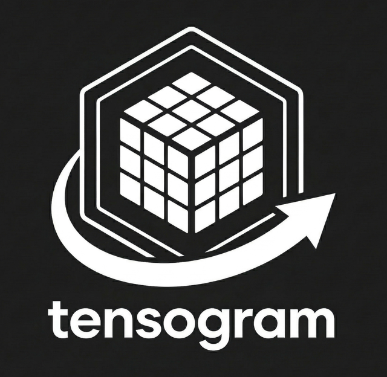

<p align="center">
  
</p>

<h1 align="center">Tensogram</h1>

<p align="center">
  <em>A fast, efficient 'telegram' for multidimensional tensors</em>
</p>

<p align="center">
  <a href="https://github.com/ecmwf/codex/raw/refs/heads/main/Project%20Maturity#emerging">
    
  </a>
</p>

> [!IMPORTANT]
> This software is **Emerging** and subject to ECMWF's guidelines on [Software Maturity](https://github.com/ecmwf/codex/raw/refs/heads/main/Project%20Maturity).

A library to encode and decode binary N-Tensor scientific data with semantic metadata close to the data, in a serialisable format that can be sent over the network, encoded into in-memory buffers and decoded with zero-copy.

Tensogram defines a network-transmissible binary message format, not a file format. Multiple messages can be appended to a file, each carrying its own begin/terminator codes.

## Features

- **Self-describing messages** — CBOR-encoded metadata with structured `common`/`payload`/`reserved` sections and automatic provenance (encoder version, timestamp, UUID)
- **N-Tensor support** — multiple tensors of different dtypes per message (float16 through float64, int8 through int64, complex, bfloat16)
- **No panics** — all fallible operations return `Result<T, TensogramError>`
- **Streaming encoder** — progressive encode/transmit without buffering the full message; preceder metadata frames enable consumer-side streaming decode
- **Compression** — szip, zstd, lz4, blosc2, zfp, sz3 per data object
- **Hash verification** — xxHash xxh3-64 integrity check per object
- **Multiple languages** — Rust, Python (NumPy), C/C++
- **xarray backend** — `xr.open_dataset("file.tgm", engine="tensogram")` with lazy loading, coordinate auto-detection, and hypercube stacking via `open_datasets()`
- **Zarr v3 store** — `zarr.open_group(store=TensogramStore.open_tgm("file.tgm"))` for standard Zarr API access with 14 bidirectionally-mapped dtypes
- **Python iteration** — `for msg in file:`, `file[i]`, `file[1::2]`, `iter_messages(buf)` with `Message` namedtuple
- **GRIB conversion** — import GRIB data with MARS metadata preservation and configurable namespace extraction
- **CLI** — `tensogram info/ls/dump/get/set/copy/merge/split/reshuffle/convert-grib` with `--strategy first|last|error` merge conflict resolution
- **Tracing** — structured logging via `TENSOGRAM_LOG=debug` on all performance-critical paths
- **Optional features** — `mmap` (zero-copy file reads), `async` (tokio I/O)

## Quick Start

```rust
use std::collections::BTreeMap;
use tensogram_core::{
    encode, decode, ByteOrder, DataObjectDescriptor, DecodeOptions,
    Dtype, EncodeOptions, GlobalMetadata,
};

let desc = DataObjectDescriptor {
    obj_type: "ntensor".to_string(), ndim: 2,
    shape: vec![100, 200], strides: vec![200, 1],
    dtype: Dtype::Float32, byte_order: ByteOrder::Big,
    encoding: "none".to_string(), filter: "none".to_string(),
    compression: "none".to_string(), params: BTreeMap::new(), hash: None,
};

let meta = GlobalMetadata::default();
let raw: Vec<u8> = vec![0u8; 100 * 200 * 4];

let message = encode(&meta, &[(&desc, &raw)], &EncodeOptions::default())?;
let (_, objects) = decode(&message, &DecodeOptions::default())?;
assert_eq!(objects[0].1.len(), 100 * 200 * 4);
```

See `examples/rust/` for MARS metadata, streaming, compression, file API, and more.

### Python

```python
import numpy as np
import tensogram

# Encode
data = np.random.randn(100, 200).astype(np.float32)
msg = tensogram.encode(
    {"version": 2, "common": {"mars": {"param": "2t"}}},
    [({"type": "ntensor", "shape": [100, 200], "dtype": "float32"}, data)],
)

# Decode
result = tensogram.decode(msg)
arr = result.objects[0][1]  # numpy array

# File iteration
with tensogram.TensogramFile.open("forecast.tgm") as f:
    for msg in f:
        print(msg.metadata.common["mars"]["param"], msg.objects[0][1].shape)
```

### xarray

```python
import xarray as xr

ds = xr.open_dataset("forecast.tgm", engine="tensogram")
print(ds)  # lazy-loaded Dataset with auto-detected coordinates
```

### Zarr v3

```python
import zarr
from tensogram_zarr import TensogramStore

group = zarr.open_group(store=TensogramStore.open_tgm("forecast.tgm"))
print(group.tree())
```

See `examples/python/` for 9 examples covering encode/decode, metadata, packing, file API, iterators, xarray, zarr, and streaming consumer patterns.

## Build & Test

```bash
cargo build --workspace                                          # build
cargo test --workspace                                           # test
cargo clippy --workspace --all-targets --all-features -- -D warnings  # lint
```

**Optional features:**
```bash
cargo build -p tensogram-core --features mmap,async
```

**C++ wrapper** (`include/tensogram.hpp`):
```bash
cargo build --release                  # build Rust static library first
cmake -B build -DCMAKE_BUILD_TYPE=Release
cmake --build build -j
ctest --test-dir build --output-on-failure  # run C++ tests
```
See `examples/cpp/` for encode/decode, metadata, file API, and iterator examples.

**Python bindings** (PyO3 + maturin):
```bash
python -m venv .venv && source .venv/bin/activate
pip install maturin numpy
cd crates/tensogram-python && maturin develop
python -m pytest tests/python/ -v              # 200 tests
```

**xarray + Zarr backends:**
```bash
pip install -e "tensogram-xarray/[dask]"       # 124 tests
pip install -e tensogram-zarr/                  # 172 tests
```

**GRIB conversion** (requires [ecCodes](https://confluence.ecmwf.int/display/ECC)):
```bash
cargo build -p tensogram-cli --features grib
tensogram convert-grib forecast.grib -o forecast.tgm
```

## Documentation

- [mdbook docs](docs/) — full developer guide (`cd docs && mdbook build`)
- [Architecture](ARCHITECTURE.md) — crate structure and design decisions
- [Contributing](CONTRIBUTING.md) — setup and workflow
- [Changelog](CHANGELOG.md) — release history
- [Python API](PYTHON_API.md) — quick reference for Python interface

## Repository Layout

```
crates/
├── tensogram-core/       Core encode/decode library
├── tensogram-encodings/  Encoding pipeline + compression codecs
├── tensogram-cli/        CLI binary (tensogram command)
├── tensogram-ffi/        C FFI layer
├── tensogram-grib/       GRIB converter (ecCodes, excluded from default build)
└── tensogram-python/     Python bindings (PyO3, excluded from default build)
tensogram-xarray/         xarray backend engine (pip install)
tensogram-zarr/           Zarr v3 store backend (pip install)
examples/{rust,cpp,python}/
docs/                     mdBook documentation
.github/workflows/ci.yml  CI matrix (Rust, Python, C++, xarray, zarr, docs)
```

## Copyright and License

Copyright 2024- European Centre for Medium-Range Weather Forecasts (ECMWF).

This software is licensed under the terms of the [Apache License, Version 2.0](LICENSE) which can also be obtained at http://www.apache.org/licenses/LICENSE-2.0.

In applying this licence, ECMWF does not waive the privileges and immunities granted to it by virtue of its status as an intergovernmental organisation nor does it submit to any jurisdiction.
