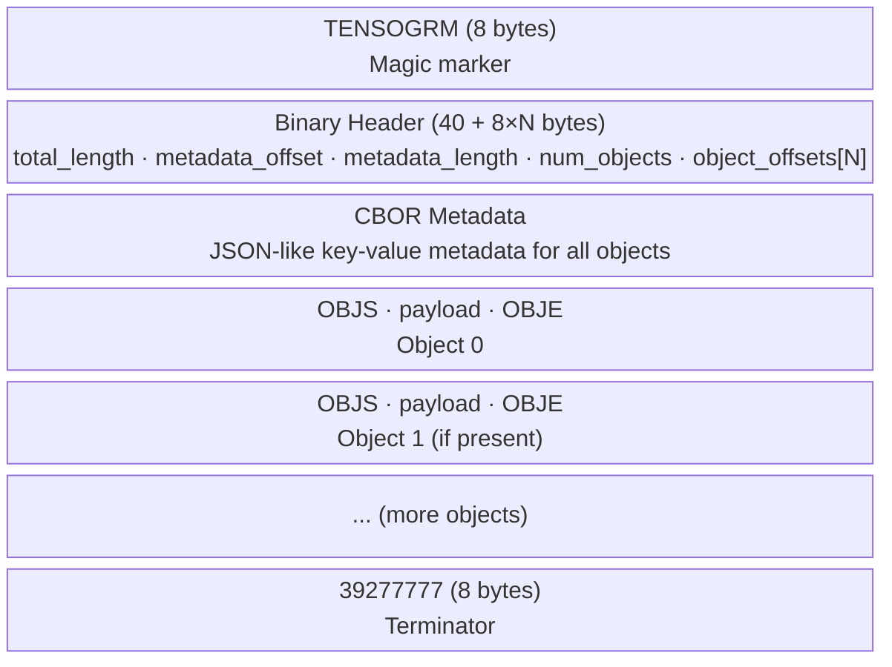

# What is a Message?

A Tensogram **message** is a single, self-contained binary blob. It carries:

1. A **binary header** — fixed-size index for fast, random access to any object
2. **CBOR metadata** — a compact, flexible key-value store describing all objects
3. One or more **payload blocks** — the actual tensor bytes, optionally encoded and compressed

Every message begins with the ASCII string `TENSOGRM` and ends with `39277777`. This makes it trivial to find message boundaries even in a file containing hundreds of concatenated messages.

## Structure at a Glance



## Why the Binary Header?

The binary header holds the byte offset of every object payload inside the message. This makes it possible to jump directly to object 3 without scanning through objects 0, 1, and 2. That is O(1) random access, which matters when a message carries many large tensors.

## Messages vs Files

A `.tgm` file is just a sequence of messages written one after another:

```
[message 1][message 2][message 3]...
```

There is no file-level index or header. The `TensogramFile` API scans the file once (lazily, on first access) and builds an in-memory list of `(offset, length)` pairs for each message. After that, reading any message is a seek + read — no scan needed.

## Self-Description

Every message carries all the information needed to decode it:

- The dtype of every object (float32, int16, etc.)
- The shape and strides (dimensions and memory layout)
- The encoding applied to the payload (none, simple_packing, etc.)
- Any application-level metadata (MARS keys, units, timestamps, etc.)

This means a decoder never needs an external schema. You can receive a Tensogram message on a new machine, years after it was encoded, and decode it correctly.

## Edge Case: Zero-Object Messages

A message with no objects is valid. It contains only the binary header and CBOR metadata. This is useful for sending pure metadata (e.g. a control message or an acknowledgement with provenance information) without any tensor payload.

```rust
let metadata = Metadata {
    version: 1,
    objects: vec![],
    payload: vec![],
    extra: BTreeMap::new(),
};
let msg = encode(&metadata, &[], &EncodeOptions::default()).unwrap();
```
