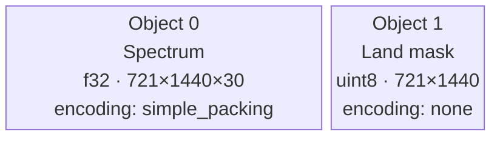

# Objects and Dtypes

An **object** is one N-dimensional tensor inside a message. A message can carry multiple objects. Each object has:

- A **descriptor** in the `objects` array (shape, dtype, strides, extra metadata)
- A **payload descriptor** in the `payload` array (encoding, filter, compression, hash)
- The actual **binary payload** between its `OBJS`/`OBJE` markers

The two arrays are always the same length and correspond by index: `objects[0]` pairs with `payload[0]`, and so on.

## Object Descriptor

```rust
ObjectDescriptor {
    obj_type: "ntensor",   // always "ntensor" for now
    ndim: 2,               // number of dimensions
    shape: vec![100, 200], // size of each dimension
    strides: vec![200, 1], // elements to skip per dimension step
    dtype: Dtype::Float32, // element type
    extra: BTreeMap::new(), // any extra metadata
}
```

### Strides

Strides tell you how to navigate the memory layout. For a C-contiguous (row-major) array of shape `[100, 200]`:

- Advancing along axis 0 (rows) skips 200 elements
- Advancing along axis 1 (columns) skips 1 element

So `strides = [200, 1]`. For a Fortran-contiguous (column-major) array the strides would be reversed: `[1, 100]`.

To compute C-contiguous strides from shape:

```rust
fn compute_strides(shape: &[u64]) -> Vec<u64> {
    let mut strides = vec![1u64; shape.len()];
    for i in (0..shape.len() - 1).rev() {
        strides[i] = strides[i + 1] * shape[i + 1];
    }
    strides
}
// shape [100, 200] → strides [200, 1]
// shape [4, 5, 6]  → strides [30, 6, 1]
```

## Supported Data Types

| Name | Size | Description |
|---|---|---|
| `float16` | 2 bytes | IEEE 754 half-precision float |
| `bfloat16` | 2 bytes | Brain float (truncated float32) |
| `float32` | 4 bytes | IEEE 754 single-precision float |
| `float64` | 8 bytes | IEEE 754 double-precision float |
| `complex64` | 8 bytes | Two float32 (real + imag) |
| `complex128` | 16 bytes | Two float64 (real + imag) |
| `int8` | 1 byte | Signed integer |
| `int16` | 2 bytes | Signed integer |
| `int32` | 4 bytes | Signed integer |
| `int64` | 8 bytes | Signed integer |
| `uint8` | 1 byte | Unsigned integer |
| `uint16` | 2 bytes | Unsigned integer |
| `uint32` | 4 bytes | Unsigned integer |
| `uint64` | 8 bytes | Unsigned integer |
| `bitmask` | < 1 byte | Packed bits (sub-byte; size depends on element count) |

> **Edge case:** `bitmask` returns `0` from `byte_width()`. Callers that need the actual byte count must compute it from the element count: `(num_elements + 7) / 8`.

## Payload Descriptor

```rust
PayloadDescriptor {
    byte_order: ByteOrder::Big,          // big or little endian
    encoding: "simple_packing".to_string(), // or "none"
    filter: "shuffle".to_string(),          // or "none"
    compression: "none".to_string(),        // or "szip" (stub)
    params: BTreeMap::new(),                // encoding parameters
    hash: Some(HashDescriptor { ... }),     // optional integrity hash
}
```

Each object has its **own** payload descriptor, so different objects in the same message can use different encodings, byte orders, and hash algorithms.

## Multiple Objects in One Message

A common use case: a sea wave spectrum message carries one tensor for the spectrum itself and a second tensor for land/sea mask metadata:



Both share the same CBOR metadata section, including the forecast date, step, and MARS keys.

> **Edge case:** The number of entries in `objects`, `payload`, and the data slices passed to `encode()` must all be equal. The encoder returns an error if they do not match.
