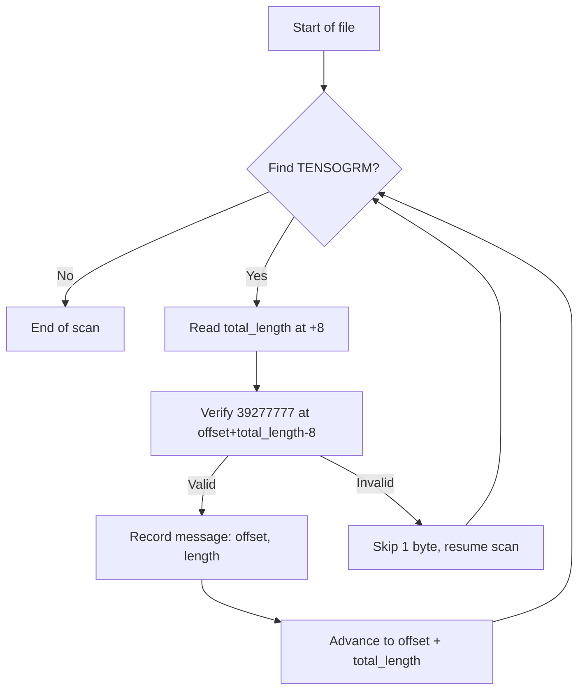

# Message Layout

This page describes the exact byte layout of a Tensogram message. You need this if you are implementing a reader in another language or debugging a corrupted file.

## Overview

```
Offset  Size    Field
──────  ──────  ─────────────────────────────────────────────────────────────
0       8       Magic: "TENSOGRM" (ASCII, no null terminator)
8       8       total_length (big-endian uint64, includes magic + terminator)
16      8       metadata_offset (byte offset of CBOR section from start)
24      8       metadata_length (byte length of CBOR section)
32      8       num_objects (N)
40      8×N     object_offsets[0..N] (byte offsets of each OBJS marker)
40+8N   varies  CBOR metadata bytes
...     varies  Object payloads (each: OBJS · data · OBJE)
end-8   8       Terminator: "39277777" (ASCII)
```

All integer fields are **big-endian** (network byte order).

## Binary Header in Detail

The fixed header is always 40 bytes, followed by 8 bytes per object for the offset table:

```
Bytes 0–7:   54 45 4E 53 4F 47 52 4D   "TENSOGRM"
Bytes 8–15:  00 00 00 00 00 01 23 45   total_length = 74565
Bytes 16–23: 00 00 00 00 00 00 00 38   metadata_offset = 56 (right after header)
Bytes 24–31: 00 00 00 00 00 00 01 C0   metadata_length = 448
Bytes 32–39: 00 00 00 00 00 00 00 02   num_objects = 2
Bytes 40–47: 00 00 00 00 00 00 02 00   object_offsets[0] = 512
Bytes 48–55: 00 00 00 00 00 00 84 00   object_offsets[1] = 33792
```

Header size = `40 + num_objects × 8` bytes.

## Object Payloads

Each object payload is wrapped in OBJS/OBJE markers (4 bytes each):

```
4 bytes:   "OBJS" (ASCII)
N bytes:   encoded payload bytes
4 bytes:   "OBJE" (ASCII)
```

The `object_offsets` array in the header points to the start of each `OBJS` marker, so a decoder can seek directly to any object without scanning the others.

## Terminator

The last 8 bytes of every message are `39277777` (ASCII). This pattern was chosen because it is unlikely to appear naturally in floating-point or integer data, making it safe to use as a corruption boundary detector.

## Scanning a Multi-Message File

To find all messages in a file, scan forward looking for the `TENSOGRM` magic bytes. When found, read `total_length` from bytes 8–15 to know how far to advance. Verify the terminator at `offset + total_length - 8`.



If the terminator does not match, the message is corrupt. The scanner skips one byte and resumes searching for the next `TENSOGRM` start — this is the **corruption recovery** path.

## Partial Decode

Because the header contains `metadata_offset` and `metadata_length`, a decoder can read only the CBOR metadata without touching any payload:

```rust
let meta = decode_metadata(&message_bytes)?;
// No object bytes were read or allocated
```

And because `object_offsets` gives the position of each `OBJS` marker, the decoder can seek to and read a single object by index without reading the others:

```rust
let (descriptor, payload) = decode_object(&message_bytes, 2, &DecodeOptions::default())?;
// Objects 0 and 1 were never read
```
