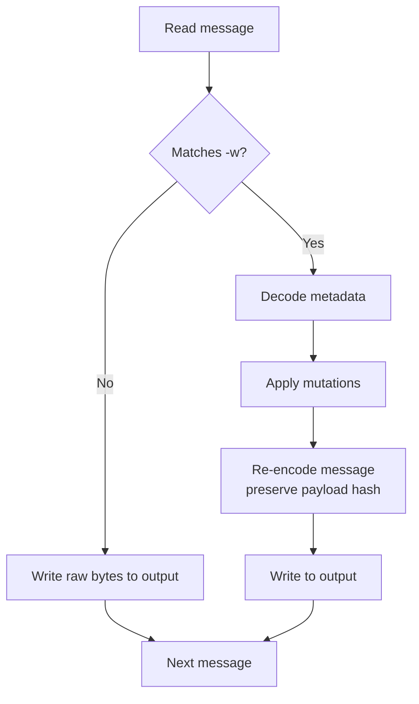

# tensogram set

Modifies metadata keys in messages and writes the result to a new file. Matching messages are decoded, their metadata is updated, and they are re-encoded with the original payload bytes and pipeline settings.

## Usage

```
tensogram set [OPTIONS] <INPUT> <OUTPUT> <KEY=VALUE>[,KEY=VALUE...]
```

## Options

| Option | Description |
|---|---|
| `-w, --where <EXPR>` | Only modify messages that match this filter |

## Examples

```bash
# Change mars.date to 20260402 in all messages
tensogram set input.tgm output.tgm mars.date=20260402

# Set multiple keys at once
tensogram set input.tgm output.tgm mars.date=20260402,mars.step=12

# Only modify temperature fields
tensogram set input.tgm output.tgm mars.class=rd -w "mars.param=2t"
```

## Key=Value Syntax

Multiple mutations can be specified as a comma-separated list:

```
tensogram set in.tgm out.tgm key1=val1,key2=val2,key3=val3
```

Keys use dot-notation: `mars.param` sets the `param` field inside the `mars` namespace. A top-level key like `experiment` sets a top-level metadata field.

Object-level metadata can be updated with `objects.<index>.<path>`:

```bash
# Add object-specific metadata to the first object
tensogram set input.tgm output.tgm objects.0.processing.version=2
```

## Structural/Integrity Keys

The following keys **cannot** be modified because they describe the physical structure of the payload. Changing them would make the metadata inconsistent with the actual bytes on disk:

| Key | Reason |
|---|---|
| `shape` | Tensor dimensions |
| `strides` | Memory layout |
| `dtype` | Element type |
| `ndim` | Number of dimensions |
| `type` | Object type |
| `encoding` | Encoding algorithm |
| `filter` | Filter algorithm |
| `compression` | Compression algorithm |
| `hash` | Payload integrity hash |
| `szip_rsi` | Szip compression block parameter |
| `szip_block_size` | Szip compression block parameter |
| `szip_flags` | Szip compression flags |
| `szip_block_offsets` | Szip block seek table |
| `reference_value` | Simple packing quantization parameter |
| `binary_scale_factor` | Simple packing quantization parameter |
| `decimal_scale_factor` | Simple packing quantization parameter |
| `bits_per_value` | Simple packing quantization parameter |
| `shuffle_element_size` | Shuffle filter parameter |

Attempting to modify any of these returns an error before any output is written.

## Pass-Through for Non-Matching Messages

Messages that do not match the `-w` filter are copied verbatim to the output file. Their bytes are not re-encoded or re-hashed.

> **Note:** Messages that are modified are re-encoded after the metadata mutation. Because the decoded payload bytes are unchanged, `set` preserves the original payload hash instead of recomputing it.

## Workflow


