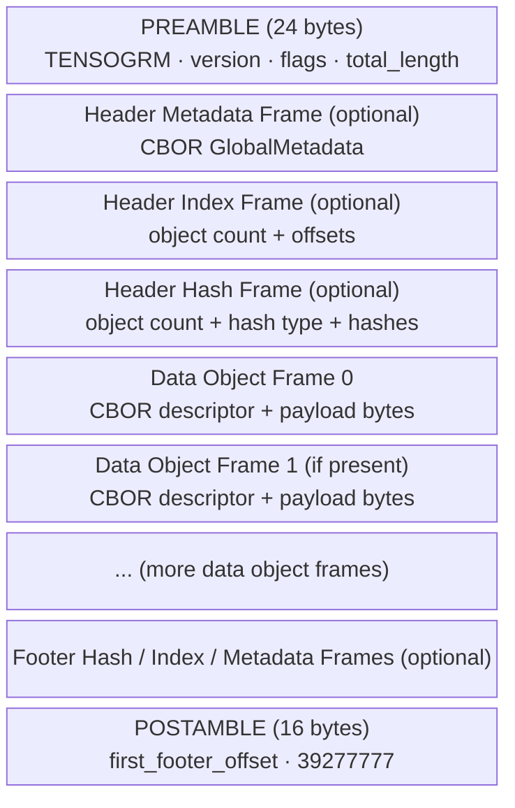

# What is a Message?

A Tensogram **message** is a single, self-contained binary blob. It carries:

1. A **Preamble** -- fixed-size header with magic bytes, version, flags, and total length
2. Optional **header frames** -- metadata, index, and hash frames for fast random access
3. One or more **data object frames** -- each containing a CBOR descriptor and the actual tensor bytes
4. Optional **footer frames** -- metadata, index, and hash frames (used in streaming mode)
5. A **Postamble** -- footer offset and terminator magic

Every message begins with the ASCII string `TENSOGRM` and ends with `39277777`. This makes it trivial to find message boundaries even in a file containing hundreds of concatenated messages.

## Structure at a Glance



## Frame-Based Design

The v2 wire format is entirely **frame-based**. Every piece of data between the Preamble and Postamble is wrapped in a frame. Each frame starts with a 4-byte marker (`FR` + a uint16 frame type), a version, flags, and a length field. This uniform structure means a decoder can skip any frame it does not understand by jumping over its declared length.

Frame types:

| Type ID | Name | Location |
|---|---|---|
| 1 | Header Metadata Frame | Header |
| 2 | Header Index Frame | Header |
| 3 | Header Hash Frame | Header |
| 4 | Data Object Frame | Body |
| 5 | Footer Hash Frame | Footer |
| 6 | Footer Index Frame | Footer |
| 7 | Footer Metadata Frame | Footer |

Padding between frames is allowed (from `ENDF` to the next `FR` marker) for 64-bit memory alignment.

## Why Header Frames?

When a message is encoded in a single buffer (the common case), the index and hash frames are placed in the **header**, right after the Preamble. A decoder reads the Preamble, then the metadata frame, then the index frame, and can immediately seek to any data object by offset. That is O(1) random access, which matters when a message carries many large tensors.

## Streaming Support

When encoding in streaming mode, the producer may not know in advance how many data objects the message will contain. In this case:

- `total_length` in the Preamble is set to **0** (unknown)
- Index and hash frames are written in the **footer** instead of the header
- The Postamble's `first_footer_offset` field points back to where the footer frames begin

A decoder reading a streamed message seeks to the end, reads the Postamble, then jumps to the footer frames to find the index. Both paths (header index and footer index) give O(1) access to any object.

## Data Object Frames

Each data object is self-contained in its own frame. The frame carries:

- A **CBOR descriptor** (`DataObjectDescriptor`) describing the tensor shape, dtype, encoding pipeline, and optional hash
- The **binary payload** (the actual encoded tensor bytes)

The CBOR descriptor can appear before or after the payload within the frame. By default it is placed after the payload, since some encoding parameters (like hash values) are only known after the payload has been written. A flag in the frame header indicates the position.

## Messages vs Files

A `.tgm` file is just a sequence of messages written one after another:

```
[message 1][message 2][message 3]...
```

There is no file-level index or header. The `TensogramFile` API scans the file once (lazily, on first access) and builds an in-memory list of `(offset, length)` pairs for each message. After that, reading any message is a seek + read -- no scan needed.

To find message boundaries in a file:

1. Scan for `TENSOGRM` magic (8 bytes)
2. If `total_length` is non-zero, use it to advance to the next message
3. Otherwise, walk frames using their length fields until the next magic or EOF

## Self-Description

Every message carries all the information needed to decode it:

- The dtype of every object (float32, int16, etc.)
- The shape and strides (dimensions and memory layout)
- The full encoding pipeline applied to the payload (encoding, filter, compression)
- The byte order of each object's data
- Any application-level metadata (MARS keys, units, timestamps, etc.)

This means a decoder never needs an external schema. You can receive a Tensogram message on a new machine, years after it was encoded, and decode it correctly.

## Edge Case: Zero-Object Messages

A message with no data object frames is valid. It contains only the Preamble, a metadata frame, and the Postamble. This is useful for sending pure metadata (e.g. a control message or an acknowledgement with provenance information) without any tensor payload.

```rust
let metadata = GlobalMetadata {
    version: 2,
    extra: BTreeMap::new(),
};
let msg = encode(&metadata, &[], &EncodeOptions::default()).unwrap();
```
