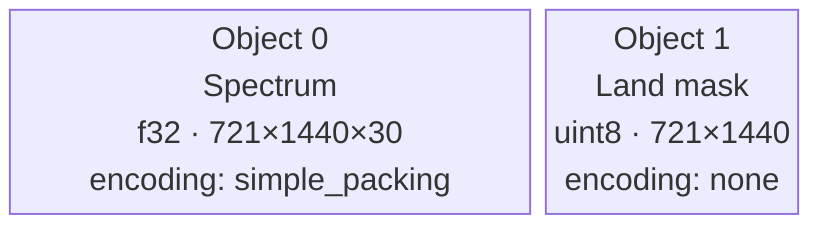

# Objects and Dtypes

An **object** is one N-dimensional tensor inside a message. A message can carry multiple objects. In v2, each object is fully described by a single struct:

- A **`DataObjectDescriptor`** carrying tensor metadata, encoding pipeline, and integrity hash -- all in one place
- The actual **binary payload** within the object's frame

There is no separate "payload descriptor" array. The descriptor travels with the data inside the same frame.

## DataObjectDescriptor

```rust
DataObjectDescriptor {
    // ── Tensor metadata ──
    obj_type: "ntensor",           // always "ntensor" for now
    ndim: 2,                       // number of dimensions
    shape: vec![100, 200],         // size of each dimension
    strides: vec![200, 1],         // elements to skip per dimension step
    dtype: Dtype::Float32,         // element type

    // ── Encoding pipeline ──
    byte_order: ByteOrder::Big,    // big or little endian
    encoding: "simple_packing",    // or "none"
    filter: "shuffle",             // or "none"
    compression: "szip",           // or "none", "zstd", "lz4", etc.

    // ── Optional NaN / Inf bitmask companion ──
    masks: None,                   // or Some(MasksMetadata { .. })

    // ── Flexible parameters (encoding only) ──
    params: BTreeMap::from([       // BTreeMap<String, ciborium::Value>
        ("sp_reference_value".into(), ciborium::Value::Float(230.5)),
        ("sp_bits_per_value".into(), ciborium::Value::Integer(16.into())),
    ]),
}
```

In v3 the per-object integrity hash lives in an **inline 8-byte slot in the frame footer**, not on the descriptor. The slot is populated when the message's `HASHES_PRESENT` preamble flag is set (the default).

The `params` map is flattened into the CBOR alongside the fixed fields, so the on-wire CBOR is a single flat map. This keeps things simple for decoders -- no nested "encoding" or "tensor" sub-objects to navigate.

Each data object has its **own** descriptor, so different objects in the same message can use different encodings, byte orders, and hash algorithms.

### Strides

Strides tell you how to navigate the memory layout. For a C-contiguous (row-major) array of shape `[100, 200]`:

- Advancing along axis 0 (rows) skips 200 elements
- Advancing along axis 1 (columns) skips 1 element

So `strides = [200, 1]`. For a Fortran-contiguous (column-major) array the strides would be reversed: `[1, 100]`.

To compute C-contiguous strides from shape:

```rust
fn compute_strides(shape: &[u64]) -> Vec<u64> {
    let mut strides = vec![1u64; shape.len()];
    for i in (0..shape.len() - 1).rev() {
        strides[i] = strides[i + 1] * shape[i + 1];
    }
    strides
}
// shape [100, 200] → strides [200, 1]
// shape [4, 5, 6]  → strides [30, 6, 1]
```

## Supported Data Types

| Name | Size | Description |
|---|---|---|
| `float16` | 2 bytes | IEEE 754 half-precision float |
| `bfloat16` | 2 bytes | Brain float (truncated float32) |
| `float32` | 4 bytes | IEEE 754 single-precision float |
| `float64` | 8 bytes | IEEE 754 double-precision float |
| `complex64` | 8 bytes | Two float32 (real + imag) |
| `complex128` | 16 bytes | Two float64 (real + imag) |
| `int8` | 1 byte | Signed integer |
| `int16` | 2 bytes | Signed integer |
| `int32` | 4 bytes | Signed integer |
| `int64` | 8 bytes | Signed integer |
| `uint8` | 1 byte | Unsigned integer |
| `uint16` | 2 bytes | Unsigned integer |
| `uint32` | 4 bytes | Unsigned integer |
| `uint64` | 8 bytes | Unsigned integer |
| `bitmask` | < 1 byte | Packed bits (sub-byte; size depends on element count) |

> **Edge case:** `bitmask` returns `0` from `byte_width()`. Callers that need the actual byte count must compute it from the element count: `(num_elements + 7) / 8`.

## Multiple Objects in One Message

A message can carry several related tensors. Two concrete examples:

- A **wave-spectrum message** with the spectrum itself as a 3-tensor and a
  land/sea mask as a 2-tensor.
- A **medical-imaging message** with a 4-D time-series volume, a 3-D
  segmentation mask, and a 1-D array of acquisition timestamps.



All objects live in the same message. Each object has its own
`DataObjectDescriptor` embedded in its frame and its own entry in
`GlobalMetadata.base` holding per-object application metadata. Different
objects can use completely different encoding pipelines.

> **Edge case:** The number of `DataObjectDescriptor` entries and the data slices passed to `encode()` must be equal. The encoder returns an error if they do not match.
