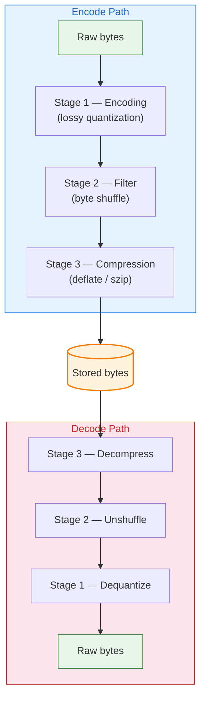

# The Encoding Pipeline

Every object payload passes through a three-stage pipeline on the way in (encoding) and out (decoding). The stages always run in the same order:

Each stage is **independently configurable per object**. Set a stage to `"none"` to skip it.

## Stage 1: Encoding

Encoding transforms values to reduce the number of bits needed to represent them. The only supported encoding right now is `simple_packing` — a GRIB-style lossy quantization that maps a range of floating-point values onto N-bit integers.

| Value | Meaning |
|---|---|
| `"none"` | Pass through unchanged |
| `"simple_packing"` | Lossy quantization (see [Simple Packing](../encodings/simple-packing.md)) |

## Stage 2: Filter

Filters rearrange bytes to improve compression ratios. The shuffle filter reorders bytes by their significance level (all most-significant bytes first, then all second-most-significant bytes, etc.), which makes float data much more compressible because nearby values have similar high bytes.

| Value | Meaning |
|---|---|
| `"none"` | Pass through unchanged |
| `"shuffle"` | Byte-level shuffle (see [Byte Shuffle Filter](../encodings/shuffle.md)) |

## Stage 3: Compression

Compression reduces the total byte count. The library currently supports only `"none"` in production. Szip/libaec is stubbed — the trait exists, but the bindings to the C library are not yet implemented.

| Value | Meaning |
|---|---|
| `"none"` | Pass through unchanged |
| `"szip"` | Szip/libaec compression (stub — returns an error) |

## Typical Combinations

| Use case | encoding | filter | compression |
|---|---|---|---|
| Exact integers (land mask) | `none` | `none` | `none` |
| Lossy floats (temperature) | `simple_packing` | `none` | `none` |
| Best compression (floats) | `none` | `shuffle` | *(future szip)* |
| GRIB-compatible packing | `simple_packing` | `none` | `none` |

## Integrity Hashing

After all three stages, the stored bytes can be hashed. The hash is stored in the payload descriptor alongside the encoded bytes. On decode, if `verify_hash: true` is set, the hash is recomputed and compared.

| Algorithm | Hash length | Notes |
|---|---|---|
| `xxh3` | 16 hex chars (64-bit) | Default. Fast, non-cryptographic |
| `sha1` | 40 hex chars | Slower. Use for archival |
| `md5` | 32 hex chars | Legacy compatibility |

> **Edge case:** The hash covers the **stored bytes** (after encoding + filter + compression), not the original raw bytes. This means a hash mismatch always indicates storage or transmission corruption, not a quantization difference from lossy encoding.
