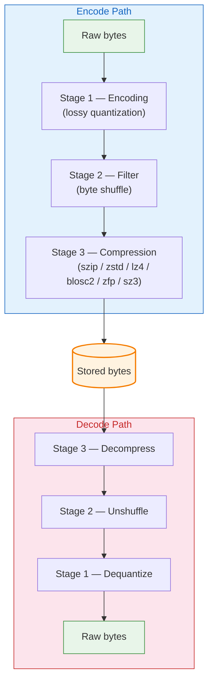

# The Encoding Pipeline

Every object payload passes through a three-stage pipeline on the way in (encoding) and out (decoding). The stages always run in the same order:



Each stage is **independently configurable per object** via fields in the `DataObjectDescriptor`. Set a stage to `"none"` to skip it. For callers with already-encoded payloads, a pipeline-bypass option exists via `encode_pre_encoded` (see [Pre-encoded Payloads](../guide/encode-pre-encoded.md)).

## Stage 1: Encoding

Encoding transforms values to reduce the number of bits needed to represent them. The only supported encoding right now is `simple_packing` — a lossy quantisation that maps a bounded range of floating-point values onto N-bit integers. The bit layout matches GRIB 2 simple_packing so quantised payloads are interoperable with existing GRIB tooling.

| Value | Meaning |
|---|---|
| `"none"` | Pass through unchanged |
| `"simple_packing"` | Lossy quantization (see [Simple Packing](../encodings/simple-packing.md)) |

## Stage 2: Filter

Filters rearrange bytes to improve compression ratios. The shuffle filter reorders bytes by their significance level (all most-significant bytes first, then all second-most-significant bytes, etc.), which makes float data much more compressible because nearby values have similar high bytes.

| Value | Meaning |
|---|---|
| `"none"` | Pass through unchanged |
| `"shuffle"` | Byte-level shuffle (see [Byte Shuffle Filter](../encodings/shuffle.md)) |

## Stage 3: Compression

Compression reduces the total byte count. Seven compressors are implemented:

| Value | Type | Random Access | Notes |
|---|---|---|---|
| `"none"` | Pass-through | Yes | No compression |
| `"szip"` | Lossless | Yes | CCSDS 121.0-B-3 via libaec |
| `"zstd"` | Lossless | No | Excellent ratio/speed tradeoff |
| `"lz4"` | Lossless | No | Fastest decompression |
| `"blosc2"` | Lossless | Yes | Multi-codec, chunk-level access |
| `"zfp"` | Lossy | Yes (fixed-rate) | Floating-point arrays |
| `"sz3"` | Lossy | No | Error-bounded scientific data |

See [Compression](../encodings/compression.md) for full details on each compressor, including parameters and random access support.

> **Note**: ZFP and SZ3 operate directly on typed floating-point data. Use them with `encoding: "none"` and `filter: "none"` -- they replace both encoding and compression.

## Typical Combinations

| Use case | encoding | filter | compression |
|---|---|---|---|
| Exact integers (e.g. a mask) | `none` | `none` | `none` |
| Lossy bounded-range floats | `simple_packing` | `none` | `szip` |
| Best lossless (floats) | `none` | `shuffle` | `szip` or `blosc2` |
| GRIB 2 CCSDS-interoperable | `simple_packing` | `none` | `szip` |
| Real-time streaming | `none` | `none` | `lz4` |
| Archival storage | `none` | `shuffle` | `zstd` |
| ML model weights | `none` | `none` | `blosc2` |
| Lossy float w/ random access | `none` | `none` | `zfp` (fixed_rate) |
| Error-bounded science | `none` | `none` | `sz3` |

## How It Looks in Code

The entire pipeline is configured through the `DataObjectDescriptor`:

```rust
DataObjectDescriptor {
    obj_type: "ntensor".into(),
    ndim: 2,
    shape: vec![721, 1440],
    strides: vec![1440, 1],
    dtype: Dtype::Float32,
    byte_order: ByteOrder::Big,
    encoding: "simple_packing".into(),
    filter: "none".into(),
    compression: "szip".into(),
    masks: None,
    params: BTreeMap::from([
        ("sp_reference_value".into(), Value::Float(230.5)),
        ("sp_bits_per_value".into(), Value::Integer(16.into())),
    ]),
}
```

All encoding parameters (reference_value, bits_per_value, szip_block_offsets, etc.) go into the `params` map. The encoder populates additional params during encoding (like block offsets for szip), and the decoder reads them back.

## Integrity Hashing

Every frame ends with an **inline 8-byte hash slot** followed by the `ENDF` marker. For data object frames, the slot lives at `frame_end − 12`, and the hash covers the frame body (payload + any mask blobs + CBOR descriptor). Populating the slot is controlled message-wide via the `HASHES_PRESENT` preamble flag, set by `EncodeOptions.hash_algorithm = Some(HashAlgorithm::Xxh3)` (the default).

To verify integrity after decoding, run `tensogram validate --checksum`. The validator walks every frame and recomputes the xxh3-64 digest against the stored slot without parsing CBOR on the fast path.

| Algorithm | Hash length | Notes |
|---|---|---|
| `xxh3` | 8-byte raw / 16 hex chars (64-bit) | Default. Fast, non-cryptographic |

> **Edge case:** The hash covers the **frame body only** — header, `cbor_offset`, the hash slot itself, and the `ENDF` marker are not part of the hashed region.
