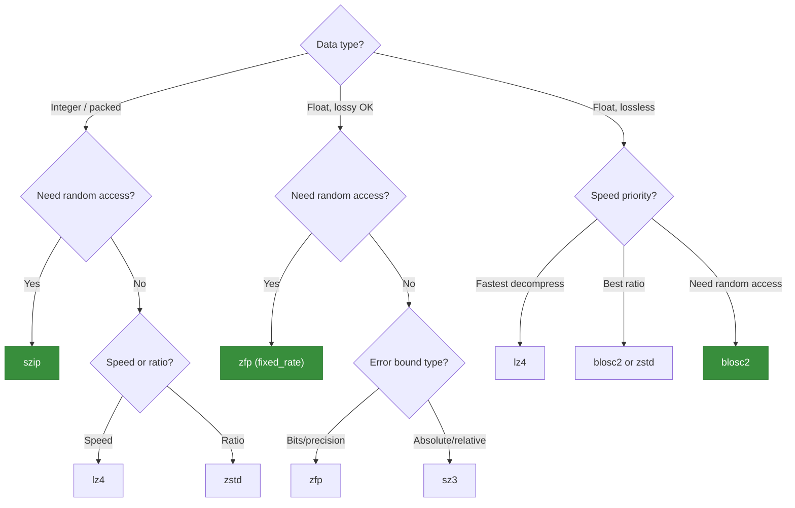

# Compression

Compression is the third stage of the encoding pipeline. It reduces the total byte count of the already-encoded and filtered payload.

## Supported Compressors

| Compressor | Type | Random Access | Notes |
|---|---|---|---|
| `none` | Pass-through | Yes (trivial) | No compression |
| `szip` | Lossless | Yes (RSI blocks) | CCSDS 121.0-B-3 via libaec. Best for integer/packed data |
| `zstd` | Lossless | No | Zstandard. Excellent ratio/speed tradeoff |
| `lz4` | Lossless | No | Fastest decompression. Good for real-time pipelines |
| `blosc2` | Lossless | Yes (chunks) | Multi-codec meta-compressor with chunk-level access |
| `zfp` | Lossy | Yes (fixed-rate) | Purpose-built for floating-point arrays |
| `sz3` | Lossy | No | Error-bounded lossy compression for scientific data |

## The Compressor Trait

All compressors implement a common interface with three operations:

```rust
pub trait Compressor {
    fn compress(&self, data: &[u8]) -> Result<CompressResult, CompressionError>;
    fn decompress(&self, data: &[u8], expected_size: usize) -> Result<Vec<u8>, CompressionError>;
    fn decompress_range(
        &self,
        data: &[u8],
        block_offsets: &[u64],
        byte_pos: usize,
        byte_size: usize,
    ) -> Result<Vec<u8>, CompressionError>;
}
```

`decompress_range` enables partial decode without decompressing the entire payload. Compressors that don't support it return `CompressionError::RangeNotSupported`.

## Lossless Compressors

### Szip (libaec)

Szip implements CCSDS 121.0-B-3, a lossless compressor designed for scientific data. It works on integer data and exploits the block structure of packed values.

**Random access**: Szip records RSI (Reference Sample Interval) block boundaries during encoding. These offsets are stored in metadata as `szip_block_offsets`, enabling seek-to-block partial decode via `decompress_range`. When using `encode_pre_encoded`, the caller must provide these bit-precise block offsets themselves to enable random access (see [Pre-encoded Payloads](../guide/encode-pre-encoded.md)).

| Parameter | Type | Description |
|---|---|---|
| `szip_rsi` | uint | Reference sample interval (samples per RSI block) |
| `szip_block_size` | uint | Block size (typically 8 or 16) |
| `szip_flags` | uint | AEC encoding flags (e.g., `AEC_DATA_PREPROCESS`) |
| `szip_block_offsets` | array of uint | Bit offsets of RSI block boundaries (computed during encoding) |

> **Important**: libaec encodes integers only. For floating-point data, use either:
> - `simple_packing` → `szip` (lossy quantization to integers, then compress)
> - `shuffle` → `szip` (byte rearrangement, then compress as uint8)

### Zstd (Zstandard)

General-purpose lossless compression with excellent ratio/speed tradeoff. Widely used and well-optimized.

| Parameter | Type | Default | Description |
|---|---|---|---|
| `zstd_level` | int | 3 | Compression level (1-22). Higher = better ratio, slower |

No random access — `decode_range` is not supported with zstd.

### LZ4

Fastest decompression of any compressor in the library. Slightly lower compression ratio than Zstd, but 3-5x faster to decompress.

No configurable parameters. No random access.

### Blosc2

A meta-compressor that splits data into independently-compressed chunks, then stores them in a frame. Supports multiple internal codecs.

**Random access**: Because each chunk is independent, Blosc2 can decompress only the chunks covering the requested byte range. `decompress_range` works by mapping byte offsets to chunk indices.

| Parameter | Type | Default | Description |
|---|---|---|---|
| `blosc2_codec` | string | `"lz4"` | Internal codec: `blosclz`, `lz4`, `lz4hc`, `zlib`, `zstd` |
| `blosc2_clevel` | int | 5 | Compression level (0-9) |
| `blosc2_typesize` | uint | (auto) | Element byte width for shuffle optimization |

> `blosc2_typesize` is automatically computed from the preceding pipeline stage: dtype byte width for unencoded data, 1 for shuffled bytes, or packed byte width for simple_packing output.

## Lossy Compressors

### ZFP

Purpose-built compression for floating-point arrays. ZFP compresses data in blocks of 4 elements (1D) and supports three modes:

| Mode | Parameter | Description |
|---|---|---|
| `fixed_rate` | `zfp_rate` (float) | Fixed bits per value. Enables O(1) random access |
| `fixed_precision` | `zfp_precision` (uint) | Fixed number of uncompressed bit planes |
| `fixed_accuracy` | `zfp_tolerance` (float) | Maximum absolute error bound |

**Random access**: In fixed-rate mode, every block compresses to exactly the same number of bits. This means the byte offset of any block is computable from its index, enabling `decompress_range` without stored block offsets.

| Parameter | Type | Description |
|---|---|---|
| `zfp_mode` | string | One of `"fixed_rate"`, `"fixed_precision"`, `"fixed_accuracy"` |
| `zfp_rate` | float | Bits per value (only for `fixed_rate`) |
| `zfp_precision` | uint | Bit planes to keep (only for `fixed_precision`) |
| `zfp_tolerance` | float | Max absolute error (only for `fixed_accuracy`) |

> **Important**: ZFP operates directly on floating-point data. Use `encoding: "none"` and `filter: "none"` — ZFP replaces both encoding and compression.

### SZ3

Error-bounded lossy compression for scientific data. SZ3 uses prediction-based methods (interpolation, Lorenzo, regression) to achieve high compression ratios within strict error bounds.

| Parameter | Type | Description |
|---|---|---|
| `sz3_error_bound_mode` | string | One of `"abs"`, `"rel"`, `"psnr"` |
| `sz3_error_bound` | float | Error bound value (meaning depends on mode) |

Error bound modes:
- **`abs`** — Absolute error: `|original - decompressed| <= bound` for every element
- **`rel`** — Relative error: `|original - decompressed| / value_range <= bound`
- **`psnr`** — Peak signal-to-noise ratio lower bound

No random access — `decode_range` is not supported with SZ3.

> **Important**: Like ZFP, SZ3 operates on floating-point data. Use `encoding: "none"` and `filter: "none"`.

## Choosing a Compressor



| Use case | Recommended | Why |
|---|---|---|
| Quantised floats with partial-access support | `simple_packing` + `szip` | RSI-block random access; interoperable with GRIB 2 CCSDS packing |
| Real-time streaming | `lz4` | Fastest decompression, low latency |
| Archival storage | `zstd` (level 9-15) | Best lossless ratio |
| ML model weights | `blosc2` | Chunk random access, good for large tensors |
| Float fields, lossy OK | `zfp` (fixed_rate) | Best lossy ratio with random access |
| Error-bounded science | `sz3` (abs) | Guaranteed error bounds per element |
| Exact integers | `none` or `lz4` | No information loss |

## Invalid Combinations

Some pipeline combinations are rejected at configuration time:

| Combination | Rejected? | Reason |
|---|---|---|
| `zfp` + `shuffle` | Yes | ZFP operates on typed floats; shuffle rearranges bytes |
| `zfp` + `simple_packing` | Yes | ZFP IS the encoding for floats |
| `sz3` + `shuffle` | Yes | SZ3 operates on typed data |
| `sz3` + `simple_packing` | Yes | SZ3 IS lossy encoding for floats |
| `shuffle` + `decode_range` | Yes | Byte rearrangement breaks contiguous sample ranges |
| `zstd`/`lz4`/`sz3` + `decode_range` | Yes | Stream compressors don't support partial decode |
