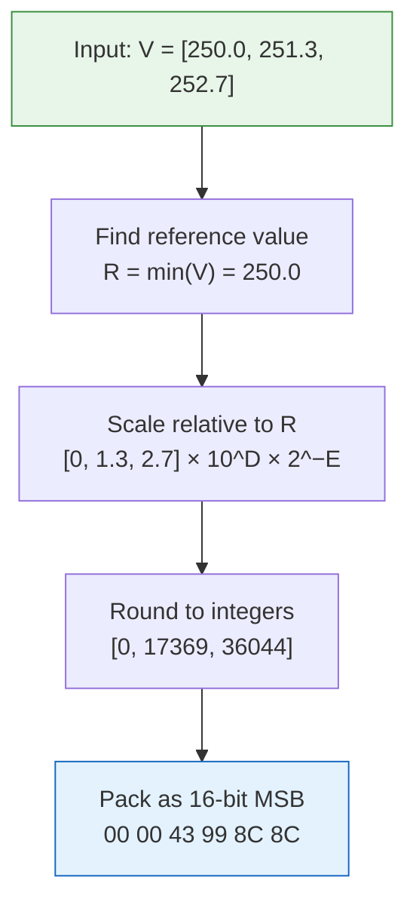

# Simple Packing

Simple packing is a **lossy compression** technique inherited from GRIB. It quantizes a range of floating-point values into N-bit integers, dramatically reducing payload size at the cost of precision.

A 16-bit simple_packing payload is 8x smaller than the equivalent float64 and 4x smaller than float32, with precision loss typically well below instrument noise in weather data.

## How It Works

Given a set of float64 values `V[i]`:

1. Find the minimum value `R` (the **reference value**).
2. Scale all values relative to R: `Y[i] = (V[i] - R) × 10^D × 2^-E`
3. Round Y[i] to the nearest integer and pack it into `B` bits (MSB first).

The parameters `D` (decimal scale factor), `E` (binary scale factor), and `B` (bits per value) are chosen automatically by `compute_params()`.



## Limitations and Edge Cases

### NaN is Rejected

`compute_params()` and `encode()` return an error if the data contains any NaN values. Simple packing has no representation for NaN (unlike IEEE 754 floats). Remove or replace NaN values before encoding.

```rust
// This will fail:
let values = vec![1.0f64, 2.0, f64::NAN, 4.0];
let params = compute_params(&values, 16, 0);
assert!(params.is_err());
```

### Constant Fields

If all values are identical (range = 0), `compute_params()` succeeds and stores everything in the reference value. All packed integers are 0. Decoding reconstructs the constant correctly.

### bits_per_value Range

Valid range: **1 to 64**. Zero bits and more than 64 bits are rejected. The practical range for weather data is 8–24 bits.

| bits_per_value | Packed values | Precision vs float64 |
|---|---|---|
| 8 | 256 levels | Coarse (rough categories) |
| 16 | 65,536 levels | Good for temperature, wind |
| 24 | 16,777,216 levels | Near-float32 precision |
| 32 | ~4 billion levels | Near-float64 for most ranges |

## API

### compute_params

```rust
pub fn compute_params(
    values: &[f64],
    bits_per_value: u8,
    decimal_scale_factor: i16,
) -> Result<PackingParams>
```

Computes the optimal packing parameters for the given data. Call this once before encoding.

```rust
let values: Vec<f64> = (0..1000).map(|i| 250.0 + i as f64 * 0.01).collect();
let params = compute_params(&values, 16, 0)?;

println!("reference_value: {}", params.reference_value);
println!("binary_scale_factor: {}", params.binary_scale_factor);
println!("bits_per_value: {}", params.bits_per_value);
```

### encode

```rust
pub fn encode(
    values: &[f64],
    params: &PackingParams,
) -> Result<Vec<u8>>
```

Encodes f64 values to a packed byte buffer using the given parameters.

### decode

```rust
pub fn decode(
    packed: &[u8],
    num_values: usize,
    params: &PackingParams,
) -> Result<Vec<f64>>
```

Decodes a packed buffer back to f64 values. The `num_values` parameter is required because the byte length alone is not enough to determine the element count (bits per value may not divide evenly into bytes).

## Precision Example

Temperature data over Europe: range 220–310 K.

| bits_per_value | Step size | Max error |
|---|---|---|
| 8 | 0.353 K | ±0.18 K |
| 12 | 0.022 K | ±0.011 K |
| 16 | 0.00137 K | ±0.00069 K |

At 16 bits, the error is smaller than any practical sensor precision.

## Full Integration Example

```rust
use tensogram_core::{encode, decode, Metadata, ObjectDescriptor, PayloadDescriptor,
                     ByteOrder, Dtype, EncodeOptions, DecodeOptions};
use tensogram_encodings::simple_packing;
use ciborium::Value;
use std::collections::BTreeMap;

// Source data: 1000 temperature values
let values: Vec<f64> = (0..1000).map(|i| 273.0 + i as f64 * 0.05).collect();
let raw: Vec<u8> = values.iter().flat_map(|v| v.to_ne_bytes()).collect();

// Compute packing parameters
let params = simple_packing::compute_params(&values, 16, 0).unwrap();

// Build payload descriptor with packing params
let mut p = BTreeMap::new();
p.insert("reference_value".into(), Value::Float(params.reference_value));
p.insert("binary_scale_factor".into(),
    Value::Integer((params.binary_scale_factor as i64).into()));
p.insert("decimal_scale_factor".into(),
    Value::Integer((params.decimal_scale_factor as i64).into()));
p.insert("bits_per_value".into(),
    Value::Integer((params.bits_per_value as i64).into()));

let metadata = Metadata {
    version: 1,
    objects: vec![ObjectDescriptor {
        obj_type: "ntensor".into(),
        ndim: 1,
        shape: vec![1000],
        strides: vec![1],
        dtype: Dtype::Float64,
        extra: BTreeMap::new(),
    }],
    payload: vec![PayloadDescriptor {
        byte_order: ByteOrder::Big,
        encoding: "simple_packing".into(),
        filter: "none".into(),
        compression: "none".into(),
        params: p,
        hash: None,
    }],
    extra: BTreeMap::new(),
};

let msg = encode(&metadata, &[&raw], &EncodeOptions::default()).unwrap();
println!("Packed size: {} bytes (was {} bytes)", msg.len(), raw.len());

let (_, objects) = decode(&msg, &DecodeOptions::default()).unwrap();
let decoded: Vec<f64> = objects[0].chunks_exact(8)
    .map(|c| f64::from_ne_bytes(c.try_into().unwrap()))
    .collect();

// Check precision
for (orig, dec) in values.iter().zip(decoded.iter()) {
    assert!((orig - dec).abs() < 0.001);
}
```
