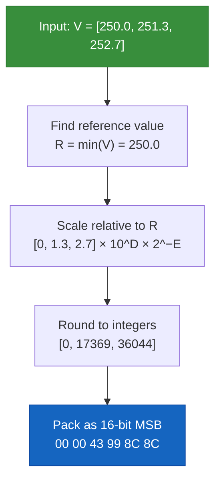

# Simple Packing

Simple packing is a **lossy quantisation** technique derived from GRIB's
simple-packing method. It quantises a range of floating-point values into
N-bit integers, dramatically reducing payload size at the cost of precision.

A 16-bit simple_packing payload is 8× smaller than the equivalent float64 and
4× smaller than float32, with precision loss typically below instrument noise
for most bounded-range scientific measurements (temperatures, voltages,
pressures, intensity counts).

## How It Works

Given a set of float64 values `V[i]`:

1. Find the minimum value `R` (the **reference value**).
2. Scale all values relative to R: `Y[i] = (V[i] - R) × 10^D × 2^-E`
3. Round Y[i] to the nearest integer and pack it into `B` bits (MSB first).

The parameters `D` (decimal scale factor), `E` (binary scale factor), and `B` (bits per value) are chosen automatically by `compute_params()`.



## Limitations and Edge Cases

### NaN and ±Infinity are Rejected

`compute_params()` and `encode()` return an error if the data
contains any NaN or ±Infinity values. Simple packing has no
representation for non-finite numbers (unlike IEEE 754 floats), and
feeding `Inf` through the range / scale-factor derivation would
produce an `i32::MAX`-saturated `binary_scale_factor` that silently
decodes to `NaN` everywhere. Both are errors at the codec entry:

- NaN → `PackingError::NanValue(index)`
- +Inf / -Inf → `PackingError::InfiniteValue(index)`

Remove or replace non-finite values before encoding.  If you want
to preserve them, switch to `encoding="none"` and opt in to the NaN
/ Inf bitmask companion via `allow_nan=true` / `allow_inf=true` —
see [NaN / Inf Handling](../guide/nan-inf-handling.md) for the full
semantics.  Simple packing cannot represent non-finite values at
all, so the mask companion is only available on the pass-through
encoding path.

```rust
// Both rejected:
let with_nan = vec![1.0_f64, 2.0, f64::NAN, 4.0];
let with_inf = vec![1.0_f64, 2.0, f64::INFINITY, 4.0];
assert!(compute_params(&with_nan, 16, 0).is_err());
assert!(compute_params(&with_inf, 16, 0).is_err());
```

### Params Safety Net

Beyond input-value validation, `encode()` also checks the
`SimplePackingParams` it receives:

- `reference_value` must be finite (`NaN` / `±Inf` → error).
- `|binary_scale_factor| ≤ 256`. The threshold catches the
  `i32::MAX`-saturation fingerprint from feeding `Inf` through
  `compute_params` indirectly; real-world data (`|bsf| ≤ 60`) fits
  comfortably. The constant `MAX_REASONABLE_BINARY_SCALE = 256` is
  exported from `tensogram_encodings::simple_packing`.

This closes the standalone-API footgun where a caller constructs or
mutates `SimplePackingParams` directly rather than deriving them
from `compute_params`. Both failures surface as
`PackingError::InvalidParams { field, reason }` with a clear message
naming the offending field.

### Constant Fields

If all values are identical (range = 0), `compute_params()` succeeds and stores everything in the reference value. All packed integers are 0. Decoding reconstructs the constant correctly.

### bits_per_value Range

Valid range: **0 to 64**. More than 64 bits is rejected. Zero bits is accepted — `compute_params` stores the first value as the reference value (not the minimum) and `encode` produces an empty byte buffer. Decode reconstructs the reference value for every element, so this is only lossless for constant fields. Typical range for scientific floating-point data is 8–24 bits.

| bits_per_value | Packed values | Precision vs float64 |
|---|---|---|
| 8 | 256 levels | Coarse (rough categories) |
| 16 | 65,536 levels | Good for temperature, wind |
| 24 | 16,777,216 levels | Near-float32 precision |
| 32 | ~4 billion levels | Near-float64 for most ranges |

## API

### compute_params

```rust
pub fn compute_params(
    values: &[f64],
    bits_per_value: u32,
    decimal_scale_factor: i32,
) -> Result<SimplePackingParams, PackingError>
```

Computes the optimal packing parameters for the given data. Call this once before encoding.

```rust
let values: Vec<f64> = (0..1000).map(|i| 250.0 + i as f64 * 0.01).collect();
let params = compute_params(&values, 16, 0)?;

println!("reference_value: {}", params.reference_value);
println!("binary_scale_factor: {}", params.binary_scale_factor);
println!("bits_per_value: {}", params.bits_per_value);
```

### encode

```rust
pub fn encode(
    values: &[f64],
    params: &SimplePackingParams,
) -> Result<Vec<u8>, PackingError>
```

Encodes f64 values to a packed byte buffer using the given parameters.

### decode

```rust
pub fn decode(
    packed: &[u8],
    num_values: usize,
    params: &SimplePackingParams,
) -> Result<Vec<f64>, PackingError>
```

Decodes a packed buffer back to f64 values. The `num_values` parameter is required because the byte length alone is not enough to determine the element count (bits per value may not divide evenly into bytes).

## Precision Example

Consider a bounded-range scalar field spanning 90 units (e.g. a temperature
field 220–310 K, a pressure field 950–1040 hPa, or any analogous bounded
scientific quantity):

| bits_per_value | Step size | Max error |
|---|---|---|
| 8 | 0.353 units | ±0.18 units |
| 12 | 0.022 units | ±0.011 units |
| 16 | 0.00137 units | ±0.00069 units |

At 16 bits, the error is smaller than most practical sensor precisions. The
same analysis applies to any physical quantity with a bounded dynamic range.

## Full Integration Example

```rust
use tensogram::{encode, decode, GlobalMetadata, DataObjectDescriptor,
                     ByteOrder, Dtype, EncodeOptions, DecodeOptions};
use tensogram_encodings::simple_packing;
use ciborium::Value;
use std::collections::BTreeMap;

// Source data: 1000 temperature values
let values: Vec<f64> = (0..1000).map(|i| 273.0 + i as f64 * 0.05).collect();
let raw: Vec<u8> = values.iter().flat_map(|v| v.to_ne_bytes()).collect();

// Compute packing parameters
let params = simple_packing::compute_params(&values, 16, 0).unwrap();

// Build descriptor with packing params
let mut p = BTreeMap::new();
p.insert("reference_value".into(), Value::Float(params.reference_value));
p.insert("binary_scale_factor".into(),
    Value::Integer((params.binary_scale_factor as i64).into()));
p.insert("decimal_scale_factor".into(),
    Value::Integer((params.decimal_scale_factor as i64).into()));
p.insert("bits_per_value".into(),
    Value::Integer((params.bits_per_value as i64).into()));

let desc = DataObjectDescriptor {
    obj_type: "ntensor".into(),
    ndim: 1,
    shape: vec![1000],
    strides: vec![1],
    dtype: Dtype::Float64,
    byte_order: ByteOrder::Big,
    encoding: "simple_packing".into(),
    filter: "none".into(),
    compression: "none".into(),
    masks: None,
    params: p,
};

let global = GlobalMetadata::default();

let msg = encode(&global, &[(&desc, &raw)], &EncodeOptions::default()).unwrap();
println!("Packed size: {} bytes (was {} bytes)", msg.len(), raw.len());

let (_, objects) = decode(&msg, &DecodeOptions::default()).unwrap();
let decoded: Vec<f64> = objects[0].1.chunks_exact(8)
    .map(|c| f64::from_ne_bytes(c.try_into().unwrap()))
    .collect();

// Check precision
for (orig, dec) in values.iter().zip(decoded.iter()) {
    assert!((orig - dec).abs() < 0.001);
}
```
