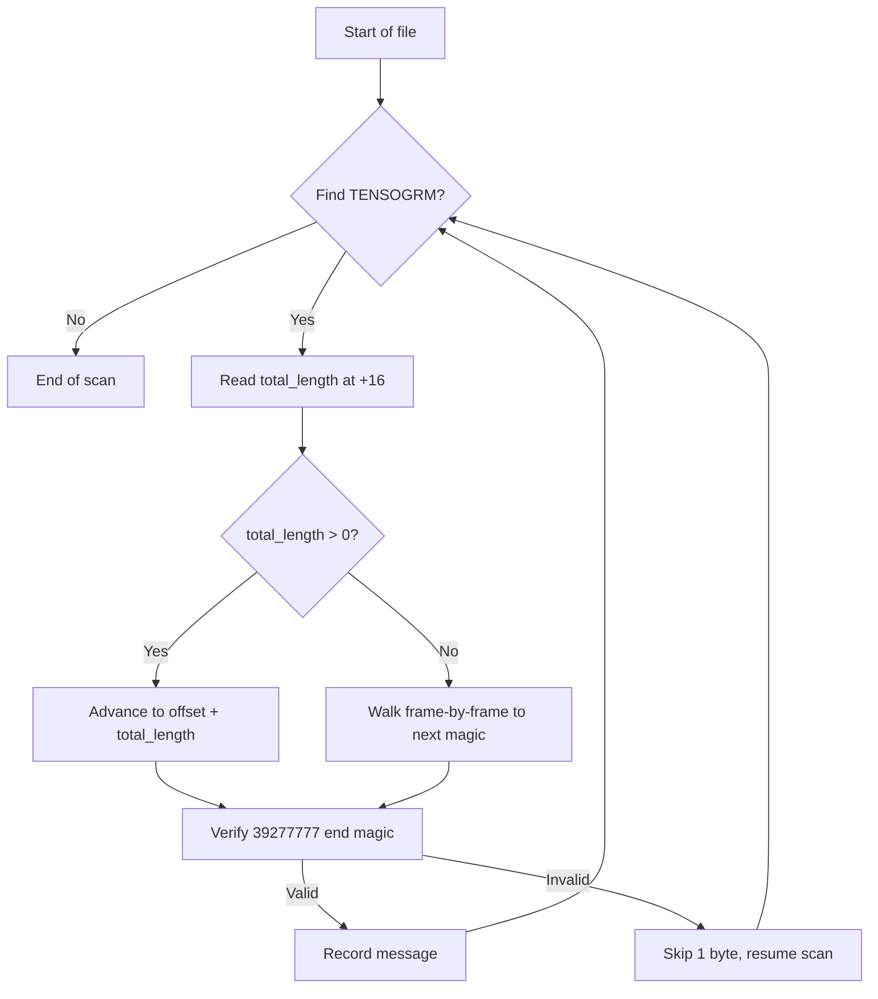

# Wire Format (v2)

This page describes the exact byte layout of a Tensogram v2 message. You need this if you are implementing a reader in another language, debugging a corrupted file, or just want to understand what is happening under the hood.

All integer fields are **big-endian** (network byte order).

## Overview

A Tensogram message is built from three sections: a **header** (preamble + optional frames), one or more **data object frames**, and a **footer** (optional frames + postamble).

```
┌────────────────────────────────────────────────────────────────────┐
│  PREAMBLE                  magic, version, flags, length  (24 B)   │
├────────────────────────────────────────────────────────────────────┤
│  HEADER METADATA FRAME     CBOR global metadata      (optional)    │
├────────────────────────────────────────────────────────────────────┤
│  HEADER INDEX FRAME        CBOR object offsets       (optional)    │
├────────────────────────────────────────────────────────────────────┤
│  HEADER HASH FRAME         CBOR object hashes        (optional)    │
├────────────────────────────────────────────────────────────────────┤
│  PRECEDER METADATA FRAME   per-object metadata       (optional)    │
│  DATA OBJECT FRAME 0       header + payload + descriptor           │
│  PRECEDER METADATA FRAME   per-object metadata       (optional)    │
│  DATA OBJECT FRAME 1       ...                                     │
│  DATA OBJECT FRAME 2       (no preceder)                           │
│  ...                       (any number of objects)                 │
├────────────────────────────────────────────────────────────────────┤
│  FOOTER HASH FRAME         CBOR object hashes        (optional)    │
├────────────────────────────────────────────────────────────────────┤
│  FOOTER INDEX FRAME        CBOR object offsets       (optional)    │
├────────────────────────────────────────────────────────────────────┤
│  FOOTER METADATA FRAME     CBOR global metadata      (optional)    │
├────────────────────────────────────────────────────────────────────┤
│  POSTAMBLE                 first_footer_offset, end_magic  (16 B)  │
└────────────────────────────────────────────────────────────────────┘
```

At least one metadata frame (header or footer) must be present — messages cannot exist without metadata. Index and hash frames are optional but highly encouraged. By default, the encoder places them in the header when writing to a buffer, or in the footer when streaming.

**Frame ordering:** The decoder enforces that frames appear in order: header frames, then data object frames, then footer frames. A header frame appearing after a data object frame, or a data object frame appearing after a footer frame, is rejected as malformed.

## Preamble (24 bytes)

The preamble is the fixed-size start of every message.

```
Offset  Size    Field
──────  ──────  ─────────────────────────────────
0       8       Magic: "TENSOGRM" (ASCII)
8       2       Version (uint16 BE) — currently 2
10      2       Flags (uint16 BE)
12      4       Reserved (uint32 BE) — set to zero
16      8       Total length (uint64 BE)
```

**Total length** is the byte count of the entire message from the first byte of the preamble to the last byte of the postamble. A value of **zero** means the encoder is in **streaming mode** — the total length was not known when the preamble was written.

### Preamble flags

The flags field is a bitmask indicating which optional frames are present:

| Bit | Frame |
|-----|-------|
| 0   | Header Metadata Frame present |
| 1   | Footer Metadata Frame present |
| 2   | Header Index Frame present |
| 3   | Footer Index Frame present |
| 4   | Header Hash Frame present |
| 5   | Footer Hash Frame present |
| 6   | Preceder Metadata Frames present |

Unused flag bits must be set to zero.

## Frames

Every frame (header, footer, and data object) shares a common 16-byte frame header and ends with a 4-byte end marker.

### Frame header (16 bytes)

```
Offset  Size    Field
──────  ──────  ─────────────────────────────────
0       2       Start marker: "FR" (ASCII)
2       2       Frame type (uint16 BE)
4       2       Frame version (uint16 BE)
6       2       Reserved flags (uint16 BE)
8       8       Frame length — offset to end of frame (uint64 BE)
```

Frame versions are independent from the message version and from each other.

### Frame end marker (4 bytes)

Every frame ends with the ASCII string `ENDF`.

### Frame types

| Type | Name | Contents |
|------|------|----------|
| 1 | Header Metadata | CBOR global metadata map |
| 2 | Header Index | CBOR index of data object offsets |
| 3 | Header Hash | CBOR array of per-object hashes |
| 4 | `NTensorFrame` (legacy) | Descriptor + payload (see below) — **read-only**; new encoders do not emit |
| 5 | Footer Hash | CBOR array of per-object hashes |
| 6 | Footer Index | CBOR index of data object offsets |
| 7 | Footer Metadata | CBOR global metadata map |
| 8 | Preceder Metadata | Per-object CBOR metadata (see below) |
| 9 | `NTensorFrame` | Descriptor + payload + optional NaN / Inf bitmask companion sections (see [NaN / Inf Handling](../guide/nan-inf-handling.md)) |

### Padding between frames

It is valid to have padding bytes between a frame's `ENDF` marker and the next frame's `FR` marker. This allows encoders to align frame starts to 8-byte (64-bit) boundaries for memory-mapped access.

## Data Object Frames

A data object frame wraps one tensor's payload together with its CBOR descriptor. The descriptor can go either **before** or **after** the payload — flag bit 0 in the preamble controls this. The default is **after**, because when encoding the descriptor is sometimes only fully known once the payload has been written (e.g., after computing a hash or determining compressed size).

```
┌──────────────────────────────────────────────────────────────┐
│  FRAME HEADER       "FR" + type(4) + ver + flags + len (16 B)│
├──────────────────────────────────────────────────────────────┤
│  CBOR DESCRIPTOR              (if before — flag bit 0 = 0)   │
├──────────────────────────────────────────────────────────────┤
│  DATA PAYLOAD                 raw or compressed bytes        │
├──────────────────────────────────────────────────────────────┤
│  CBOR DESCRIPTOR              (if after — flag bit 0 = 1)    │
├──────────────────────────────────────────────────────────────┤
│  cbor_offset (uint64 BE, 8 B) offset to CBOR from frame start│
├──────────────────────────────────────────────────────────────┤
│  "ENDF" (4 B)                 end marker                     │
└──────────────────────────────────────────────────────────────┘
```

The `cbor_offset` field (8 bytes, immediately before `ENDF`) tells the reader where the CBOR descriptor starts relative to the beginning of this frame. This lets a reader jump straight to the descriptor regardless of whether it is placed before or after the payload.

The CBOR descriptor fully describes the data object: its type, shape, strides, data type, byte order, encoding pipeline, and optional per-object metadata. See the [CBOR Metadata](cbor-metadata.md) page for the schema.

### `NTensorFrame` (type 9)

Emitted by every encoder at 0.17+ — layout-compatible with the
legacy type 4 `NTensorFrame` except for the frame-type number and
the optional NaN / Inf bitmask companion sections that may appear
between the payload and the CBOR descriptor:

```
┌──────────────────────────────────────────────────────────────┐
│  FRAME HEADER       "FR" + type(9) + ver + flags + len (16 B)│
├──────────────────────────────────────────────────────────────┤
│  DATA PAYLOAD       raw or compressed bytes, NaN/Inf         │
│                     positions substituted with 0.0           │
├──────────────────────────────────────────────────────────────┤
│  mask_nan blob      OPTIONAL — compressed NaN position mask  │
├──────────────────────────────────────────────────────────────┤
│  mask_inf+ blob     OPTIONAL — compressed +Inf position mask │
├──────────────────────────────────────────────────────────────┤
│  mask_inf- blob     OPTIONAL — compressed -Inf position mask │
├──────────────────────────────────────────────────────────────┤
│  CBOR DESCRIPTOR    carries a top-level "masks" sub-map      │
│                     when any mask is present (see below)     │
├──────────────────────────────────────────────────────────────┤
│  cbor_offset (uint64 BE, 8 B)                                │
├──────────────────────────────────────────────────────────────┤
│  "ENDF" (4 B)                                                │
└──────────────────────────────────────────────────────────────┘
```

When **no** NaN / Inf values were recorded, the `masks` sub-map is
absent from the CBOR and the frame is byte-identical to a type 4
`NTensorFrame` payload layout.  Readers that don't know about type 9
(pre-0.17) can still locate the CBOR via `cbor_offset` but will
misinterpret any trailing mask bytes — encoders should not emit type
9 with masks when the target readership may predate 0.17.

See [NaN / Inf Handling](../guide/nan-inf-handling.md) for the
encode / decode semantics and the documented lossy-reconstruction
caveat.

## Preceder Metadata Frame

A Preceder Metadata Frame (type 8) optionally appears immediately before a Data Object Frame. It carries per-object metadata for the following data object, using the same GlobalMetadata CBOR format but with a single-entry `base` array.

**Use case:** Streaming producers that do not know ahead of time when the message will end can emit per-object metadata early via preceders, rather than waiting for the footer.

**Ordering rules:**
- Must appear in the data objects phase (after headers, before footers).
- Must be followed by exactly one Data Object Frame.
- Two consecutive preceders without an intervening DataObject are invalid.
- A dangling preceder (not followed by a DataObject) is invalid.
- Preceders are optional per-object.

**CBOR structure:**
```cbor
{
  "version": 2,
  "base": [{"mars": {"param": "2t"}, "units": "K"}]
}
```

**Merge on decode:** Preceder keys override footer `base[i]` keys on conflict. Footer-only keys (e.g., auto-populated `_reserved_.tensor` with ndim, shape, strides, dtype) are preserved. The consumer sees a unified `GlobalMetadata.base` — the preceder/footer distinction is transparent.

## Postamble (16 bytes)

The postamble sits at the very end of every message.

```
Offset  Size    Field
──────  ──────  ─────────────────────────────────
0       8       first_footer_offset (uint64 BE)
8       8       End magic: "39277777" (ASCII)
```

**`first_footer_offset`** is the byte offset (from the start of the message) to the first footer frame. This is **never zero**:

- If footer frames exist, it points to the start of the first one (e.g., the Footer Hash Frame).
- If no footer frames exist, it points to the postamble itself.

This guarantee means a reader can always distinguish "no footer frames" from "footer at offset 0" without ambiguity.

The end magic `39277777` was chosen because it is unlikely to appear naturally in floating-point or integer data, making it useful as a corruption boundary detector.

## Random Access Patterns

### With a header index (most common)

When a message was written in non-streaming mode, the index is in the header. This is the fastest path — no seeking to the end required.

```
1. Read preamble (24 B) → check flags
2. Read header metadata frame → global context
3. Read header index frame → offsets[], object_count
4. Seek to offsets[N], read data object frame → decode
```

### With a footer index only (streaming mode)

When a message was written in streaming mode, the encoder did not know the object count or offsets up front. The index lives in the footer.

```
1. Seek to end − 16, read postamble → first_footer_offset
2. Seek to first_footer_offset, scan footer frames → find index
3. Read footer index frame → offsets[], object_count
4. Seek to offsets[N], read data object frame → decode
```

Both paths give **O(1) access** to any data object by index.

## Scanning a Multi-Message File

Multiple messages can be concatenated into a single `.tgm` file. To find message boundaries:

1. Scan forward for the `TENSOGRM` magic (8 bytes).
2. Read `total_length` from the preamble.
   - If `total_length` is non-zero, advance by that many bytes to reach the next message.
   - If `total_length` is zero (streaming mode), use the header index frame length if present.
3. If neither total length nor header index is available, walk frame-by-frame — each frame header contains a length field — until the next `TENSOGRM` magic or EOF.
4. Verify the `39277777` end magic at the expected position to confirm message integrity.



If the end magic does not match, the message is likely corrupt. The scanner skips one byte and resumes searching — this is the **corruption recovery** path.

## A Note on CBOR

Frames that contain CBOR data (metadata, index, hash) use length-prefixed CBOR encoding — there are no explicit start/end markers within the CBOR stream itself. The CBOR decoder reads the first byte to determine the data type and item count, then consumes exactly that many bytes. The frame boundaries (`FR`...`ENDF`) provide the outer containment.

All CBOR maps use deterministic encoding with canonical key ordering (RFC 8949 section 4.2). See [CBOR Metadata](cbor-metadata.md) for details.
