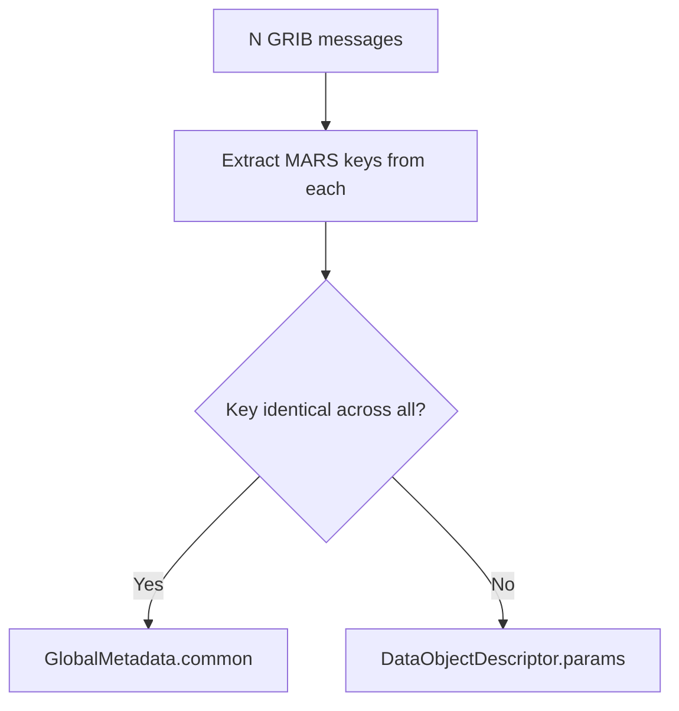

# MARS Key Mapping

The converter reads the following MARS namespace keys from each GRIB message using ecCodes' `read_key_dynamic` API.

## Keys Extracted

### Identification
| GRIB Key | Description | Example |
|----------|-------------|---------|
| `class` | MARS class | `"od"` (operational) |
| `type` | Data type | `"an"` (analysis), `"fc"` (forecast) |
| `stream` | Data stream | `"oper"`, `"enfo"` |
| `expver` | Experiment version | `"0001"` |

### Parameter
| GRIB Key | Description | Example |
|----------|-------------|---------|
| `param` | Parameter ID | `"2t"` (2m temperature) |
| `shortName` | Short name | `"2t"` |
| `name` | Full name | `"2 metre temperature"` |
| `paramId` | Numeric ID | `167` |
| `discipline` | WMO discipline | `0` |
| `parameterCategory` | WMO category | `0` |
| `parameterNumber` | WMO number | `0` |

### Vertical
| GRIB Key | Description | Example |
|----------|-------------|---------|
| `level` | Level value | `500` |
| `typeOfLevel` | Level type | `"isobaricInhPa"` |
| `levtype` | MARS level type | `"pl"` (pressure level) |

### Temporal
| GRIB Key | Description | Example |
|----------|-------------|---------|
| `date` / `dataDate` | Reference date | `20260404` |
| `time` / `dataTime` | Reference time | `1200` |
| `stepRange` / `step` | Forecast step | `"0"`, `"6"`, `"0-6"` |
| `stepUnits` | Step units | `1` (hours) |

### Spatial
| GRIB Key | Description | Example |
|----------|-------------|---------|
| `gridType` | Grid type | `"regular_ll"` |
| `Ni`, `Nj` | Grid dimensions | `360`, `181` |
| `numberOfPoints` | Total grid points | `65160` |
| `latitudeOfFirstGridPointInDegrees` | First latitude | `90.0` |
| `longitudeOfFirstGridPointInDegrees` | First longitude | `0.0` |
| `latitudeOfLastGridPointInDegrees` | Last latitude | `-90.0` |
| `longitudeOfLastGridPointInDegrees` | Last longitude | `359.0` |
| `iDirectionIncrementInDegrees` | Longitude step | `1.0` |
| `jDirectionIncrementInDegrees` | Latitude step | `1.0` |

### Other
| GRIB Key | Description | Example |
|----------|-------------|---------|
| `bitsPerValue` | Packing precision | `16` |
| `packingType` | GRIB packing | `"grid_simple"` |
| `centre` | Originating centre | `"ecmf"` |
| `subCentre` | Sub-centre | `0` |
| `generatingProcessIdentifier` | Process ID | `148` |

## Partitioning Algorithm

Given N GRIB messages in merge-all mode:

1. Extract all MARS keys from each message using `read_key_dynamic`
2. For each key, check if the value is identical across all N messages
3. **Common**: key present in all messages with the same value → `GlobalMetadata.common`
4. **Varying**: key differs → stored in each object's `DataObjectDescriptor.params`

## Sentinel Handling

ecCodes uses sentinel values for missing keys:
- String: `"MISSING"` or `"not_found"` → skipped
- Integer: `2147483647` or `-2147483647` → skipped
- Float: `NaN` or `Inf` → skipped
