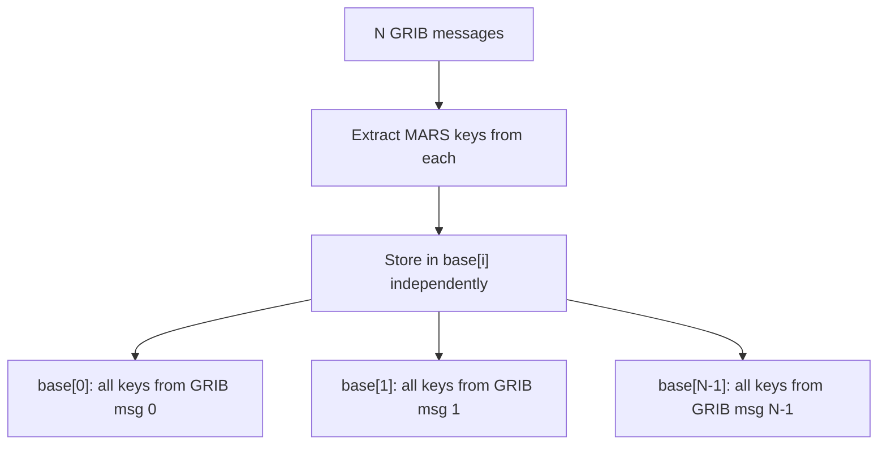

# MARS Key Mapping

The importer reads the following MARS namespace keys from each GRIB message using ecCodes' `read_key_dynamic` API.

## Keys Extracted

### Identification
| GRIB Key | Description | Example |
|----------|-------------|---------|
| `class` | MARS class | `"od"` (operational) |
| `type` | Data type | `"an"` (analysis), `"fc"` (forecast) |
| `stream` | Data stream | `"oper"`, `"enfo"` |
| `expver` | Experiment version | `"0001"` |

### Parameter
| GRIB Key | Description | Example |
|----------|-------------|---------|
| `param` | Parameter ID | `"2t"` (2m temperature) |
| `shortName` | Short name | `"2t"` |
| `name` | Full name | `"2 metre temperature"` |
| `paramId` | Numeric ID | `167` |
| `discipline` | WMO discipline | `0` |
| `parameterCategory` | WMO category | `0` |
| `parameterNumber` | WMO number | `0` |

### Vertical
| GRIB Key | Description | Example |
|----------|-------------|---------|
| `level` | Level value | `500` |
| `typeOfLevel` | Level type | `"isobaricInhPa"` |
| `levtype` | MARS level type | `"pl"` (pressure level) |

### Temporal
| GRIB Key | Description | Example |
|----------|-------------|---------|
| `date` / `dataDate` | Reference date | `20260404` |
| `time` / `dataTime` | Reference time | `1200` |
| `stepRange` / `step` | Forecast step | `"0"`, `"6"`, `"0-6"` |
| `stepUnits` | Step units | `1` (hours) |

### Spatial

The grid type is read from outside the MARS namespace and stored as
`mars.grid` as a convenience (not a standard MARS key):

| GRIB Key | Stored as | Description | Example |
|----------|-----------|-------------|---------|
| `gridType` | `mars.grid` | Grid type | `"regular_ll"` |

For `regular_ll` grids with standard scan mode (`iScansNegatively = 0`,
`jScansPositively = 0`), the four corner-point keys from the ecCodes
`geography` namespace are also lifted into a canonical
`mars.area = [N, W, S, E]`:

| ecCodes key | Role | Example (0.25° global, dateline-first) |
|----------|------|---------|
| `latitudeOfFirstGridPointInDegrees` | → `N` | `90.0` |
| `longitudeOfFirstGridPointInDegrees` | → `W` (see normalisation) | raw `180.0` → `-180.0` |
| `latitudeOfLastGridPointInDegrees` | → `S` | `-90.0` |
| `longitudeOfLastGridPointInDegrees` | → `E` | `179.75` |

**Full-global dateline-first normalisation.**  ECMWF open-data GRIB
encodes full-global grids as `longitudeOfFirstGridPointInDegrees =
180` (first point at the dateline, scanning eastwards through
Greenwich).  The MARS-area convention wants a monotone `W ≤ E` range,
so the importer subtracts `360` from the raw `W` when the grid
provably spans a full circle (`Ni × iDirectionIncrementInDegrees ≈
360`), yielding `[-180, 179.75]` instead of the raw `[180, 179.75]`.
This is the only normalisation applied; everything else passes
through unchanged.  See `rust/tensogram-grib/src/area.rs` for the
pure helper and its test matrix.

**When `mars.area` is NOT emitted.**  The converter refuses (and omits
`mars.area`) when any of the following holds — non-standard scan
(`iScansNegatively != 0` or `jScansPositively != 0`, or either key
missing from the GRIB), missing or NaN corner keys, `Ni < 2`,
`i_direction_increment <= 0`, degenerate `W == E` or `N == S`,
inverted latitudes (`lat_first < lat_last`), or a dateline-crossing
regional subdomain that cannot be expressed as a monotone `[W, E]`.
Non-`regular_ll` grids (`reduced_gg`, octahedral `O*`, Gaussian
`N*`) never get a `mars.area`: their geography cannot be captured as
four corners.

The full raw geography namespace (including `Ni`, `Nj`,
`numberOfPoints`, `iDirectionIncrementInDegrees`, etc.) is lifted
into `base[i]["grib"]["geography"]` only when the converter is
called with `preserve_all_keys=true`.

### Other
| GRIB Key | Description | Example |
|----------|-------------|---------|
| `bitsPerValue` | Packing precision | `16` |
| `packingType` | GRIB packing | `"grid_simple"` |
| `centre` | Originating centre | `"ecmf"` |
| `subCentre` | Sub-centre | `0` |
| `generatingProcessIdentifier` | Process ID | `148` |

## Storage in Tensogram

Given N GRIB messages in merge-all mode:

1. Extract all MARS keys from each message using `read_key_dynamic`
2. Store ALL keys for each GRIB message in the corresponding `base[i]["mars"]` entry independently
3. There is no common/varying partitioning in the output — each `base[i]` entry is self-contained

If you need to extract commonalities after decoding (e.g. for display), use the `compute_common()` utility in software.

## Sentinel Handling

ecCodes uses sentinel values for missing keys:
- String: `"MISSING"` or `"not_found"` → skipped
- Integer: `2147483647` or `-2147483647` → skipped
- Float: `NaN` or `Inf` → skipped
