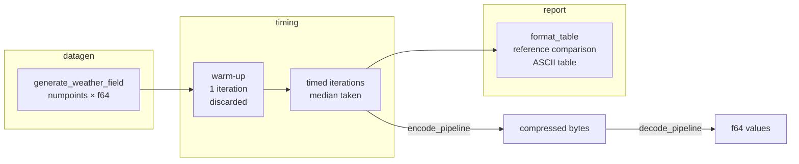

# Benchmarks

The `benchmarks/` crate provides reproducible, tabular performance comparisons for
all encoding/compression pipeline combinations. It lives in the repository and can
be re-run at any time to measure the effect of changes to the core encoding paths.

## Design Rationale

The benchmark suite is a standalone binary rather than a Criterion harness for two
reasons:

1. **Custom reporting** — the TODO spec requires formatted comparison tables with
   compression ratios, sizes in KiB, and reference-relative speedup factors. Criterion
   is purpose-built for statistical regression detection (mean ± stddev), not tabular
   multi-metric comparison.
2. **Zero extra dependencies** — a standalone binary with `std::time::Instant` adds
   no compilation overhead to the workspace and is fully controlled.

## Codec Matrix Benchmark

Runs all valid encoder × compressor × bit-width combinations on 16 million synthetic
float64 values and reports encode time, decode time, compressed size, and compression
ratio against the `none+none` baseline.

### Quick start

```bash
cargo run --release -p tensogram-benchmarks --bin codec-matrix
```

Override parameters with CLI flags:

```bash
cargo run --release -p tensogram-benchmarks --bin codec-matrix -- \
    --num-points 16000000 \
    --iterations 5 \
    --seed 42
```

| Flag | Default | Description |
|------|---------|-------------|
| `--num-points` | 16 000 000 | Number of float64 values to encode; always rounded up to the next multiple of 4 (up to 3 extra values) for szip alignment |
| `--iterations` | 5 | Timed iterations per combo (median reported) |
| `--seed` | 42 | PRNG seed for deterministic data generation |

### Combinations measured

| Group | Description | Count |
|-------|-------------|-------|
| Baseline | `none+none` (raw f64 bytes, no compression) | 1 |
| Raw + lossless | `none+{zstd,lz4,blosc2,szip}` | 4 |
| SimplePacking + lossless | `sp(B)+{none,zstd,lz4,blosc2,szip}` at B=16, 24, 32 bits | 15 |
| Lossy float | `none+zfp(rate=16/24/32)`, `none+sz3(abs=0.01)` | 4 |
| **Total** | | **24** |

### Example output

```
Tensogram Codec Matrix (16000000 float64 values, 5 iterations, median)
Reference: none+none

 Combo                  | Encode (ms) | Decode (ms) | Ratio (%) | Size (KiB) | vs Ref Enc | vs Ref Dec
------------------------+-------------+-------------+-----------+------------+------------+-----------
 none+none [REF]        |       4.123 |       3.891 |    100.00 |  125000.0  |      1.00x |      1.00x
 none+zstd(3)           |     312.456 |      52.100 |     72.30 |   90375.0  |     75.79x |     13.39x
 none+lz4               |      58.234 |       8.100 |     98.20 |  122750.0  |     14.12x |      2.08x
 sp(16)+none            |      95.200 |     185.400 |     25.00 |   31250.0  |     23.09x |     47.65x
 sp(24)+szip            |      70.100 |     175.200 |     28.50 |   35625.0  |     17.00x |     45.03x
 none+zfp(rate=24)      |      52.300 |     155.100 |     37.50 |   46875.0  |     12.69x |     39.86x
 ...
```

### Interpreting the output

| Column | Meaning |
|--------|---------|
| `Encode (ms)` | Median time to compress the payload (wall clock, unloaded machine) |
| `Decode (ms)` | Median time to decompress the payload |
| `Ratio (%)` | `compressed_bytes / original_bytes × 100` — lower is better |
| `Size (KiB)` | Compressed payload size |
| `vs Ref Enc` | `this_encode_ms / reference_encode_ms` — values > 1.00× are slower than the reference |
| `vs Ref Dec` | Same for decode |

The reference (`none+none`) is the throughput of copying raw float64 bytes through the
pipeline without any encoding or compression. It sets the baseline latency floor.

## GRIB Comparison Benchmark

Compares ecCodes CCSDS packing (`grid_ccsds`, 24 bit) — the operational reference —
against Tensogram `simple_packing(24)+szip` on 10 million float64 values.

### Requirements

- ecCodes C library installed (`brew install eccodes` on macOS, `apt install libeccodes-dev` on Debian/Ubuntu)
- Build with `--features eccodes`

### Quick start

```bash
cargo run --release -p tensogram-benchmarks --bin grib-comparison --features eccodes
```

```bash
cargo run --release -p tensogram-benchmarks --bin grib-comparison --features eccodes -- \
    --num-points 10000000 \
    --iterations 5 \
    --seed 42
```

### Methods compared

| Method | Description |
|--------|-------------|
| `eccodes grid_ccsds` **(reference)** | ecCodes CCSDS packing (CCSDS 121.0-B-3 via libaec) |
| `eccodes grid_simple` | ecCodes simple packing (GRIB grid_simple, same bit depth) |
| `tensogram sp(24)+szip` | Tensogram SimplePacking(24) + szip (same algorithm, different framing) |

### Timing model

- **GRIB encode**: time of `codes_set_double_array("values", ...)` — the quantisation and packing call.
- **GRIB decode**: time to create a handle from raw GRIB bytes + `codes_get_double_array("values", ...)`.
- **Tensogram encode/decode**: `encode_pipeline` / `decode_pipeline` on the packed bit stream.

### Example output

```
GRIB vs Tensogram Comparison (10000000 float64 values, 24 bit, 5 iterations)
Reference: eccodes grid_ccsds

 Combo                    | Encode (ms) | Decode (ms) | Ratio (%) | Size (KiB)  | vs Ref Enc | vs Ref Dec
--------------------------+-------------+-------------+-----------+-------------+------------+-----------
 eccodes grid_ccsds [REF] |     312.000 |     245.000 |     37.50 |   36621.1   |      1.00x |      1.00x
 eccodes grid_simple      |     180.000 |     120.000 |     37.50 |   36621.1   |      0.58x |      0.49x
 tensogram sp(24)+szip    |     210.000 |     160.000 |     28.57 |   27915.1   |      0.67x |      0.65x
```

## Benchmark pipeline flow



## Edge cases and limitations

### Input validation

Both benchmarks reject `num_points = 0` and `iterations = 0` with an `Err` return
(no panic). These are caught before any data generation or pipeline calls.

### Szip alignment padding

The codec matrix rounds `num_points` up to the next multiple of 4 (by at most 3
extra values) before running. This is required because libaec promotes 24-bit
samples to 4-byte containers, so the packed byte count must be a multiple of 4.
The padding values come from the same PRNG sequence, so the rounding has no effect
on the overall benchmark character. The title line and `original_bytes` field both
reflect the actual (padded) count.

### Compression expansion

Some compressors (especially LZ4 on raw f64 bytes) may produce output *larger*
than the input (`Ratio > 100%`). This is expected and reported accurately — the
`none+none` baseline itself is simply a memcpy and always shows 100.00%.

### Very small data sizes

With `--num-points 1` the codec matrix rounds to 4 values. All 24 combinations
succeed at this size, but absolute timing values are dominated by per-call overhead
rather than actual compression throughput. Use ≥ 10 000 points for meaningful
relative comparisons.

### PRNG determinism

The SplitMix64 PRNG is fully deterministic for a given seed, but the weather field
generator uses `f64::sin()` / `f64::cos()` whose implementations may differ across
platforms or libm versions. Timing comparisons are therefore only valid within the
same build environment. Size-based metrics (`Ratio %`, `Size KiB`) are
platform-independent.

### GRIB grid factorization

For prime `num_points`, the GRIB benchmark creates a degenerate 1 × N grid.
ecCodes handles this correctly, but it differs from the typical nearly-square grids
used in production. For representative GRIB benchmarks, use composite sizes
(e.g. 10 000 000 = 2500 × 4000).

## Error handling

All benchmark functions return `Result<_, BenchmarkError>` — no panics, no
`unwrap()` in library code. Errors propagate to the binary entry point, which
prints them to stderr and exits with code 1.

### Error paths

| Source | When | Message |
|--------|------|---------|
| Input validation | `num_points = 0` | `"num_points must be > 0"` |
| Input validation | `iterations = 0` | `"iterations must be > 0"` |
| `compute_params` | All values identical (zero range) | `"sp(24) params: ..."` with inner error |
| `encode_pipeline` | Codec failure (e.g. unsupported config) | Pipeline error description |
| `decode_pipeline` | Corrupted or truncated encoded data | Pipeline error description |
| ecCodes C API | `codes_set_long` returns non-zero | `"codes_set_long(key, val) returned rc"` |
| ecCodes C API | Handle creation returns null | `"codes_grib_handle_new_from_samples(GRIB2) returned null; check ECCODES_SAMPLES_PATH..."` |
| CString conversion | Key/value contains interior NUL byte | `"invalid key 'name': nul byte found..."` |

### Graceful degradation

In the codec matrix benchmark, if a single combination fails (e.g. a codec is
unavailable at runtime), the error is logged to stderr and an `[ERROR]` row
appears in the output table with zero times and zero size. The remaining
combinations continue to run. The GRIB comparison benchmark uses the same pattern.

## Reproducibility

All benchmarks use a deterministic PRNG (SplitMix64) seeded by `--seed`. The same
seed on the same machine produces identical data and therefore comparable timing
across runs. For cross-machine comparisons, use the `Ratio (%)` and `Size (KiB)`
columns (size-independent) rather than absolute millisecond values.

## Running in CI

For fast CI validation, pass `--num-points 10000 --iterations 1`:

```bash
cargo run -p tensogram-benchmarks --bin codec-matrix -- \
    --num-points 10000 --iterations 1
```

The smoke test suite (`cargo test -p tensogram-benchmarks`) uses 500–1000 points
and completes in under 5 seconds.
