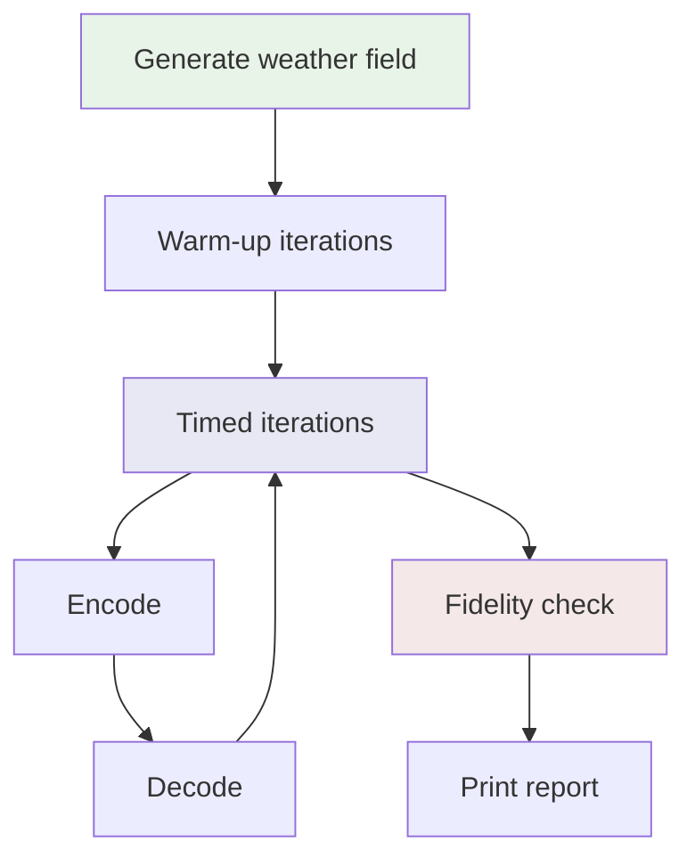

# Benchmarks

Tensogram ships with a benchmark suite that measures all encoding and compression
combinations on synthetic data. It produces tabular comparisons of speed, compressed
size, and decode fidelity. The benchmarks can be re-run at any time to measure the
effect of changes.

## Codec Matrix Benchmark

Tests all valid encoder × compressor × bit-width combinations on 16 million
synthetic float64 values.

### Quick start

```bash
cargo run --release -p tensogram-benchmarks --bin codec-matrix
```

Override parameters with CLI flags:

```bash
cargo run --release -p tensogram-benchmarks --bin codec-matrix -- \
    --num-points 16000000 \
    --iterations 10 \
    --warmup 3 \
    --seed 42
```

| Flag | Default | Description |
|------|---------|-------------|
| `--num-points` | 16 000 000 | Number of float64 values to encode |
| `--iterations` | 10 | Timed iterations per combination (median reported) |
| `--warmup` | 3 | Warm-up iterations (discarded) |
| `--seed` | 42 | PRNG seed for deterministic data generation |

### Combinations measured

| Group | Description | Count |
|-------|-------------|-------|
| Baseline | No encoding, no compression | 1 |
| Lossless compressors | Raw floats compressed with zstd, LZ4, Blosc2, or szip | 4 |
| SimplePacking + lossless | Quantized to 16, 24, or 32 bits, then compressed with each of the above (or no compressor) | 15 |
| Lossy codecs | ZFP (fixed rate 16/24/32) and SZ3 (absolute error 0.01) | 4 |
| **Total** | | **24** |

For actual results, see [Benchmark Results](benchmark-results.md).

### How to read the results

The results page splits each benchmark into a **performance table** (timing,
throughput, compressed size) and a **fidelity table** (error norms for lossy codecs).

| Column | Meaning | Better is |
|--------|---------|-----------|
| **Method** | Encoder + compressor. E.g. "24-bit + szip" means values are quantized to 24 bits then compressed with szip. **[REF]** marks the baseline. | — |
| **Enc / Dec (ms)** | Median encode / decode time. | Lower |
| **Enc / Dec MB/s** | Throughput: uncompressed size ÷ median time. | Higher |
| **Ratio** | Compressed size as percentage of original. 25% = compressed to ¼. Above 100% means the codec expanded the data. | Lower |
| **Size (MiB)** | Compressed output size. | — |
| **Linf** | Max absolute error (worst single value). | Smaller |
| **L1** | Mean absolute error (average drift). | Smaller |
| **L2** | Root mean square error (penalizes outliers). | Smaller |

For lossless codecs all three error norms are zero.
Errors are absolute, in the same units as the input data.

**Quick rules of thumb:**
- If you need exact data back, use one of the lossless codecs.
- If you can tolerate some loss, compare Ratio vs error norms for your use case.
- Throughput (MB/s) is the most useful speed metric — it accounts for data size and
  lets you compare across different payload sizes.

## GRIB Comparison Benchmark

Compares Tensogram's 24-bit SimplePacking + szip against
[ecCodes](https://confluence.ecmwf.int/display/ECC) (ECMWF's operational GRIB
encoder) on 10 million float64 values. Both sides are timed symmetrically:
encoding measures the full path from a float64 array to compressed bytes, and
decoding measures the reverse.

### Requirements

- ecCodes C library installed (`brew install eccodes` on macOS, `apt install libeccodes-dev` on Debian/Ubuntu)
- Build with `--features eccodes`

### Quick start

```bash
cargo run --release -p tensogram-benchmarks --bin grib-comparison --features eccodes
```

```bash
cargo run --release -p tensogram-benchmarks --bin grib-comparison --features eccodes -- \
    --num-points 10000000 \
    --iterations 10 \
    --warmup 3 \
    --seed 42
```

### Methods compared

| Method | Description |
|--------|-------------|
| ecCodes CCSDS **(reference)** | CCSDS packing — the standard used in operational weather data distribution |
| ecCodes simple packing | Basic fixed-bit-width packing without entropy coding |
| Tensogram 24-bit + szip | Tensogram's SimplePacking at 24 bits followed by szip entropy coding |

For actual results, see [Benchmark Results](benchmark-results.md).

## Benchmark pipeline flow



Each timed iteration runs a full encode → decode cycle. After all iterations
complete, the last decoded output is compared against the original to produce
the fidelity metrics.

## Things to know

### Compression expansion

Some compressors (especially LZ4 on raw 64-bit floats) may produce output *larger*
than the input (Ratio > 100%). This is normal — high-entropy data can't always be
compressed. The baseline row is a raw copy and always shows 100%.

### Szip alignment

The codec matrix may round `num_points` up by 1–3 values for szip block alignment.
This only matters for very small inputs.

### Small data sizes

With `--num-points 1`, timing is dominated by per-call overhead rather than
compression throughput. Use ≥ 10 000 points for meaningful comparisons.

### GRIB grid shape

For prime `num_points`, the GRIB benchmark creates a 1 × N grid (not a realistic
near-square grid). Use composite sizes for representative results
(e.g. `--num-points 10000000`).

### Reproducibility

The data generator is deterministic for a given `--seed`, so repeated runs on the
same machine produce comparable timing. Compression ratios, sizes, and fidelity
are reproducible across machines. Timing and throughput are not.

### Error handling

If a single codec fails, the benchmark logs the error and continues with the
remaining combinations. The summary line reports how many succeeded and failed.
The CLI exits with code 1 if any combination failed.

## Running in CI

For fast CI validation, pass `--num-points 10000 --iterations 1 --warmup 1`:

```bash
cargo run -p tensogram-benchmarks --bin codec-matrix -- \
    --num-points 10000 --iterations 1 --warmup 1
```

The smoke test suite (`cargo test -p tensogram-benchmarks`) uses 500–1000 points
and completes in under 5 seconds.
