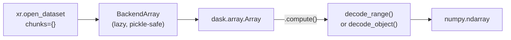

# Dask Integration

Tensogram supports [Dask](https://www.dask.org/) natively through its xarray
backend.  When you open a `.tgm` file with `chunks={}`, xarray wraps every
tensor variable in a `dask.array.Array`.  No data is read from disk until
you call `.compute()` or `.values`.

```python
import xarray as xr
ds = xr.open_dataset("forecast.tgm", engine="tensogram", chunks={})
# ds["temperature"].data is now a dask.array -- zero I/O so far
mean = ds["temperature"].mean().compute()  # data decoded here
```

This chapter explains how the integration works, walks through a complete
example with distributed computation, and covers the performance knobs
you can tune.

---

## How It Works

The tensogram xarray backend implements `BackendArray`, xarray's lazy-loading
protocol.  When dask requests a chunk, the backend:

1. Opens the `.tgm` file and reads the raw message bytes.
2. For small slices on compressors that support random access
   (`none`, `szip`, `blosc2`, `zfp` fixed-rate): maps the N-D slice to
   flat byte ranges and decodes only those ranges via `decode_range()`.
3. For large slices or stream compressors: falls back to full
   `decode_object()` and slices in memory.

The `BackendArray` stores only the file path (no open handles), making it
**pickle-safe** for dask multiprocessing and distributed execution.



### Chunking Strategies

| `chunks` value | Behaviour |
|----------------|-----------|
| `{}` | Automatic: one chunk per tensor object (most common) |
| `{"latitude": 100}` | Split along latitude every 100 elements |
| `{"latitude": 100, "longitude": 200}` | Split along both axes |

For tensogram files, `chunks={}` is usually the right choice because
each data object is already a self-contained tensor.  Finer chunking
adds overhead from repeated file opens.

---

## Complete Example: Distributed Statistics over 4-D Tensors

This walkthrough corresponds to `examples/python/09_dask_distributed.py`.
It creates 4 `.tgm` files representing a 4-D temperature field
(time x level x latitude x longitude), then computes statistics
entirely through dask's lazy execution.

### Step 1: Create the Data Files

Each file contains 10 data objects (one per pressure level) plus
latitude and longitude coordinate arrays:

```python
import numpy as np
import tensogram

def _desc(shape, dtype="float32", **extra):
    return {
        "type": "ntensor", "shape": list(shape), "dtype": dtype,
        "byte_order": "little", "encoding": "none",
        "filter": "none", "compression": "none", **extra,
    }

LEVEL_VALUES = [1000, 925, 850, 700, 500, 400, 300, 200, 100, 50]
NLAT, NLON = 36, 72

with tensogram.TensogramFile.create("temperature_20260401.tgm") as f:
    lat = np.linspace(-87.5, 87.5, NLAT, dtype=np.float64)
    lon = np.linspace(0, 355, NLON, dtype=np.float64)

    objects = [
        (_desc([NLAT], dtype="float64", name="latitude"), lat),
        (_desc([NLON], dtype="float64", name="longitude"), lon),
    ]
    for level_hpa in LEVEL_VALUES:
        field = np.random.default_rng(42).random((NLAT, NLON)).astype(np.float32)
        desc = _desc([NLAT, NLON], name=f"temperature_{level_hpa}hPa")
        objects.append((desc, field))

    f.append({"version": 3}, objects)
```

### Step 2: Open with Dask Lazy Loading

The critical parameters are `engine="tensogram"` and `chunks={}`:

```python
import xarray as xr
import tensogram_xarray  # registers the engine

ds = xr.open_dataset(
    "temperature_20260401.tgm",
    engine="tensogram",
    variable_key="name",  # name variables from descriptor "name" field
    chunks={},             # enable dask lazy loading
)
```

At this point:

- **No tensor data has been decoded.** Only CBOR metadata was read.
- Each variable is a `dask.array.Array`:

```python
>>> type(ds["temperature_1000hPa"].data)
<class 'dask.array.core.Array'>

>>> ds["temperature_1000hPa"].shape
(36, 72)

>>> ds["temperature_1000hPa"].chunks
((36,), (72,))
```

### Step 3: Build a 4-D Tensor from Multiple Files

Stack variables across levels within each file, then stack files
across time:

```python
import dask
import dask.array as da

# Open all 4 files
paths = ["temperature_20260401.tgm", "temperature_20260402.tgm",
         "temperature_20260403.tgm", "temperature_20260404.tgm"]

datasets = [
    xr.open_dataset(p, engine="tensogram", variable_key="name", chunks={})
    for p in paths
]

# Stack levels within each file, then stack across time
# Build in LEVEL_VALUES order (not alphabetical) so axis matches labels
temp_vars = [f"temperature_{lev}hPa" for lev in LEVEL_VALUES]

all_timesteps = []
for ds in datasets:
    level_arrays = [ds[v].data for v in temp_vars]
    all_timesteps.append(da.stack(level_arrays, axis=0))

full_4d = da.stack(all_timesteps, axis=0)
# Shape: (4, 10, 36, 72) -- (time, level, lat, lon)
# Still lazy -- zero I/O
```

### Step 4: Compute Statistics with Dask

Schedule multiple computations, then execute them in a single
`dask.compute()` call:

```python
# Schedule (lazy -- no computation yet)
global_mean = full_4d.mean()
global_std  = full_4d.std()
global_min  = full_4d.min()
global_max  = full_4d.max()

# Execute all at once (data decoded from .tgm files here)
mean_val, std_val, min_val, max_val = dask.compute(
    global_mean, global_std, global_min, global_max
)

print(f"Mean: {mean_val:.2f} K")
print(f"Std:  {std_val:.2f} K")
print(f"Min:  {min_val:.2f} K")
print(f"Max:  {max_val:.2f} K")
```

### Step 5: Selective Lazy Loading

Only the data you touch is decoded.  Slicing the 4-D array triggers
decoding of just the relevant chunks:

```python
# Single point: backend uses decode_range() for the tiny slice
# (1 element out of 2592 = 0.04%, well below the 50% threshold)
point = full_4d[0, 0, 18, 0].compute()

# One pressure level across all times: touches 4 backing arrays
level_400 = full_4d[:, 5, :, :].mean().compute()

# Equatorial band: partial range decode for the selected rows
equatorial = full_4d[0, 0, 9:27, :].mean().compute()
```

---

## Performance Tuning

### The `range_threshold` Parameter

When dask requests a slice, the backend decides between partial decode
(`decode_range()`) and full decode (`decode_object()`) based on the
fraction of requested elements:

> **Rule:** partial reads are used when
> `requested_elements / total_elements <= range_threshold`

| `range_threshold` | Behaviour |
|-------------------|-----------|
| `0.3` | Aggressive partial reads (good for uncompressed data) |
| `0.5` (default) | Balanced: partial below 50%, full above |
| `0.9` | Almost always full decode (good for fast decompressors) |

```python
# More aggressive partial reads
ds = xr.open_dataset("file.tgm", engine="tensogram",
                     chunks={}, range_threshold=0.3)

# Almost always full decode
ds = xr.open_dataset("file.tgm", engine="tensogram",
                     chunks={}, range_threshold=0.9)
```

### Which Compressors Support Partial Reads?

| Compression | Partial Read? | Notes |
|-------------|:-------------:|-------|
| `none` | Yes | Direct byte offset |
| `szip` | Yes | RSI block seeking |
| `blosc2` | Yes | Independent chunk decompression |
| `zfp` (fixed_rate) | Yes | Fixed-size blocks |
| `zfp` (other modes) | No | Variable-size blocks |
| `zstd` | No | Stream compressor |
| `lz4` | No | Stream compressor |
| `sz3` | No | Stream compressor |

The `shuffle` filter also disables partial reads (byte rearrangement
breaks contiguous ranges).  The fallback is always transparent: the
full object is decoded and sliced in memory.

### Dask Scheduler Choice

Tensogram's backend is thread-safe (uses a `threading.Lock` per array).
All three dask schedulers work:

```python
# Synchronous (debugging)
dask.config.set(scheduler="synchronous")

# Threaded (default, good for I/O-bound work)
dask.config.set(scheduler="threads")

# Multiprocessing (BackendArray is pickle-safe)
dask.config.set(scheduler="processes")
```

For large-scale work, `dask.distributed` also works because the
`BackendArray` stores only the file path (no unpicklable state).

---

## Thread Safety

The `TensogramBackendArray` uses a per-array `threading.Lock` to
serialise file I/O.  This means:

- Multiple dask tasks can read different variables concurrently.
- Reads to the same variable are serialised (no concurrent file opens
  for the same array).
- The lock is excluded from pickle state and recreated on deserialise.

---

## Installation

For dask support, install the optional dependency:

```bash
uv venv .venv && source .venv/bin/activate   # if not already in a virtualenv
uv pip install "tensogram-xarray[dask]"
```

This pulls in `dask[array]` alongside `tensogram` and `xarray`.

---

## Debugging

Enable debug logging to see when partial reads are used vs full decodes:

```python
import logging
logging.getLogger("tensogram_xarray").setLevel(logging.DEBUG)
```

You will see messages like:

```
DEBUG:tensogram_xarray.array:decode_range failed for forecast.tgm msg=0 obj=2,
    falling back to full decode: RangeNotSupported
```

This is expected for stream compressors and is not an error.

---

## Error Handling

### When Errors Are Raised

| When | What | Error type |
|------|------|-----------|
| `open_dataset()` | File not found | `OSError` with file path |
| `open_dataset()` | `message_index` negative | `ValueError` with index |
| `open_dataset()` | `message_index` out of range | `ValueError` with index and count |
| `open_dataset()` | `dim_names` length mismatch | `ValueError` with actual vs expected |
| `open_dataset()` | Unsupported dtype | `TypeError` with dtype name |
| `.compute()` | Decode failure | `ValueError` or `RuntimeError` from tensogram |
| `.compute()` | Hash mismatch (with `verify_hash=True`) | `ValueError` with object index |
| `.compute()` | File moved/deleted after open | `OSError` from OS |

**Key design point:** errors in metadata (file not found, bad index, wrong
dim_names) surface immediately at `open_dataset()` time.  Errors in data
decoding surface at `.compute()` time because payloads are lazy-loaded.

### Partial Read Fallback

When `decode_range()` fails (e.g. unsupported compressor for partial reads),
the backend catches the error and falls back to full `decode_object()`:

```python
except (ValueError, RuntimeError, OSError) as exc:
    logger.debug("decode_range failed ... falling back to full decode: %s", exc)
```

This fallback is transparent — the user gets correct data regardless.  Enable
`DEBUG` logging to see when fallbacks occur.

### Dask Worker Errors

File paths are automatically resolved to absolute paths when the dataset is
opened.  This prevents "file not found" errors when dask sends work to
processes with a different working directory.

If a dask worker encounters a decode error, it propagates through dask's
error handling.  The traceback will show the tensogram error with file path,
message index, and object index for diagnosis.

---

## Edge Cases

### Ambiguous Dimension Matching

When coordinate arrays have the same size (e.g. both latitude and
longitude have 360 elements), the backend cannot distinguish them by
shape alone.  The first match gets the coordinate name; the second falls
back to a generic `dim_N`.

**Workaround:** pass explicit `dim_names` to disambiguate:

```python
ds = xr.open_dataset("file.tgm", engine="tensogram",
                     dim_names=["latitude", "longitude"], chunks={})
```

### Stacking Files with Different Variables

When stacking multiple `.tgm` files into a single dask array, verify
that every dataset contains the expected variables before stacking:

```python
temp_vars = [f"temperature_{lev}hPa" for lev in LEVEL_VALUES]
for i, ds in enumerate(datasets):
    missing = [v for v in temp_vars if v not in ds.data_vars]
    if missing:
        raise KeyError(f"Dataset {i} missing: {missing}")
```

Otherwise `da.stack()` will fail with a confusing `KeyError` from
a deep dask callback.

### Zero-Object Messages

A `.tgm` file containing only metadata frames (no data objects) returns
an empty `xr.Dataset` with no variables.  This is valid and does not
raise an error.

### Scalar (0-D) Tensors

Data objects with `shape=()` (zero dimensions) are supported.  They
become scalar `xr.Variable` objects in the dataset.

### Hash Verification with Partial Reads

When `verify_hash=True` is set, hash verification only runs on full
object reads (via `decode_object()`).  Partial reads via
`decode_range()` skip verification because only a subset of the payload
is decoded.  This means:

- Large slices (above `range_threshold`) trigger full decode with
  hash verification.
- Small slices use `decode_range()` without hash verification.

This is by design.  If you need guaranteed hash verification on every
access, set `range_threshold=0.0` to force full decodes.
