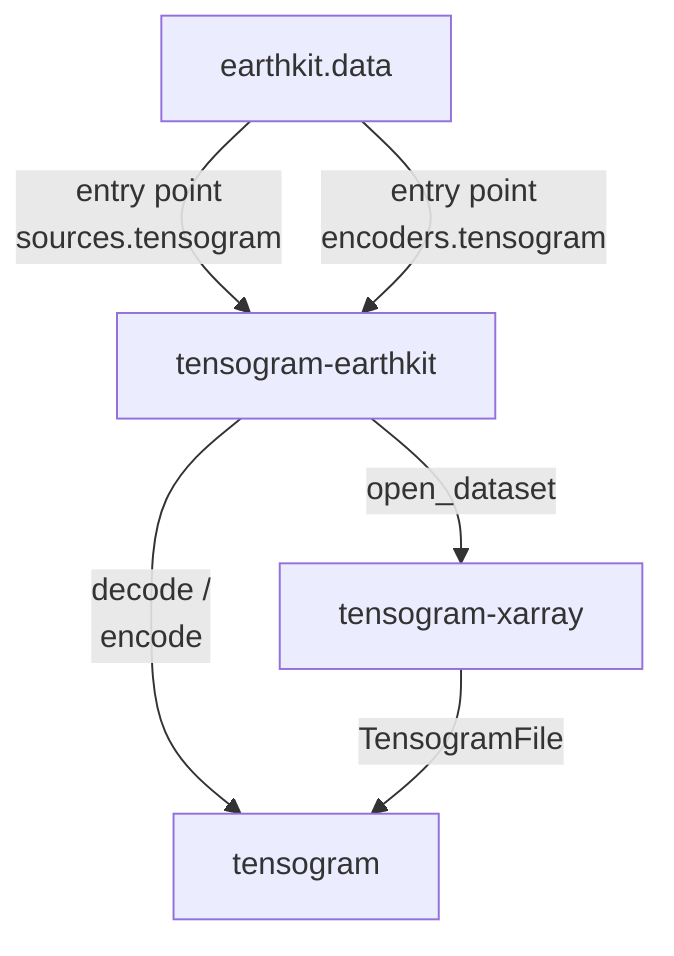

# earthkit-data Integration

The `tensogram-earthkit` package registers Tensogram as a first-class
source and encoder with
[`ecmwf/earthkit-data`](https://github.com/ecmwf/earthkit-data).  It
lets users load and write `.tgm` content through the same API they
already use for GRIB, NetCDF, BUFR, and other scientific formats.

```python
import earthkit.data as ekd

data = ekd.from_source("tensogram", "file.tgm")
ds = data.to_xarray()                                 # xarray Dataset
fl = data.to_fieldlist()                              # FieldList (MARS content only)

# Round-trip back out:
fl.to_target("file", "out.tgm", encoder="tensogram")
```

## Install

```bash
pip install tensogram-earthkit
```

The package depends on `tensogram`, `tensogram-xarray`, and
`earthkit-data`; they are pulled in automatically.

## Two decoding paths

Tensogram messages come in two flavours from the earthkit perspective:

```mermaid
flowchart LR
    A[ekd.from_source<br/>tensogram, path]:::u --> B{any base[i]<br/>has mars?}
    B -- yes --> C[FieldList of MARS fields]:::m
    B -- no --> D[xarray Dataset]:::x
    C -- to_xarray --> D
    classDef u fill:#eef
    classDef m fill:#efe
    classDef x fill:#fee
```

- **MARS path** — every object whose `base[i]` carries a non-empty
  `mars` sub-map becomes one earthkit `Field` with the MARS keys
  surfaced through the standard `metadata()`, `sel()`, `order_by()`
  API.  Coordinate-only objects (no MARS) are skipped.
- **xarray path** — non-MARS tensogram messages (or non-MARS objects
  inside a MARS message) are handed straight to the
  `tensogram-xarray` backend for coordinate auto-detection, dim-name
  resolution, and lazy loading.

Both paths live on the same `TensogramData` wrapper returned by
`from_source`.  `to_xarray()` always works; `to_fieldlist()` raises
`NotImplementedError` with a clear message for non-MARS content.

## Input shapes

| Input | Example | Behaviour |
|-------|---------|-----------|
| Local path | `ekd.from_source("tensogram", "f.tgm")` | Direct file read |
| Remote URL | `ekd.from_source("tensogram", "https://.../f.tgm")` | Remote range reads |
| Bytes | `ekd.from_source("tensogram", open("f.tgm", "rb").read())` | Materialised to temp file |
| Byte stream | Use `ekd.from_source("tensogram", stream.read())` | Drain + temp file |

Remote URLs accept the same `storage_options=` dict as the
`tensogram-xarray` backend for credentials and endpoint overrides:

```python
data = ekd.from_source(
    "tensogram",
    "s3://bucket/file.tgm",
    storage_options={"region": "eu-west-1"},
)
```

## MARS FieldList usage

```python
fl = ekd.from_source("tensogram", "mars.tgm").to_fieldlist()

# Standard earthkit FieldList API
print(len(fl))
print(fl[0].metadata("param"))

# Selection
subset = fl.sel(param="2t")

# Array-namespace interop via earthkit-utils
values_np = fl[0].to_array(array_namespace="numpy")
values_torch = fl[0].to_array(array_namespace="torch", device="cpu")
```

The FieldList's `to_xarray()` delegates to the `tensogram-xarray`
backend, so coordinate detection, dim-name resolution, and lazy
loading behave identically whether you start from `.to_xarray()` or
`.to_fieldlist().to_xarray()`.

## Writing tensogram from earthkit data

Any earthkit FieldList — including ones loaded from GRIB, NetCDF, or
another tensogram file — can be written out as a `.tgm` file:

```python
fl = ekd.from_source("file", "/data/op.grib")
fl.to_target("file", "out.tgm", encoder="tensogram")
```

MARS keys survive the round-trip:

```python
grib_fl = ekd.from_source("file", "op.grib")
grib_fl.to_target("file", "out.tgm", encoder="tensogram")

ek_fl = ekd.from_source("tensogram", "out.tgm").to_fieldlist()
assert {f.metadata("param") for f in ek_fl} == {f.metadata("param") for f in grib_fl}
```

xarray Datasets can also be encoded — every data variable becomes one
tensogram data object:

```python
from earthkit.data.encoders import create_encoder

enc = create_encoder("tensogram")
encoded = enc.encode(my_dataset)
encoded.to_file("out.tgm")
```

## Array namespace

`earthkit-utils` provides the `array_namespace` abstraction
transparently.  Because `TensogramField` is an `ArrayField` under the
hood, you get numpy / torch / cupy / jax interop for free:

```python
field = fl[0]
field.to_array(array_namespace="numpy")   # numpy.ndarray
field.to_array(array_namespace="torch")   # torch.Tensor
field.to_array(dtype="float64")           # cast on conversion
field.to_array(flatten=True)              # 1-D view
```

## Relationship with `tensogram-xarray`

`tensogram-earthkit` depends on `tensogram-xarray` and delegates
every xarray Dataset it produces to
`tensogram_xarray.TensogramBackendEntrypoint.open_dataset`.  There is
exactly one place in the stack where coordinate detection,
dim-name resolution, and lazy backing arrays are implemented.

## Edge cases

- **Non-MARS message + `.to_fieldlist()`** — raises
  `NotImplementedError` with the message ``"… has no MARS metadata;
  use to_xarray() for non-MARS tensograms"``.
- **Coordinate objects in a MARS message** — silently skipped by
  the FieldList builder.  They remain accessible via
  `.to_xarray()` as coordinate variables.
- **Empty FieldList encode** — `to_target` raises `ValueError` (the
  underlying `tensogram.encode` requires at least one object).
- **Round-trip byte-equality** — encoded bytes include a per-encode
  timestamp in `_reserved_`, so two encodes of the same data are
  **not** byte-identical but **are** semantically identical.  Tests
  assert on decoded values, not raw bytes.
- **Bytes inputs** — materialised to a temp file that is unlinked
  when the source is garbage-collected (via `weakref.finalize`).
  Calling `TensogramSource.close()` early unlinks immediately.

## Architecture



Internally the package mirrors earthkit-data's own readers layout:
`readers/file.py`, `readers/memory.py`, `readers/stream.py` each
expose the `reader` / `memory_reader` / `stream_reader` callables
earthkit's registry would expect, so a future upstream PR that moves
the code into `earthkit-data/readers/tensogram/` is a verbatim copy.
