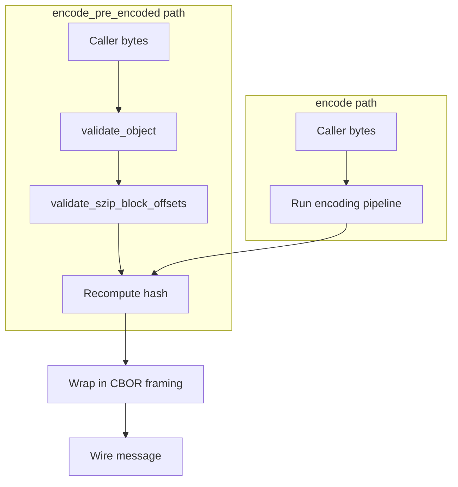

# Pre-Encoded Data API (Advanced)

## When to use this API

The `encode_pre_encoded` API is for **advanced callers** whose data is already
encoded by an external pipeline (e.g., a GPU kernel that emits packed bytes,
or a streaming receiver passing payloads through). It bypasses Tensogram's
internal encoding pipeline and uses the supplied bytes verbatim.

Do NOT use this API for ordinary encoding. Use `encode()` instead.

## ⚠️ The bit-vs-byte trap

> **WARNING**: When using `compression="szip"`, the `szip_block_offsets` parameter
> contains **bit offsets**, not byte offsets. The first offset must be 0 and
> every offset must satisfy `offset <= encoded_bytes_len * 8`. This matches
> the libaec/szip wire format. See [cbor-metadata.md](../format/cbor-metadata.md#szip-block-offsets)
> for the format reference.
>
> Getting this wrong is the #1 caller mistake. Tensogram validates the offsets
> structurally (monotonicity, bounds) but cannot detect a byte-instead-of-bit
> mistake until decode_range fails.

## API surface

### Rust
```rust
pub fn encode_pre_encoded(
    metadata: &GlobalMetadata,
    descriptors_and_data: &[(&DataObjectDescriptor, &[u8])],
    options: &EncodeOptions,
) -> Result<Vec<u8>, TensogramError>
```

### Python
```python
import tensogram

msg: bytes = tensogram.encode_pre_encoded(
    global_meta_dict={},
    descriptors_and_data=[(descriptor_dict, raw_bytes)],
    hash="xxh3",
)
```

### C
```c
tgm_error tgm_encode_pre_encoded(
    const char *metadata_json,
    const uint8_t *const *data_ptrs,
    const size_t *data_lens,
    size_t num_objects,
    const char *hash_algo,
    tgm_bytes_t *out
);
```

### C++
```cpp
std::vector<std::uint8_t> tensogram::encode_pre_encoded(
    const std::string& metadata_json,
    const std::vector<std::pair<const std::uint8_t*, std::size_t>>& objects,
    const encode_options& opts = {}
);
```

## Hash semantics

The library **always recomputes** the hash of the pre-encoded bytes using
the algorithm specified in `EncodeOptions.hash_algorithm` (default `xxh3`). Any hash
the caller stored on the descriptor is silently overwritten. This guarantees
the wire format invariant `descriptor.hash == hash_algo(bytes)` always holds.

## Provenance semantics

The encoded message is byte-format-indistinguishable from one produced by
`encode()`. The decoder cannot tell which API produced it. The provenance
fields `_reserved_.encoder.name`, `_reserved_.time`, and `_reserved_.uuid`
are populated identically.

## Self-consistency checks

Before encoding, the library validates:
1. Caller has not set `EncodeOptions.emit_preceders` (rejected).
2. Caller has not put `_reserved_` in their metadata (rejected).
3. Each descriptor passes the standard `validate_object` checks.
4. If `compression="szip"` and `szip_block_offsets` is supplied:
   - It's a CBOR Array of u64.
   - First offset is 0.
   - Strictly monotonically increasing.
   - All bit offsets `<= bytes_len * 8`.
5. If `szip_block_offsets` is supplied but `compression != "szip"`, rejected.

These are **structural** checks only. The library does NOT trial-decode the
bytes to verify they actually decode correctly.

### Limitation: encoding="none" size check

When `encoding="none"`, the `validate_object` check enforces
`payload_len == shape_product * dtype_byte_width`. This means you cannot pass
compression-only payloads (e.g., zstd-compressed raw bytes) with
`encoding="none"` because the compressed size will not match the expected raw
size. Wrap such payloads in at least `simple_packing` or another encoding.

## Worked example: simple_packing + szip with decode_range

```rust
use tensogram::{
    encode_pre_encoded, DataObjectDescriptor, EncodeOptions,
    GlobalMetadata, ByteOrder, Dtype,
};
use std::collections::BTreeMap;
use ciborium::Value;

// Pre-encoded bytes from a GPU kernel + szip block offsets in BITS
let pre_encoded_bytes: Vec<u8> = /* from GPU */;
let szip_offsets_bits: Vec<u64> = vec![0, 8192, 16384, /* ... */];

let mut params: BTreeMap<String, ciborium::Value> = BTreeMap::new();
params.insert("sp_bits_per_value".into(), Value::Integer(24u64.into()));
params.insert("sp_reference_value".into(), Value::Float(0.0));
params.insert("sp_binary_scale_factor".into(), Value::Integer((-10i64).into()));
params.insert("sp_decimal_scale_factor".into(), Value::Integer(0i64.into()));
params.insert("szip_rsi".into(), Value::Integer(128i64.into()));
params.insert("szip_block_size".into(), Value::Integer(16i64.into()));
params.insert("szip_flags".into(), Value::Integer(8i64.into()));
params.insert("szip_block_offsets".into(),
    Value::Array(szip_offsets_bits.into_iter()
        .map(|o| Value::Integer(o.into()))
        .collect()));

let desc = DataObjectDescriptor {
    obj_type: "ntensor".into(),
    ndim: 2,
    shape: vec![1024, 1024],
    strides: vec![1024, 1],
    dtype: Dtype::Float32,
    byte_order: ByteOrder::Big,
    encoding: "simple_packing".into(),
    filter: "none".into(),
    compression: "szip".into(),
    masks: None,
    params,
};

let msg = encode_pre_encoded(
    &GlobalMetadata::default(),
    &[(&desc, &pre_encoded_bytes)],
    &EncodeOptions::default(),
)?;

// decode_range works because szip_block_offsets is present.
```

## How it works



The pre-encoded path skips the pipeline entirely. The wire format is identical.

## Byte order

When using `encoding="none"`, the caller's bytes are stored **verbatim** — the
library does NOT validate or flip byte order on encode. The bytes must be in
the byte order declared in the descriptor's `byte_order` field.

For example, if `byte_order="big"` and `encoding="none"`, the caller must
provide big-endian bytes.

On decode, the library **automatically converts to native byte order** by
default (`native_byte_order=true`). Callers can use `from_ne_bytes()` or
`data_as<T>()` directly without worrying about which byte order was used on
the wire. Set `native_byte_order=false` to get the raw wire-order bytes.

## Streaming API

`StreamingEncoder::write_object_pre_encoded()` is the streaming counterpart of
`encode_pre_encoded()`. It writes a single pre-encoded object to the stream.
It can be interleaved freely with `write_object()` (normal encode) calls.

### Rust
```rust
let mut enc = StreamingEncoder::new(output, &metadata, &options)?;
enc.write_object_pre_encoded(&descriptor, &pre_encoded_bytes)?;
enc.finish()?;
```

### Python
```python
enc = tensogram.StreamingEncoder({})
enc.write_object_pre_encoded(descriptor_dict, raw_bytes)
msg = enc.finish()
```

### C++
```cpp
tensogram::streaming_encoder enc(path, metadata_json);
enc.write_object_pre_encoded(descriptor_json, data_ptr, data_len);
enc.finish();
```

## Error reference

`encode_pre_encoded` can raise the following errors:

| Error condition | Message contains |
|---|---|
| `obj_type` is empty | `"obj_type must not be empty"` |
| `ndim` doesn't match `shape.len()` | `"ndim … does not match shape.len()"` |
| `strides.len()` doesn't match `shape.len()` | `"strides.len() … does not match shape.len()"` |
| `encoding="none"` and data size wrong | `"data_len … does not match expected … bytes"` |
| `emit_preceders=true` in buffered mode | `"emit_preceders is not supported"` |
| Caller set `_reserved_` in metadata | `"_reserved_"` |
| `szip_block_offsets` not starting at 0 | `"first offset must be 0"` |
| `szip_block_offsets` not strictly increasing | `"strictly increasing"` |
| `szip_block_offsets` exceeds bit bound | `"exceeds … bit bound"` |
| `szip_block_offsets` with non-szip compression | `"szip_block_offsets provided but compression"` |
| Unknown encoding string | `"encoding"` |
| Unknown dtype | `"unknown dtype"` |

## Strides convention

The library treats strides as **opaque metadata** — it only validates that
`strides.len() == shape.len()`. The convention differs between language bindings:

- **Rust** tests use **element strides** (e.g., `[1]` for 1D, `[5, 1]` for shape `[4, 5]`)
- **C++** tests use **byte strides** (e.g., `[4]` for float32, `[12, 4]` for shape `[2, 3]` float32)

Both conventions work correctly since the library does not interpret stride values.

## Cross-references

- [Encoding](encoding.md) — the normal `encode()` API
- [Decoding](decoding.md) — `decode_range` requirements for partial reads
- [Compression](../encodings/compression.md) — szip details
- [CBOR metadata](../format/cbor-metadata.md) — wire format reference
