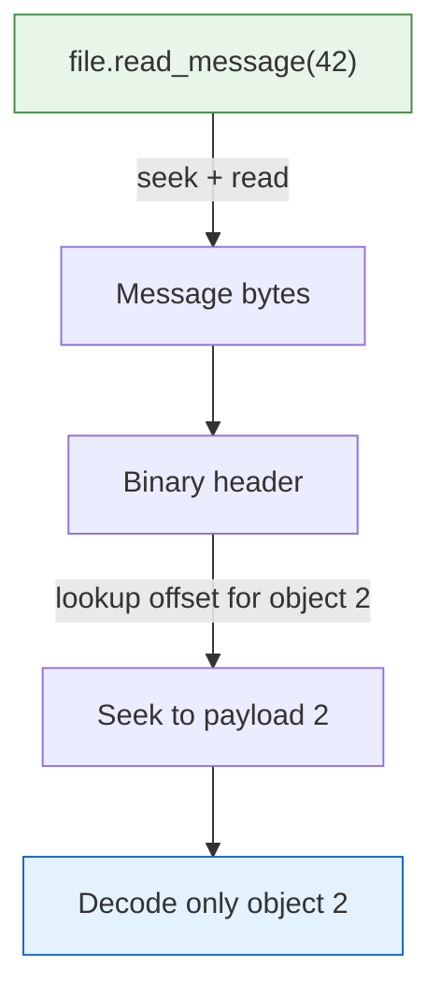

# Working with Files

The `TensogramFile` struct provides a high-level API for reading and writing `.tgm` files. It handles lazy scanning, buffered appending, and random access by message index.

## Creating a File

```rust
use tensogram_core::{TensogramFile, EncodeOptions};

let mut file = TensogramFile::create("forecast.tgm")?;
```

This creates (or truncates) the file. No data is written yet.

## Appending Messages

```rust
use std::collections::BTreeMap;
use tensogram_core::{
    GlobalMetadata, DataObjectDescriptor, ByteOrder, Dtype, EncodeOptions,
};

let global = GlobalMetadata { version: 2, ..Default::default() };

let desc = DataObjectDescriptor {
    obj_type: "ntensor".to_string(),
    ndim: 2,
    shape: vec![100, 200],
    strides: vec![200, 1],
    dtype: Dtype::Float32,
    byte_order: ByteOrder::Big,
    encoding: "none".to_string(),
    filter: "none".to_string(),
    compression: "none".to_string(),
    params: BTreeMap::new(),
    hash: None,
};

file.append(global, &[(&desc, &data)], &EncodeOptions::default())?;
```

Each `append` encodes one message and appends it to the end of the file. You can call it as many times as you like — each message is independent and self-describing.

Typical pattern for writing a multi-parameter forecast file:

```rust
let mut file = TensogramFile::create("output.tgm")?;

for param in ["2t", "10u", "10v", "msl"] {
    let (global, desc, data) = produce_field(param);
    file.append(global, &[(&desc, &data)], &EncodeOptions::default())?;
}
```

## Opening and Counting Messages

```rust
let mut file = TensogramFile::open("forecast.tgm")?;

// Streaming scan happens here (lazily, on first access)
let count = file.message_count()?;
println!("{} messages in file", count);
```

The first access triggers a streaming scan that reads preamble-sized chunks and seeks forward, so it never loads the entire file into memory. After that, every `read_message` call is a seek + read — no further scanning.

## Reading Messages

```rust
use tensogram_core::{decode, DecodeOptions};

// Read raw bytes of message 3
let raw_bytes = file.read_message(3)?;

// Decode message 3
let (meta, objects) = decode(&raw_bytes, &DecodeOptions::default())?;

// Each element is (DataObjectDescriptor, Vec<u8>)
let (ref desc, ref data) = objects[0];
println!("shape: {:?}, dtype: {}", desc.shape, desc.dtype);
```

Both are O(1) after the initial scan: they seek to the stored offset and read `length` bytes.

## Iterating Over All Messages

```rust
let mut file = TensogramFile::open("forecast.tgm")?;

for raw in file.iter()? {
    let raw = raw?;
    let meta = tensogram_core::decode_metadata(&raw)?;
    println!("version: {}", meta.version);
}
```

> **Memory note:** For files with many large messages, prefer iterating by index with `read_message(i)` inside a loop to process one at a time.

## Random Access by Index

One of Tensogram's design goals is O(1) object access. After scanning, any message is reachable in constant time. Within a message, any object is reachable in constant time via the binary header's offset table:



## File Layout Diagram

```
forecast.tgm
├── [message 0] — TENSOGRM ... 39277777
├── [message 1] — TENSOGRM ... 39277777
├── [message 2] — TENSOGRM ... 39277777
│   ├── Preamble (24B)
│   ├── Header Metadata Frame (CBOR GlobalMetadata)
│   ├── Header Index Frame (CBOR offsets)
│   ├── Data Object Frame 0 (payload + CBOR descriptor)
│   └── Data Object Frame 1 (payload + CBOR descriptor)
│   └── Postamble (16B)
└── ...
```

No file-level header, no file-level index. All indexing is per-message, built in-memory at scan time.

## Memory-Mapped I/O (optional)

Enable the `mmap` feature to use memory-mapped file access:

```toml
[dependencies]
tensogram-core = { path = "...", features = ["mmap"] }
```

```rust
let mut file = TensogramFile::open_mmap("forecast.tgm")?;

// Scan happens during open_mmap — no lazy scan needed
let count = file.message_count()?;

// Reads from the memory-mapped region (no additional seek)
let raw = file.read_message(0)?;
```

This is useful for large files where you want to avoid per-message seek + read overhead. The file is mapped read-only. All existing decode functions work unchanged.

## Async I/O (optional)

Enable the `async` feature for tokio-based non-blocking file operations:

```toml
[dependencies]
tensogram-core = { path = "...", features = ["async"] }
```

```rust
let mut file = TensogramFile::open_async("forecast.tgm").await?;

// Read a message without blocking the async runtime
let raw = file.read_message_async(0).await?;

// Decode also runs on a blocking thread (safe for FFI codecs)
let (meta, objects) = file.decode_message_async(0, &opts).await?;
```

All CPU-intensive work (scanning, decoding, FFI calls to compression libraries) runs via `tokio::task::spawn_blocking`, so it won't block the async runtime.

## Edge Cases

### Appending to an Existing File

`TensogramFile::create` truncates. To append to an existing file, use standard file I/O:

```rust
use std::io::Write;
let mut f = std::fs::OpenOptions::new().append(true).open("forecast.tgm")?;

let global = GlobalMetadata { version: 2, ..Default::default() };
let message = encode(global, &[(&desc, &data)], &EncodeOptions::default())?;
f.write_all(&message)?;
```

Or open the file with `TensogramFile::open` and use `append()` — the append method always writes at the end regardless of how the file was opened.

### Corrupted Messages

The scanner skips corrupted messages and continues. A message is considered corrupted if:
- The `total_length` field points to a location where `39277777` is not present
- The header is truncated

The scanner recovers by advancing one byte and searching for the next `TENSOGRM`.

### Empty Files

`message_count()` returns `0` for an empty file. `read_message(0)` returns an error.
