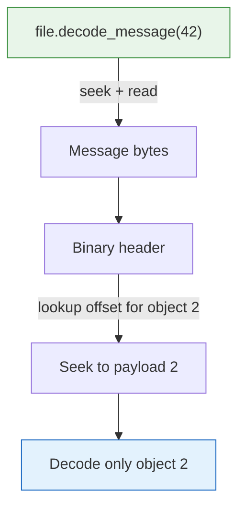

# Working with Files

The `TensogramFile` struct provides a high-level API for reading and writing `.tgm` files. It handles lazy scanning, buffered appending, and random access by message index.

## Creating a File

```rust
use tensogram_core::{TensogramFile, EncodeOptions};

let mut file = TensogramFile::create("forecast.tgm")?;
```

This creates (or truncates) the file. No data is written yet.

## Appending Messages

```rust
file.append(&metadata, &[&data], &EncodeOptions::default())?;
```

Each `append` encodes one message and appends it to the end of the file. You can call it as many times as you like — each message is independent and self-describing.

Typical pattern for writing a multi-parameter forecast file:

```rust
let mut file = TensogramFile::create("output.tgm")?;

for param in ["2t", "10u", "10v", "msl"] {
    let (metadata, data) = produce_field(param);
    file.append(&metadata, &[&data], &EncodeOptions::default())?;
}
```

## Opening and Counting Messages

```rust
let mut file = TensogramFile::open("forecast.tgm")?;

// Scanning happens here (lazily, on first access)
let count = file.message_count()?;
println!("{} messages in file", count);
```

Scanning reads the entire file once and records each message's `(offset, length)`. After that, every `read_message` and `decode_message` call is a seek + read — no further scanning.

## Reading Messages

```rust
// Read raw bytes of message 3
let raw_bytes = file.read_message(3)?;

// Decode message 3 directly
use tensogram_core::DecodeOptions;
let (meta, objects) = file.decode_message(3, &DecodeOptions::default())?;
```

Both are O(1) after the initial scan: they seek to the stored offset and read `length` bytes.

## Iterating Over All Messages

```rust
let mut file = TensogramFile::open("forecast.tgm")?;

// Returns a Vec<&[u8]> — references into the in-memory scan cache
let messages = file.messages()?;

for msg in &messages {
    let meta = tensogram_core::decode_metadata(msg)?;
    println!("shape: {:?}", meta.objects[0].shape);
}
```

> **Memory note:** `messages()` loads all message bytes into memory. For files with many large messages, prefer iterating by index with `decode_message(i, ...)` inside a loop to process one at a time.

## Random Access by Index

One of Tensogram's design goals is O(1) object access. After scanning, any message is reachable in constant time. Within a message, any object is reachable in constant time via the binary header's offset table:



## File Layout Diagram

```
forecast.tgm
├── [message 0] — TENSOGRM ... 39277777
├── [message 1] — TENSOGRM ... 39277777
├── [message 2] — TENSOGRM ... 39277777
│   ├── binary header (num_objects=2, offsets=[...]
│   ├── CBOR metadata
│   ├── OBJS payload[0] OBJE
│   └── OBJS payload[1] OBJE
└── ...
```

No file-level header, no file-level index. All indexing is per-message, built in-memory at scan time.

## Edge Cases

### Appending to an Existing File

`TensogramFile::create` truncates. To append to an existing file, use standard file I/O:

```rust
use std::io::Write;
let mut f = std::fs::OpenOptions::new().append(true).open("forecast.tgm")?;
let message = encode(&metadata, &[&data], &EncodeOptions::default())?;
f.write_all(&message)?;
```

Or open the file with `TensogramFile::open` and use `append()` — the append method always writes at the end regardless of how the file was opened.

### Corrupted Messages

The scanner skips corrupted messages and continues. A message is considered corrupted if:
- The `total_length` field points to a location where `39277777` is not present
- The header is truncated

The scanner recovers by advancing one byte and searching for the next `TENSOGRM`.

### Empty Files

`message_count()` returns `0` for an empty file. `read_message(0)` returns an error.
