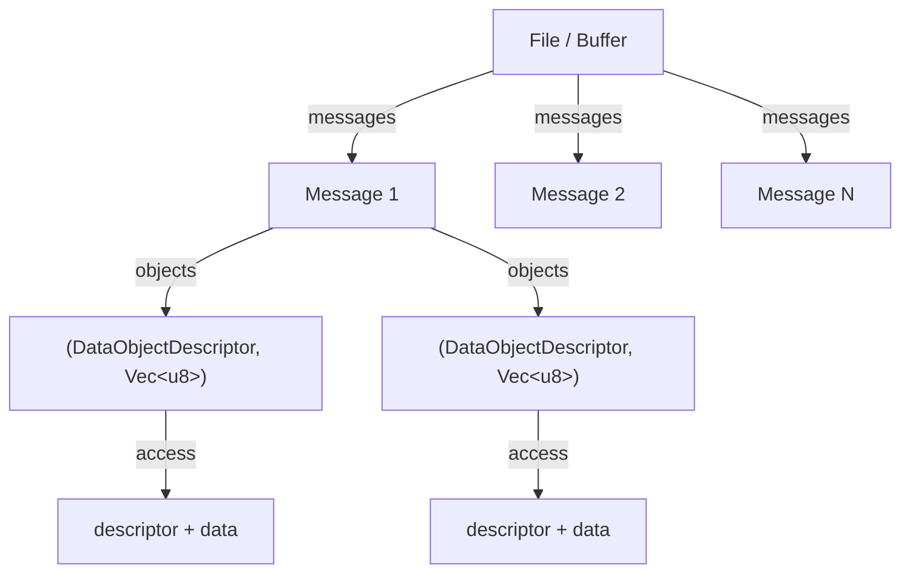

# Iterators

Tensogram provides lazy iterator APIs for traversing messages and objects without loading everything into memory at once.

## Hierarchy



## Rust API

### Buffer message iterator

Iterate over messages in a `&[u8]` byte buffer. Zero-copy: yields slices pointing into the original buffer.

```rust
use tensogram::{messages, decode, DecodeOptions};

let buf: Vec<u8> = std::fs::read("multi.tgm")?;

for msg_bytes in messages(&buf) {
    let (meta, objects) = decode(msg_bytes, &DecodeOptions::default())?;
    println!("version={} objects={}", meta.version, objects.len());
}
```

The iterator calls `scan()` once on construction, then yields `&[u8]` slices in sequence. Garbage between valid messages is silently skipped.

`MessageIter` implements `ExactSizeIterator`, so `.len()` returns the remaining count at any point.

### Object iterator

Iterate over the decoded objects (tensors) inside a single message. Each item is a `(DataObjectDescriptor, Vec<u8>)` tuple:

```rust
use tensogram::{objects, DecodeOptions};

for result in objects(&msg_bytes, DecodeOptions::default())? {
    let (descriptor, data) = result?;
    println!("shape={:?} dtype={} encoding={} bytes={}",
             descriptor.shape, descriptor.dtype, descriptor.encoding, data.len());
}
```

Each object is decoded through the full pipeline on demand — objects you don't consume are never decoded.

For metadata-only access (no payload decode), use `objects_metadata`. This returns `DataObjectDescriptor`s without decoding any payloads:

```rust
use tensogram::objects_metadata;

for desc in objects_metadata(&msg_bytes)? {
    println!("shape={:?} dtype={} byte_order={}", desc.shape, desc.dtype, desc.byte_order);
}
```

### File iterator

Iterate over messages stored in a `.tgm` file with seek-based lazy I/O:

```rust
use tensogram::{TensogramFile, objects, DecodeOptions};

let mut file = TensogramFile::open("forecast.tgm")?;
for raw in file.iter()? {
    let raw = raw?;
    // Nested: iterate objects within this message
    for result in objects(&raw, DecodeOptions::default())? {
        let (desc, data) = result?;
        println!("{:?} {} {} bytes", desc.shape, desc.dtype, data.len());
    }
}
```

`file.iter()` scans the file once (if not already scanned), then returns a `FileMessageIter` that reads each message via seek + read. The iterator does not borrow the `TensogramFile` — it owns an open file handle and a copy of the message offsets.

## C / C++ API

The C FFI uses an opaque-handle + `next()` pattern. Each iterator returns `TGM_OK` while items remain, and `TGM_END_OF_ITER` as an end sentinel.

### Buffer iterator

```c
tgm_buffer_iter_t *iter;
tgm_buffer_iter_create(buf, buf_len, &iter);

const uint8_t *msg_ptr;
size_t msg_len;
while (tgm_buffer_iter_next(iter, &msg_ptr, &msg_len) == TGM_OK) {
    // msg_ptr borrows from the original buffer
    tgm_message_t *msg;
    tgm_decode(msg_ptr, msg_len,
               /*native_byte_order=*/1, /*threads=*/0,
               /*verify_hash=*/0, &msg);
    // ... use msg ...
    tgm_message_free(msg);
}
tgm_buffer_iter_free(iter);
```

> **Lifetime**: the buffer must remain valid until `tgm_buffer_iter_free`.

### File iterator

```c
tgm_file_t *file;
tgm_file_open("data.tgm", &file);

tgm_file_iter_t *iter;
tgm_file_iter_create(file, &iter);

tgm_bytes_t raw;
while (tgm_file_iter_next(iter, &raw) == TGM_OK) {
    // raw.data is owned — free with tgm_bytes_free
    tgm_message_t *msg;
    tgm_decode(raw.data, raw.len,
               /*native_byte_order=*/1, /*threads=*/0,
               /*verify_hash=*/0, &msg);
    // ... use msg ...
    tgm_message_free(msg);
    tgm_bytes_free(raw);
}
tgm_file_iter_free(iter);
tgm_file_close(file);
```

### Object iterator

```c
tgm_object_iter_t *iter;
tgm_object_iter_create(msg_ptr, msg_len, 0, &iter);

tgm_message_t *obj;
while (tgm_object_iter_next(iter, &obj) == TGM_OK) {
    uint64_t ndim = tgm_object_ndim(obj, 0);
    const uint64_t *shape = tgm_object_shape(obj, 0);
    // ... use shape, data ...
    tgm_message_free(obj);
}
tgm_object_iter_free(iter);
```

## C++ API

The C++ wrapper (`include/tensogram.hpp`) provides RAII iterator classes that manage the underlying C handles automatically.

### Buffer iterator

```cpp
#include <tensogram.hpp>

auto buf = /* read file into std::vector<uint8_t> */;
tensogram::buffer_iterator iter(buf.data(), buf.size());

const std::uint8_t* msg_ptr;
std::size_t msg_len;
while (iter.next(msg_ptr, msg_len)) {
    auto msg = tensogram::decode(msg_ptr, msg_len);
    std::printf("version=%llu objects=%zu\n", msg.version(), msg.num_objects());
}
```

### File iterator

```cpp
auto f = tensogram::file::open("forecast.tgm");
tensogram::file_iterator iter(f);

std::vector<std::uint8_t> raw;
while (iter.next(raw)) {
    auto msg = tensogram::decode(raw.data(), raw.size());
    std::printf("objects=%zu\n", msg.num_objects());
}
```

### Object iterator

```cpp
tensogram::object_iterator iter(msg_ptr, msg_len);
tensogram::message obj = tensogram::decode(msg_ptr, msg_len); // placeholder for next()
while (iter.next(obj)) {
    auto o = obj.object(0);
    auto shape = o.shape();
    std::printf("dtype=%s shape=[%llu, %llu]\n",
                o.dtype_string().c_str(), shape[0], shape[1]);
}
```

### Range-based for on message

```cpp
auto msg = tensogram::decode(buf, len);
for (const auto& obj : msg) {
    std::printf("dtype=%s bytes=%zu\n",
                obj.dtype_string().c_str(), obj.data_size());
}
```

## Python API

`TensogramFile` supports iteration, indexing, and slicing:

```python
import tensogram

# Iterate all messages
with tensogram.TensogramFile.open("forecast.tgm") as f:
    for meta, objects in f:
        for desc, arr in objects:
            print(f"  shape={arr.shape}  dtype={desc.dtype}")

# Index and slice
with tensogram.TensogramFile.open("forecast.tgm") as f:
    meta, objects = f[0]        # first message
    meta, objects = f[-1]       # last message
    subset = f[10:20]           # range of messages
    every_5th = f[::5]          # strided access

# Buffer iteration
buf = open("data.tgm", "rb").read()
for meta, objects in tensogram.iter_messages(buf):
    desc, arr = objects[0]
    print(f"  shape={arr.shape}")
```

`decode()`, `decode_message()`, file iteration, and `iter_messages()` return `Message` namedtuples with `.metadata` and `.objects` fields.
Tuple unpacking (`meta, objects = msg`) also works. `TensogramFile` supports `len(f)` and context manager (`with`).

**Thread safety:** iterators own independent file handles and buffer copies — no shared mutable state. Safe under free-threaded Python (PEP 703, no GIL).

## Edge cases

| Scenario | Behavior |
|----------|----------|
| Empty buffer / file | Iterator yields zero items |
| Garbage between messages | Silently skipped by scanner |
| Truncated message at end | Skipped (not yielded) |
| Zero-object message | `objects()` returns empty iterator |
| I/O error during file iteration | `FileMessageIter::next()` yields `Err(...)` |
