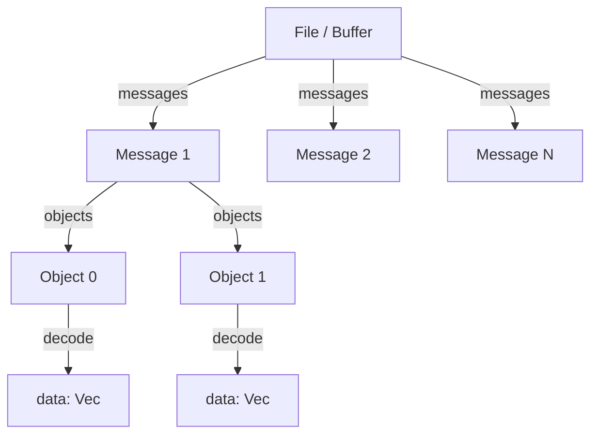

# Iterators

Tensogram provides lazy iterator APIs for traversing messages and objects without loading everything into memory at once.

## Hierarchy



## Rust API

### Buffer message iterator

Iterate over messages in a `&[u8]` byte buffer. Zero-copy: yields slices pointing into the original buffer.

```rust
use tensogram_core::{messages, decode, DecodeOptions};

let buf: Vec<u8> = std::fs::read("multi.tgm")?;

for msg_bytes in messages(&buf) {
    let (meta, objects) = decode(msg_bytes, &DecodeOptions::default())?;
    println!("version={} objects={}", meta.version, objects.len());
}
```

The iterator calls `framing::scan()` once on construction, then yields `&[u8]` slices in sequence. Garbage between valid messages is silently skipped.

`MessageIter` implements `ExactSizeIterator`, so `.len()` returns the remaining count at any point.

### Object iterator

Iterate over the decoded objects (tensors) inside a single message:

```rust
use tensogram_core::{objects, DecodeOptions};

for result in objects(&msg_bytes, DecodeOptions::default())? {
    let (descriptor, data) = result?;
    println!("shape={:?} dtype={} bytes={}",
             descriptor.shape, descriptor.dtype, data.len());
}
```

Each object is decoded through the full pipeline on demand — objects you don't consume are never decoded.

For metadata-only access (no payload decode), use `objects_metadata`:

```rust
use tensogram_core::objects_metadata;

for desc in objects_metadata(&msg_bytes)? {
    println!("shape={:?} dtype={}", desc.shape, desc.dtype);
}
```

### File iterator

Iterate over messages stored in a `.tgm` file with seek-based lazy I/O:

```rust
use tensogram_core::{TensogramFile, objects, DecodeOptions};

let mut file = TensogramFile::open("forecast.tgm")?;
for raw in file.iter()? {
    let raw = raw?;
    // Nested: iterate objects within this message
    for result in objects(&raw, DecodeOptions::default())? {
        let (desc, data) = result?;
        println!("{:?} {} bytes", desc.shape, data.len());
    }
}
```

`file.iter()` scans the file once (if not already scanned), then returns a `FileMessageIter` that reads each message via seek + read. The iterator does not borrow the `TensogramFile` — it owns a clone of the path and offsets.

## C / C++ API

The C FFI uses an opaque-handle + `next()` pattern. Each iterator returns `TGM_OK` while items remain, and `TGM_END_OF_ITER` as an end sentinel.

### Buffer iterator

```c
tgm_buffer_iter_t *iter;
tgm_buffer_iter_create(buf, buf_len, &iter);

const uint8_t *msg_ptr;
size_t msg_len;
while (tgm_buffer_iter_next(iter, &msg_ptr, &msg_len) == TGM_OK) {
    // msg_ptr borrows from the original buffer
    tgm_message_t *msg;
    tgm_decode(msg_ptr, msg_len, 0, &msg);
    // ... use msg ...
    tgm_message_free(msg);
}
tgm_buffer_iter_free(iter);
```

> **Lifetime**: the buffer must remain valid until `tgm_buffer_iter_free`.

### File iterator

```c
tgm_file_t *file;
tgm_file_open("data.tgm", &file);

tgm_file_iter_t *iter;
tgm_file_iter_create(file, &iter);

tgm_bytes_t raw;
while (tgm_file_iter_next(iter, &raw) == TGM_OK) {
    // raw.data is owned — free with tgm_bytes_free
    tgm_message_t *msg;
    tgm_decode(raw.data, raw.len, 0, &msg);
    // ... use msg ...
    tgm_message_free(msg);
    tgm_bytes_free(raw);
}
tgm_file_iter_free(iter);
tgm_file_close(file);
```

### Object iterator

```c
tgm_object_iter_t *iter;
tgm_object_iter_create(msg_ptr, msg_len, 0, &iter);

tgm_message_t *obj;
while (tgm_object_iter_next(iter, &obj) == TGM_OK) {
    uint64_t ndim = tgm_object_ndim(obj, 0);
    const uint64_t *shape = tgm_object_shape(obj, 0);
    // ... use shape, data ...
    tgm_message_free(obj);
}
tgm_object_iter_free(iter);
```

## Python API

The Python bindings support the iterator protocol natively:

```python
import tensogram

# File iteration
f = tensogram.TensogramFile.open("forecast.tgm")
for msg in f:
    print(f"Message with {len(msg)} objects")
    for tensor in msg:
        print(f"  shape={tensor.shape}  dtype={tensor.dtype}")
        val = tensor[0, 0]  # N-d indexing

# Buffer iteration
buf = open("data.tgm", "rb").read()
for msg in tensogram.iter_messages(buf):
    for tensor in msg:
        arr = tensor.to_numpy()
```

## Edge cases

| Scenario | Behavior |
|----------|----------|
| Empty buffer / file | Iterator yields zero items |
| Garbage between messages | Silently skipped by scanner |
| Truncated message at end | Skipped (not yielded) |
| Zero-object message | `objects()` returns empty iterator |
| I/O error during file iteration | `FileMessageIter::next()` yields `Err(...)` |
