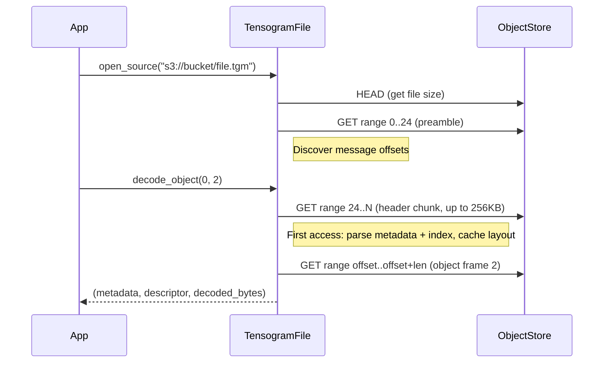

# Remote Access

Enable the `remote` feature to open `.tgm` files on HTTP, S3, GCS, or Azure without downloading the whole file. Individual objects are fetched via targeted range requests.

```toml
[dependencies]
tensogram-core = { path = "...", features = ["remote"] }
```

## Opening a Remote File

```rust
use tensogram_core::TensogramFile;

// Auto-detect: local path or remote URL
let mut file = TensogramFile::open_source("https://example.com/forecast.tgm")?;

// S3
let mut file = TensogramFile::open_source("s3://bucket/forecast.tgm")?;
```

`open_source` inspects the URL scheme and routes to the remote backend for `s3://`, `s3a://`, `gs://`, `az://`, `azure://`, `http://`, `https://`. Everything else is treated as a local path.

The original `open()` method is unchanged and always opens a local file.

You can also check whether a string is a remote URL without opening:

```rust
use tensogram_core::is_remote_url;

assert!(is_remote_url("s3://bucket/file.tgm"));
assert!(!is_remote_url("/local/path/file.tgm"));
```

## Storage Options (Credentials, Region, etc.)

Pass an explicit options map for fine-grained control:

```rust
use std::collections::BTreeMap;
use tensogram_core::TensogramFile;

let mut opts = BTreeMap::new();
opts.insert("aws_access_key_id".to_string(), "AKIA...".to_string());
opts.insert("aws_secret_access_key".to_string(), "...".to_string());
opts.insert("region".to_string(), "eu-west-1".to_string());

let mut file = TensogramFile::open_remote("s3://bucket/forecast.tgm", &opts)?;
```

When no options are passed, credentials are read from the environment (e.g. `AWS_ACCESS_KEY_ID`, `AWS_SECRET_ACCESS_KEY`, `AWS_DEFAULT_REGION`, `GOOGLE_APPLICATION_CREDENTIALS`).

## Supported Schemes

| Scheme | Backend | Notes |
|--------|---------|-------|
| `http://`, `https://` | HTTP | `allow_http` is set automatically for `http://` |
| `s3://`, `s3a://` | Amazon S3 | Env-based or explicit credentials |
| `gs://` | Google Cloud Storage | Service account or env |
| `az://`, `azure://` | Azure Blob Storage | MSI or env |

All backends are provided by the [`object_store`](https://crates.io/crates/object_store) crate.

## Object-Level Access

Three methods provide selective access without downloading full messages:

```rust
use tensogram_core::DecodeOptions;

// Metadata only — triggers layout discovery on first call, then cached
let meta = file.decode_metadata(0)?;

// Descriptors — fetches each object frame to extract its descriptor
let (meta, descriptors) = file.decode_descriptors(0)?;

// Single object by index — fetches only the target object frame
let (meta, desc, data) = file.decode_object(0, 2, &DecodeOptions::default())?;
```

These methods also work on local files, where they read the full message and decode the requested parts.

## Request Budget

### Header-indexed files (buffered writes)

| Phase | Operation | HTTP Requests |
|-------|-----------|:---:|
| **Open** | `open_source` / `open_remote` | 1 HEAD + 1 GET per message (preamble read) |
| **First access** | `decode_metadata(i)` | 1 GET (header chunk, discovers metadata + index) |
| **Cached** | `decode_metadata(i)` again | 0 (served from cache) |
| **Object read** | `decode_object(i, j)` | 1 GET per object (if layout already cached) |
| **Descriptors** | `decode_descriptors(i)` | 1 GET per object in message |

### Footer-indexed files (streaming writes)

| Phase | Operation | HTTP Requests |
|-------|-----------|:---:|
| **Open** | `open_source` / `open_remote` | 1 HEAD + 1 GET per message (preamble read) |
| **First access** | `decode_metadata(i)` | 2 GETs (postamble + footer region) |
| **Cached** | `decode_metadata(i)` again | 0 (served from cache) |
| **Object read** | `decode_object(i, j)` | 1 GET per object (if layout already cached) |

The layout (metadata + index) is discovered per-message on first access to that message, then cached. Subsequent calls reuse the cached layout. Streaming messages must be the last message in a multi-message file.

## How It Works



## Checking if a File is Remote

```rust
use tensogram_core::TensogramFile;

let file = TensogramFile::open_source("s3://bucket/data.tgm")?;
assert!(file.is_remote());
println!("source: {}", file.source()); // "s3://bucket/data.tgm"
```

`source()` returns the original URL for remote files and the file path for local files.

## Error Handling

Remote access can return different `TensogramError` variants depending on the failure:

| Error condition | Error type | When it happens |
|-----------------|------------|-----------------|
| Invalid URL | `Remote` | `open_source` / `open_remote` with a malformed URL |
| Connection failure | `Remote` | Network unreachable, DNS failure, timeout |
| File not found | `Remote` | HTTP 404, S3 NoSuchKey |
| No valid messages | `Remote` | File contains no parseable messages |
| Unsupported layout | `Remote` | Message lacks both header-index and footer-index flags |
| Object index out of range | `Object` | `decode_object(i, j)` where `j >= object_count` |

All errors are returned as `Result`. The library avoids panics, though thread creation failures and corrupt-index arithmetic edge cases may still panic in extreme conditions.

## Limitations

- **Streaming messages must be last.** In multi-message files, streaming-encoded messages (`total_length=0`) must be the last message. The remote scanner assumes the streaming message extends to the end of the file.
- **Optimistic scan.** Remote message scanning validates preamble magic and `total_length` plausibility but does not verify end-of-message markers (unlike local scanning). A corrupt preamble with a plausible length will be accepted until a later read fails.
- **Read-only.** Remote writes are not supported.
- **Header probe size.** Layout discovery reads a single chunk of up to 256 KB from the header region. If the metadata or index frame does not fit in this chunk, `decode_metadata()` will error (it does not retry with a larger read).
- **HTTP server requirements.** The remote HTTP server must support `HEAD` requests (for file size) and `Range` request headers (for partial reads).
- **Rust core only.** Python bindings, xarray backend, and zarr store do not yet support remote URLs. This will be added in a follow-up PR.
- **`read_message()` and `decode_message()` download the full message** even for remote files. Use `decode_metadata()`, `decode_descriptors()`, or `decode_object()` for selective access.
- **Thread-per-request.** Each range request spawns a thread with a temporary tokio runtime. This is correct but not optimal for many small reads. A shared runtime will be added in a follow-up.
