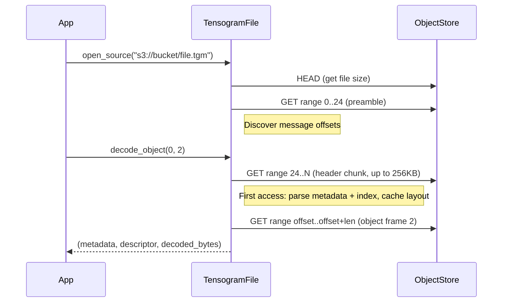

# Remote Access

Enable the `remote` feature to open `.tgm` files on HTTP, S3, GCS, or Azure without downloading the whole file. Individual objects are fetched via targeted range requests.

```toml
[dependencies]
tensogram-core = { path = "...", features = ["remote"] }
```

## Opening a Remote File

```rust
use tensogram_core::TensogramFile;

// Auto-detect: local path or remote URL
let mut file = TensogramFile::open_source("https://example.com/forecast.tgm")?;

// S3
let mut file = TensogramFile::open_source("s3://bucket/forecast.tgm")?;
```

`open_source` inspects the URL scheme and routes to the remote backend for `s3://`, `s3a://`, `gs://`, `az://`, `azure://`, `http://`, `https://`. Everything else is treated as a local path.

The Rust `open()` method is unchanged and always opens a local file. In Python, `TensogramFile.open()` auto-detects remote URLs.

You can also check whether a string is a remote URL without opening:

```rust
use tensogram_core::is_remote_url;

assert!(is_remote_url("s3://bucket/file.tgm"));
assert!(!is_remote_url("/local/path/file.tgm"));
```

## Storage Options (Credentials, Region, etc.)

Pass an explicit options map for fine-grained control:

```rust
use std::collections::BTreeMap;
use tensogram_core::TensogramFile;

let mut opts = BTreeMap::new();
opts.insert("aws_access_key_id".to_string(), "AKIA...".to_string());
opts.insert("aws_secret_access_key".to_string(), "...".to_string());
opts.insert("region".to_string(), "eu-west-1".to_string());

let mut file = TensogramFile::open_remote("s3://bucket/forecast.tgm", &opts)?;
```

When no options are passed, credentials are read from the environment (e.g. `AWS_ACCESS_KEY_ID`, `AWS_SECRET_ACCESS_KEY`, `AWS_DEFAULT_REGION`, `GOOGLE_APPLICATION_CREDENTIALS`).

## Python Usage

```python
import tensogram

# Auto-detect remote URL
with tensogram.TensogramFile.open("s3://bucket/forecast.tgm") as f:
    meta = f.file_decode_metadata(0)
    result = f.file_decode_object(0, 0)
    data = result["data"]  # numpy array

# With explicit storage options
with tensogram.TensogramFile.open_remote(
    "s3://bucket/forecast.tgm",
    {"region": "eu-west-1"}
) as f:
    print(f.source())   # "s3://bucket/forecast.tgm"
    print(f.is_remote()) # True
```

## xarray Usage

```python
import xarray as xr

ds = xr.open_dataset(
    "s3://bucket/forecast.tgm",
    engine="tensogram",
    storage_options={"region": "eu-west-1"},
)
```

## Supported Schemes

| Scheme | Backend | Notes |
|--------|---------|-------|
| `http://`, `https://` | HTTP | `allow_http` is set automatically for `http://` |
| `s3://`, `s3a://` | Amazon S3 | Env-based or explicit credentials |
| `gs://` | Google Cloud Storage | Service account or env |
| `az://`, `azure://` | Azure Blob Storage | MSI or env |

All backends are provided by the [`object_store`](https://crates.io/crates/object_store) crate.

## Object-Level Access

Three methods provide selective access without downloading full messages:

```rust
use tensogram_core::DecodeOptions;

// Metadata only — triggers layout discovery on first call, then cached
let meta = file.decode_metadata(0)?;

// Descriptors — reads only the descriptor data needed for each object
let (meta, descriptors) = file.decode_descriptors(0)?;

// Single object by index — fetches only the target object frame
let (meta, desc, data) = file.decode_object(0, 2, &DecodeOptions::default())?;
```

These methods also work on local files, where they read the full message and decode the requested parts.

## Request Budget

### Header-indexed files (buffered writes)

| Phase | Operation | HTTP Requests |
|-------|-----------|:---:|
| **Open** | `open_source` / `open_remote` | 1 HEAD + 1 GET per message (preamble read) |
| **First access** | `decode_metadata(i)` | 1 GET (header chunk, discovers metadata + index) |
| **Cached** | `decode_metadata(i)` again | 0 (served from cache) |
| **Object read** | `decode_object(i, j)` | 1 GET per object (if layout already cached) |
| **Descriptors (first)** | `decode_descriptors(i)` | 1 GET (layout) + 1 GET per object |
| **Descriptors (cached)** | `decode_descriptors(i)` | 1 GET per object |

### Footer-indexed files (streaming writes)

| Phase | Operation | HTTP Requests |
|-------|-----------|:---:|
| **Open** | `open_source` / `open_remote` | 1 HEAD + 1 GET per message (preamble read) |
| **First access** | `decode_metadata(i)` | 2 GETs (postamble + footer region) |
| **Cached** | `decode_metadata(i)` again | 0 (served from cache) |
| **Object read** | `decode_object(i, j)` | 1 GET per object (if layout already cached) |
| **Descriptors (first)** | `decode_descriptors(i)` | 2 GETs (layout) + 1 GET per object |
| **Descriptors (cached)** | `decode_descriptors(i)` | 1 GET per object |

The layout (metadata + index) is discovered per-message on first access to that message, then cached. Subsequent calls reuse the cached layout. Streaming messages must be the last message in a multi-message file.

## How It Works (Header-Indexed Example)



## Checking if a File is Remote

```rust
use tensogram_core::TensogramFile;

let file = TensogramFile::open_source("s3://bucket/data.tgm")?;
assert!(file.is_remote());
println!("source: {}", file.source()); // "s3://bucket/data.tgm"
```

`source()` returns the original URL for remote files and the file path for local files.

## Error Handling

Remote access can return different `TensogramError` variants depending on the failure:

| Error condition | Error type | When it happens |
|-----------------|------------|-----------------|
| Invalid URL | `Remote` | `open_source` / `open_remote` with a malformed URL |
| Connection failure | `Remote` | Network unreachable, DNS failure, timeout |
| File not found | `Remote` | HTTP 404, S3 NoSuchKey |
| No valid messages | `Remote` | File contains no parseable messages |
| Unsupported layout | `Remote` | Message lacks both header-index and footer-index flags |
| Object index out of range | `Object` | `decode_object(i, j)` where `j >= object_count` |

All errors are returned as `Result`. The library avoids panics.

## Shared Runtime

Remote I/O uses a process-wide shared tokio runtime (multi-thread, 2 workers) created on first use. All `RemoteBackend` instances share the same runtime, so TCP connection pools and DNS caches are reused across calls.

The sync bridge adapts to the calling context:

- **Not in a tokio runtime** (Python, CLI): the shared runtime's handle drives the future directly — no extra thread creation.
- **Inside a multi-thread tokio runtime** (`#[tokio::test]`, server handler): `block_in_place` tells tokio to spawn a replacement worker so the blocked thread doesn't cause runtime starvation.
- **Inside a current-thread tokio runtime**: falls back to a scoped thread, since `block_in_place` is not supported on single-threaded runtimes.

## Async API

The `async` feature enables async methods for decode, read, and metadata extraction. These work for both local and remote files:

```rust
use tensogram_core::{TensogramFile, DecodeOptions};

// Async decode methods (feature = "async")
let meta = file.decode_metadata_async(0).await?;
let (meta, descs) = file.decode_descriptors_async(0).await?;
let (meta, desc, data) = file.decode_object_async(0, 0, &DecodeOptions::default()).await?;
let msg = file.read_message_async(0).await?;
```

When both `remote` and `async` features are enabled, async open methods are also available:

```rust
// Async open (auto-detects local vs remote) — requires remote + async
let mut file = TensogramFile::open_source_async("s3://bucket/forecast.tgm").await?;

// Async open with explicit storage options
let mut file = TensogramFile::open_remote_async(
    "s3://bucket/forecast.tgm",
    &opts,
).await?;
```

For remote backends, async methods directly `await` object store operations, bypassing the sync bridge entirely. For local backends, they use `spawn_blocking` for file I/O.

```toml
[dependencies]
tensogram-core = { path = "...", features = ["remote", "async"] }
```

## Range Reads

`TensogramFile::decode_range()` supports partial object decoding for both local and remote files. It takes an object index and a list of `(offset, count)` element ranges, returning only the requested elements without decoding the entire object.

For remote files, it fetches the full object frame (via indexed access) then runs the range decode pipeline on the raw payload. This is most beneficial with szip-compressed objects that have `szip_block_offsets`, where only the compressed blocks covering the requested range are decompressed.

```rust
// Rust: decode elements 100..200 from object 0
let ranges = vec![(100, 100)];
let parts = file.decode_range(0, 0, &ranges, &DecodeOptions::default())?;
```

```python
# Python: decode elements 100..200 from object 0
arr = file.file_decode_range(0, 0, [(100, 100)], join=True)
```

The xarray backend uses `file_decode_range` automatically when slicing remote arrays that support partial decode (uncompressed or szip-compressed objects without shuffle filters).

## Descriptor-Only Reads

`decode_descriptors()` fetches only the CBOR descriptor from each data object frame, not the full payload. For large objects (hundreds of MB), this avoids downloading the entire frame just to extract a few hundred bytes of metadata.

For frames smaller than 64 KB, the full frame is read in a single request (fewer round-trips). For larger frames, the library reads only the frame header (16 bytes), footer (12 bytes), and the CBOR descriptor region.

## Limitations

- **Streaming messages must be last.** In multi-message files, streaming-encoded messages (`total_length=0`) must be the last message. The remote scanner assumes the streaming message extends to the end of the file.
- **Optimistic scan for buffered messages.** Remote message scanning validates preamble magic and `total_length` plausibility but does not verify end-of-message markers for buffered messages. Streaming messages (`total_length=0`) do validate the END_MAGIC at EOF.
- **Read-only.** Remote writes are not supported.
- **Header probe size.** Layout discovery reads a single chunk of up to 256 KB from the header region. If the metadata or index frame does not fit in this chunk, `decode_metadata()` will error (it does not retry with a larger read).
- **HTTP server requirements.** The remote HTTP server must support `HEAD` requests (for file size) and `Range` request headers (for partial reads).
- **`read_message()` and `decode_message()` download the full message** even for remote files. Use `decode_metadata()`, `decode_descriptors()`, or `decode_object()` for selective access.
- **Zarr remote reads are lazy per-chunk.** The zarr store fetches only metadata at open time; individual chunks are decoded on first access. Local files still use eager decode for lower latency.
- **Sequential async access.** Async methods take `&mut self`, so a single file handle cannot serve concurrent async reads. Open separate handles for parallelism.
