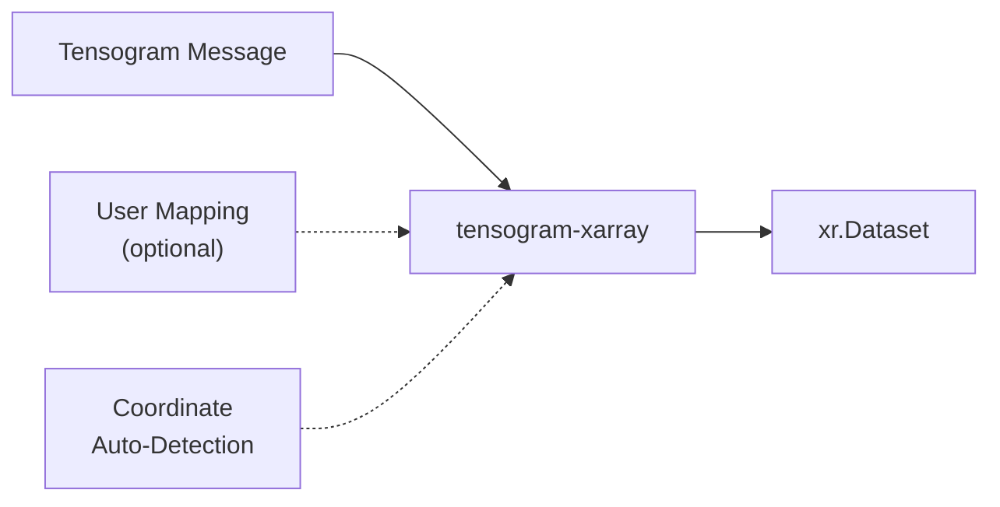
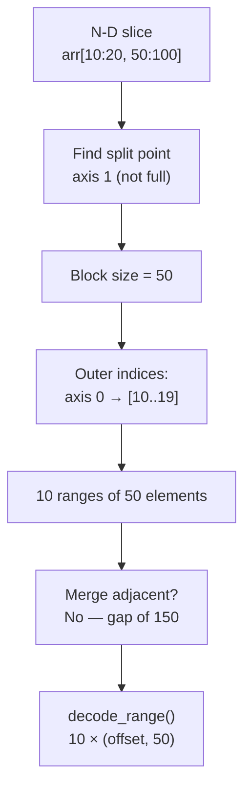

# xarray Integration

The `tensogram-xarray` package provides a read-only xarray backend engine
for `.tgm` files.  Once installed, you can open tensogram data with:

```python
import xarray as xr
ds = xr.open_dataset("forecast.tgm", engine="tensogram")
```

This chapter explains the conversion philosophy, the mapping rules, and
walks through progressively complex examples so you know exactly what
to expect -- and what to provide -- when loading tensogram data into xarray.

---

## Philosophy: Why Mapping is Needed

Tensogram and xarray have fundamentally different data models:

| Concept | Tensogram | xarray |
|---------|-----------|--------|
| Dimensions | Unnamed, positional (`shape = [721, 1440]`) | Named (`"latitude"`, `"longitude"`) |
| Coordinates | Not built-in; application metadata | Arrays of values labelling each dimension |
| Variables | Data objects, indexed by position | Named DataArrays inside a Dataset |
| Attributes | CBOR maps at message and per-object level | Key-value dicts on Dataset and DataArray |

Tensogram is **vocabulary-agnostic** by design.  The library never interprets
metadata keys -- it does not know what `"mars.param"` or `"date"` means.
xarray, on the other hand, requires named dimensions and coordinate arrays
to enable its powerful label-based indexing and alignment.

The `tensogram-xarray` backend bridges this gap.  It applies a set of rules
to translate tensogram structure into xarray structure, and lets you override
those rules when the defaults are not enough.



### The Mapping Pipeline

When you call `xr.open_dataset("file.tgm", engine="tensogram")`:

1. **Read metadata** -- only the CBOR metadata is parsed (no payload decode).
2. **Detect coordinates** -- data objects whose `name` or `param` matches a
   known coordinate name (`latitude`, `longitude`, `time`, ...) become
   coordinate arrays.
3. **Name dimensions** -- if you provided `dim_names`, those are used.
   Otherwise, axes matching a detected coordinate use that coordinate's
   name; remaining axes become `dim_0`, `dim_1`, ...
4. **Name variables** -- if you provided `variable_key`, the value at that
   metadata path becomes the variable name.  Otherwise `object_0`, `object_1`, ...
5. **Wrap data lazily** -- each tensor is backed by a `BackendArray` that
   decodes on demand.  No payload bytes are read until you access `.values`.

---

## Example 1: Simplest Case -- Single Object, No Metadata

**Creating the file:**

```python
import numpy as np
import tensogram

data = np.arange(60, dtype=np.float32).reshape(6, 10)
meta = {"version": 2}
desc = {"type": "ntensor", "shape": [6, 10], "dtype": "float32",
        "byte_order": "little", "encoding": "none",
        "filter": "none", "compression": "none"}

with tensogram.TensogramFile.create("simple.tgm") as f:
    f.append(meta, [(desc, data)])
```

**Opening in xarray:**

```python
>>> import xarray as xr
>>> ds = xr.open_dataset("simple.tgm", engine="tensogram")
>>> ds
<xarray.Dataset>
Dimensions:   (dim_0: 6, dim_1: 10)
Dimensions without coordinates: dim_0, dim_1
Data variables:
    object_0  (dim_0, dim_1) float32 ...
Attributes:
    tensogram_version:  2
```

The data object became a variable named `object_0`.  Dimensions are
auto-generated as `dim_0`, `dim_1`.  No coordinates -- tensogram has
no information to generate them.

**Adding dimension names:**

```python
>>> ds = xr.open_dataset("simple.tgm", engine="tensogram",
...                      dim_names=["latitude", "longitude"])
>>> ds["object_0"].dims
('latitude', 'longitude')
```

---

## Example 2: Single Object with Coordinate Objects

When coordinate arrays are stored as separate data objects in the same
message, the backend auto-detects them by name.

**Creating the file:**

```python
lat = np.linspace(-90, 90, 5, dtype=np.float64)
lon = np.linspace(0, 360, 8, endpoint=False, dtype=np.float64)
temp = np.random.default_rng(42).random((5, 8)).astype(np.float32)

meta = {"version": 2, "payload": [
    {"name": "latitude"},
    {"name": "longitude"},
    {"name": "temperature"},
]}

with tensogram.TensogramFile.create("with_coords.tgm") as f:
    f.append(meta, [
        ({"type": "ntensor", "shape": [5], "dtype": "float64", ...}, lat),
        ({"type": "ntensor", "shape": [8], "dtype": "float64", ...}, lon),
        ({"type": "ntensor", "shape": [5, 8], "dtype": "float32", ...}, temp),
    ])
```

**Opening in xarray:**

```python
>>> ds = xr.open_dataset("with_coords.tgm", engine="tensogram")
>>> ds
<xarray.Dataset>
Dimensions:      (latitude: 5, longitude: 8)
Coordinates:
  * latitude     (latitude) float64 -90.0 -45.0 0.0 45.0 90.0
  * longitude    (longitude) float64 0.0 45.0 90.0 135.0 180.0 225.0 270.0 315.0
Data variables:
    temperature  (latitude, longitude) float32 ...
Attributes:
    tensogram_version:  2
```

**How it works:**

- Objects with `name: "latitude"` and `name: "longitude"` match known
  coordinate names (case-insensitive).
- They become coordinate arrays on the Dataset.
- The temperature object's shape `(5, 8)` matches the sizes of
  `latitude` (5) and `longitude` (8), so its dimensions are automatically
  resolved to `("latitude", "longitude")`.

### Known Coordinate Names

The following names are recognized (case-insensitive):

| Name | Canonical dimension |
|------|-------------------|
| `lat`, `latitude` | `latitude` |
| `lon`, `longitude` | `longitude` |
| `x` | `x` |
| `y` | `y` |
| `time` | `time` |
| `level` | `level` |
| `pressure` | `pressure` |
| `height` | `height` |
| `depth` | `depth` |
| `frequency` | `frequency` |
| `step` | `step` |

If no matching coordinate objects are found and no `dim_names` are provided,
dimensions remain generic (`dim_0`, `dim_1`, ...).

---

## Example 3: Multi-Object with `variable_key`

When a message contains multiple data objects, each with per-object metadata
identifying the parameter, you can use `variable_key` to name the variables.

**Creating the file:**

```python
t2m = np.ones((3, 4), dtype=np.float32) * 273.15
u10 = np.ones((3, 4), dtype=np.float32) * 5.0

meta = {"version": 2,
    "common": {"mars": {"class": "od", "date": "20260401", "type": "fc"}},
    "payload": [
        {"mars": {"param": "2t", "levtype": "sfc"}},
        {"mars": {"param": "10u", "levtype": "sfc"}},
    ],
}

with tensogram.TensogramFile.create("mars.tgm") as f:
    f.append(meta, [
        ({"type": "ntensor", "shape": [3, 4], "dtype": "float32", ...}, t2m),
        ({"type": "ntensor", "shape": [3, 4], "dtype": "float32", ...}, u10),
    ])
```

**Without `variable_key`:**

```python
>>> ds = xr.open_dataset("mars.tgm", engine="tensogram")
>>> list(ds.data_vars)
['object_0', 'object_1']
```

**With `variable_key`:**

```python
>>> ds = xr.open_dataset("mars.tgm", engine="tensogram",
...                      variable_key="mars.param")
>>> list(ds.data_vars)
['2t', '10u']
>>> ds.attrs
{'mars': {'class': 'od', 'date': '20260401', 'type': 'fc'},
 'tensogram_version': 2}
```

The `variable_key` supports dotted paths: `"mars.param"` navigates into
the nested `mars` dict within each object's metadata.

---

## Example 4: Multi-Message File with Auto-Merge

When a `.tgm` file contains many messages (one object each) that differ
only in metadata, `open_datasets()` can stack them along outer dimensions.

**Creating the file:**

```python
import tensogram_xarray

rng = np.random.default_rng(99)
with tensogram.TensogramFile.create("multi.tgm") as f:
    for param in ["2t", "10u"]:
        for date in ["20260401", "20260402"]:
            data = rng.random((3, 4), dtype=np.float32).astype(np.float32)
            meta = {"version": 2,
                    "payload": [{"mars": {"param": param, "date": date}}]}
            desc = {"type": "ntensor", "shape": [3, 4], "dtype": "float32",
                    "byte_order": "little", "encoding": "none",
                    "filter": "none", "compression": "none"}
            f.append(meta, [(desc, data)])
```

**Opening with `open_datasets()`:**

```python
>>> datasets = tensogram_xarray.open_datasets(
...     "multi.tgm", variable_key="mars.param"
... )
>>> len(datasets)
1
>>> ds = datasets[0]
>>> list(ds.data_vars)
['2t', '10u']
```

**What happened:**

1. The scanner read metadata from all 4 messages (no payload decode).
2. Objects were grouped by structure: all have shape `(3, 4)` and `float32`.
3. `variable_key="mars.param"` split by parameter: `2t` (2 objects) and
   `10u` (2 objects).
4. Within each sub-group, `mars.date` varies across `["20260401", "20260402"]`,
   so it became an outer dimension.
5. Each variable has shape `(2, 3, 4)` with a `mars.date` coordinate.

---

## Example 5: Heterogeneous File -- Auto-Split

When a file contains objects of different shapes or dtypes, they cannot
be merged into a single Dataset.  `open_datasets()` automatically splits
them into compatible groups.

**Creating the file:**

```python
with tensogram.TensogramFile.create("hetero.tgm") as f:
    # Message 0: 2D float32 temperature field
    f.append({"version": 2, "payload": [{"name": "temp"}]},
             [({"type": "ntensor", "shape": [3, 4], "dtype": "float32", ...},
               np.ones((3, 4), dtype=np.float32))])

    # Message 1: 2D float32 wind field (same shape -- compatible)
    f.append({"version": 2, "payload": [{"name": "wind"}]},
             [({"type": "ntensor", "shape": [3, 4], "dtype": "float32", ...},
               np.ones((3, 4), dtype=np.float32) * 2)])

    # Message 2: 1D int32 counts (different shape AND dtype -- incompatible)
    f.append({"version": 2, "payload": [{"name": "counts"}]},
             [({"type": "ntensor", "shape": [5], "dtype": "int32", ...},
               np.array([1, 2, 3, 4, 5], dtype=np.int32))])
```

**Opening:**

```python
>>> datasets = tensogram_xarray.open_datasets("hetero.tgm")
>>> len(datasets)
2
>>> datasets[0]  # The (3, 4) float32 group
<xarray.Dataset>
Dimensions:  (dim_0: 3, dim_1: 4)
Data variables:
    temp     (dim_0, dim_1) float32 ...
    wind     (dim_0, dim_1) float32 ...

>>> datasets[1]  # The (5,) int32 group
<xarray.Dataset>
Dimensions:  (dim_0: 5)
Data variables:
    counts   (dim_0) int32 ...
```

Objects that share `(shape, dtype)` are grouped together.  Incompatible
objects go to separate Datasets.

---

## Example 6: Providing Full User Mapping

For complete control, pass all mapping parameters:

```python
ds = xr.open_dataset(
    "forecast.tgm",
    engine="tensogram",
    dim_names=["latitude", "longitude"],
    variable_key="mars.param",
    message_index=0,         # which message in a multi-message file
    verify_hash=True,        # verify xxh3 integrity on decode
)
```

| Parameter | Type | Effect |
|-----------|------|--------|
| `dim_names` | `list[str]` | Names for the innermost tensor axes (positional) |
| `variable_key` | `str` | Dotted path in per-object metadata for variable naming |
| `message_index` | `int` | Which message to open (default `0`) |
| `merge_objects` | `bool` | If `True`, calls `open_datasets()` and returns first result |
| `verify_hash` | `bool` | Verify xxh3 hashes during decode |
| `drop_variables` | `list[str]` | Variables to exclude from the Dataset |
| `range_threshold` | `float` | Fraction of total elements below which partial reads are used (default `0.5`) |

For multi-message files, use `tensogram_xarray.open_datasets()` directly:

```python
import tensogram_xarray

datasets = tensogram_xarray.open_datasets(
    "forecast.tgm",
    dim_names=["latitude", "longitude"],
    variable_key="mars.param",
    verify_hash=True,
)
```

---

## Example 7: Lazy Loading with Dask

Data is always loaded lazily.  Opening a file only reads metadata -- the
tensor payloads are decoded on first access.  This enables working with
larger-than-memory files via dask.

```python
# Open with dask chunking
ds = xr.open_dataset("large.tgm", engine="tensogram", chunks={})
print(ds["object_0"])
# <xarray.DataArray 'object_0' (dim_0: 10000, dim_1: 10000)>
# dask.array<...>

# Compute a mean without loading the full array
mean = ds["object_0"].mean().compute()
```

### When Partial Reads Are Used

The backend inspects each data object's encoding pipeline to determine
whether partial reads via `decode_range(join=False)` are available:

| Compression | Filter | Partial Read? | Mechanism |
|-------------|--------|:-------------:|-----------|
| `none` | `none` | Yes | Direct byte offset |
| `szip` | `none` | Yes | RSI block offset seeking |
| `blosc2` | `none` | Yes | Independent chunk decompression |
| `zfp` (fixed_rate) | `none` | Yes | Fixed-size blocks, computable offsets |
| `zfp` (fixed_precision) | `none` | No | Variable-size blocks |
| `zfp` (fixed_accuracy) | `none` | No | Variable-size blocks |
| `zstd` | `none` | No | Stream compressor |
| `lz4` | `none` | No | Stream compressor |
| `sz3` | `none` | No | Stream compressor |
| Any | `shuffle` | No | Byte rearrangement breaks contiguous ranges |

When partial reads are available, slicing a lazy array decodes only the
requested region:

```python
ds = xr.open_dataset("szip_data.tgm", engine="tensogram")
# Only the bytes for rows 100-110 are decompressed:
subset = ds["object_0"][100:110, :].values
```

When partial reads are not available (stream compressors or shuffle filter),
the full object is decoded and then sliced in memory.  This is transparent
to the user -- the API is identical.

### N-Dimensional Slice Mapping

When you slice a lazy xarray variable backed by tensogram, the backend must
convert an N-dimensional slice into flat element ranges that `decode_range()`
understands.  Here is how the decomposition works:

1. **Find the split point** -- scan the slice dimensions from innermost to
   outermost and find the first (innermost) dimension whose slice does not
   cover the full axis.  All dimensions inner to this point are contiguous
   in memory and form a single block per outer-index combination.

2. **Compute the contiguous block size** -- multiply the lengths of all
   dimensions inner to (and including) the split dimension's slice width.
   This gives the number of elements in each flat range.

3. **Generate one range per outer-index combination** -- iterate over the
   Cartesian product of sliced indices in all dimensions outer to the split
   point.  Each combination produces one `(offset, count)` pair.

4. **Merge adjacent ranges** -- if two consecutive ranges abut in the flat
   layout (i.e. `offset_i + count_i == offset_{i+1}`), they are merged into
   a single wider range to reduce I/O calls.

**Concrete example:** an array of shape `(100, 200)` sliced as `[10:20, 50:100]`:

- The innermost dimension (axis 1) has slice `50:100` (width 50), which does
  not cover the full axis (200), so it is the split point.
- Contiguous block size = 50 elements (just the inner slice width).
- Outer indices: axis 0 slice `10:20` gives indices `[10, 11, ..., 19]` --
  10 combinations.
- This produces **10 flat ranges**, each of 50 elements:
  `(10*200+50, 50)`, `(11*200+50, 50)`, ..., `(19*200+50, 50)`.
- None are adjacent (gap of 150 elements between each), so no merging occurs.

If the slice were `[10:20, :]` instead (full inner axis), the split point
moves to axis 0 and the 10 individual ranges of 200 elements each are
adjacent in memory -- they merge into a single range `(10*200, 10*200)`.



### Range Threshold Heuristic

Even when partial reads are technically available, reading many small ranges
can be slower than decoding the entire array -- especially for compressed
data where decompression has fixed overhead per block.

The backend uses a **ratio-based heuristic** controlled by the
`range_threshold` parameter (default **0.5**):

> **Rule:** partial reads are used only when the total number of requested
> elements is less than `range_threshold × total_elements`.

With the default of `0.5`, if you request more than 50% of the array, the
backend falls back to a full decode and slices in memory.  Lower values
make the backend more aggressive about using partial reads; higher values
make it prefer full decodes.

```python
# More aggressive partial reads (use when each range is cheap, e.g. uncompressed)
ds = xr.open_dataset("file.tgm", engine="tensogram", range_threshold=0.3)

# Almost always full decode (use when decode overhead is very low)
ds = xr.open_dataset("file.tgm", engine="tensogram", range_threshold=0.9)
```

---

## Installation

```bash
pip install tensogram-xarray
```

This pulls in `tensogram` and `xarray` as dependencies.  The xarray backend
is registered automatically via entry points -- no extra configuration needed.

```python
>>> import xarray as xr
>>> "tensogram" in xr.backends.list_engines()
True
```

For dask support:

```bash
pip install "tensogram-xarray[dask]"
```

---

## Error Handling

The backend reports errors with enough context for diagnosis.
Common error scenarios and their messages:

| Scenario | Error type | Message includes |
|----------|-----------|------------------|
| File not found | `OSError` | File path (from OS) |
| Negative `message_index` | `ValueError` | `"message_index must be >= 0, got -1"` |
| `message_index` out of range | `ValueError` | Index and file message count |
| `dim_names` length mismatch | `ValueError` | Actual vs expected count |
| Unsupported dtype | `TypeError` | `"unsupported tensogram dtype 'foo'"` |
| `decode_range` failure | Falls back to `decode_object` | Warning logged at DEBUG level with file, message, object, and cause |
| Incomplete hypercube in merge | `ValueError` | Which coordinate combination is missing |
| Silent data loss in merge | `WARNING` log | Variable name and count of dropped objects |
| Hash verification failure | `ValueError` | Object index and expected/actual hash |
| Conflicting coordinate objects | `ValueError` | Dimension name and mismatch details |

### Hash Verification and Partial Reads

When `verify_hash=True` is passed, xxh3 hash verification is performed on
**full object reads** (`decode_object`) only.  Partial reads via
`decode_range()` intentionally **skip** hash verification because:

- Partial reads decode only a subset of the payload, so the full-object
  hash cannot be validated.
- The purpose of partial reads is to minimise I/O; verifying the hash
  would require reading the entire payload, defeating the optimisation.

This means that for lazily-loaded arrays, hash verification happens when
a slice triggers a full-object decode (i.e. when the requested fraction
exceeds `range_threshold`), but not when partial `decode_range()` is used.

### Logging

The backend uses Python's standard `logging` module.  To see partial-read
fallback diagnostics:

```python
import logging
logging.getLogger("tensogram_xarray").setLevel(logging.DEBUG)
```

To see merge data-loss warnings (enabled by default at WARNING level):

```python
import logging
logging.basicConfig(level=logging.WARNING)
```
