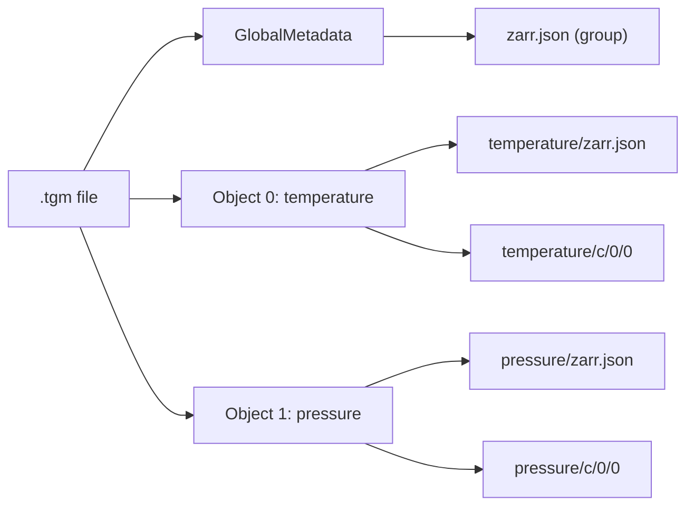

# Zarr v3 Backend

The `tensogram-zarr` package implements a [Zarr v3 Store](https://zarr.readthedocs.io/en/stable/user-guide/stores.html) backed by `.tgm` files. This lets you read and write Tensogram data through the standard Zarr Python API.

## Installation

```bash
pip install tensogram-zarr
```

Requires `zarr >= 3.0`, `tensogram`, and `numpy`.

## Reading a .tgm file through Zarr

```python
import zarr
from tensogram_zarr import TensogramStore

# Open existing .tgm file as a read-only Zarr store
store = TensogramStore.open_tgm("forecast.tgm")
root = zarr.open_group(store=store, mode="r")

# Browse available arrays
for name, arr in root.members():
    print(f"{name}: shape={arr.shape}, dtype={arr.dtype}")

# Read data (decoded eagerly at store open, served from memory)
temperature = root["2t"][:]
print(temperature.shape, temperature.mean())

# Access group-level metadata (from GlobalMetadata)
print(root.attrs["mars"])  # {'class': 'od', 'type': 'fc', ...}
```

## How the mapping works

Each `.tgm` message maps to a Zarr group:

```
zarr.json                     # root group ← GlobalMetadata
temperature/zarr.json         # array metadata ← DataObjectDescriptor
temperature/c/0/0             # chunk data ← decoded object payload
pressure/zarr.json            # another array
pressure/c/0/0                # its chunk data
```



Key design decisions:

- Each TGM data object becomes **one Zarr array** with a **single chunk** (chunk shape = array shape)
- Variable names are resolved from metadata: `mars.param`, `name`, or fallback `object_N`
- TGM encoding metadata is preserved in Zarr array attributes under `_tensogram_*` keys
- Duplicate variable names get a numeric suffix (`field`, `field_1`)

## Variable naming

By default, the store tries these metadata paths to name arrays:

1. `name`
2. `mars.param`
3. `param`
4. `mars.shortName`
5. `shortName`
6. Falls back to `object_<index>`

You can override with a custom key:

```python
store = TensogramStore.open_tgm("data.tgm", variable_key="mars.param")
```

## Multi-message files

By default the store reads message 0. Select a different message with `message_index`:

```python
store = TensogramStore.open_tgm("multi.tgm", message_index=2)
```

## Writing a .tgm file through Zarr

```python
import numpy as np
import zarr
from tensogram_zarr import TensogramStore

store = TensogramStore("output.tgm", mode="w")
root = zarr.open_group(store=store, mode="w")

# Create arrays — data is buffered in memory
root.create_array("temperature", data=np.random.rand(100, 200).astype(np.float32))
root.create_array("pressure", data=np.array([1000, 925, 850, 700], dtype=np.float64))

# Close flushes to .tgm
store.close()
```

The write path assembles all arrays into a single TGM message when the store is closed.

## Context manager

```python
with TensogramStore("data.tgm", mode="r") as store:
    root = zarr.open_group(store=store, mode="r")
    data = root["temperature"][:]
# Store automatically closed
```

## Supported data types

| Tensogram dtype | Zarr data_type | NumPy dtype |
|----------------|---------------|-------------|
| `float16`      | `float16`     | `float16`   |
| `float32`      | `float32`     | `float32`   |
| `float64`      | `float64`     | `float64`   |
| `int8`         | `int8`        | `int8`      |
| `int16`        | `int16`       | `int16`     |
| `int32`        | `int32`       | `int32`     |
| `int64`        | `int64`       | `int64`     |
| `uint8`        | `uint8`       | `uint8`     |
| `uint16`       | `uint16`      | `uint16`    |
| `uint32`       | `uint32`      | `uint32`    |
| `uint64`       | `uint64`      | `uint64`    |
| `complex64`    | `complex64`   | `complex64` |
| `complex128`   | `complex128`  | `complex128`|
| `bitmask`      | `uint8`       | `uint8`     |

## Byte range support

The store supports Zarr's `ByteRequest` types for efficient partial reads:

- `RangeByteRequest(start, end)` — read a byte range
- `OffsetByteRequest(offset)` — read from offset to end
- `SuffixByteRequest(suffix)` — read last N bytes

## Comparison with tensogram-xarray

| Feature | `tensogram-zarr` | `tensogram-xarray` |
|---------|------------------|--------------------|
| API level | Low-level (Zarr Store) | High-level (xarray engine) |
| Dimensions | Generic (dim_0, dim_1) | Named (lat, lon, time) |
| Coordinates | Not interpreted | Auto-detected from metadata |
| Multi-message | One message per store | Auto-merge into hypercubes |
| Write support | Yes | No |
| Data loading | Eager (all at open) | Lazy (on-demand `decode_range`) |

Use `tensogram-zarr` when you need direct Zarr API access or write support. Use `tensogram-xarray` when you want automatic coordinate detection and multi-message merging.

## Edge cases and limitations

### Variable name sanitization

If a metadata value used as a variable name contains `/` or `\`, those characters are replaced with `_` to prevent spurious directory nesting in the virtual key space. Empty names become `_`.

```
mars.param = "temperature/surface"  →  variable name "temperature_surface"
```

### Duplicate variable names

When multiple objects resolve to the same name, suffixes are appended: `field`, `field_1`, `field_2`, etc.

### Zero-object messages

A message with no data objects is valid (metadata-only). The store produces a root group with attributes but no arrays.

### Single chunk per array

Each TGM data object maps to a Zarr array with **chunk_shape == array_shape** (one chunk). There is no sub-chunking; partial reads within the array are handled by Zarr's byte-range support against the single chunk. If a Zarr writer attempts to store multiple chunks for the same variable, a `ValueError` is raised — TensogramStore does not silently drop extra chunks.

### Out-of-range message index

If `message_index` exceeds the number of messages in the file, an `IndexError` is raised. Negative indices are rejected with `ValueError`.

### bfloat16 dtype

`bfloat16` maps to Zarr data type `"bfloat16"` but is stored as raw 2-byte values (`<V2` numpy dtype) since numpy has no native bfloat16 type. Use `ml_dtypes.bfloat16` for interpretation.

### Byte order handling

The read path normalises all chunk data to little-endian (matching the Zarr `bytes` codec default). The write path respects `byte_order` from the Zarr codecs metadata — if a big-endian bytes codec is specified, the data is byte-swapped before encoding to TGM.

### JSON serialization (RFC 8259)

`serialize_zarr_json()` converts non-finite float values to their Zarr v3 string sentinels (`"NaN"`, `"Infinity"`, `"-Infinity"`) so the output is valid RFC 8259 JSON.

### Write path byte-count validation

When flushing to `.tgm`, the store validates that chunk byte count matches `product(shape) * dtype_size`. A mismatch raises `ValueError` with the expected and actual counts.

### close() exception safety

If `_flush_to_tgm()` fails during `close()`, the store is still marked as closed (`_is_open = False`). The exception propagates normally — partial writes do not corrupt the file since TGM messages are written atomically.

When used as a context manager and an exception is already in flight, flush errors are logged at `WARNING` level instead of replacing the original exception.

## Error handling

All errors surface with enough context for debugging:

| Scenario | Exception | Message includes |
|----------|-----------|------------------|
| File not found / unreadable | `OSError` | File path |
| Invalid TGM message | `ValueError` | File path + message index |
| Object decode failure | `ValueError` | File path + message index + object index + variable name |
| Out-of-range message index | `IndexError` | Requested index + available count |
| Negative message index | `ValueError` | The invalid index value |
| Invalid mode | `ValueError` | The invalid mode string |
| Empty path | `ValueError` | The value passed |
| Chunk byte-count mismatch | `ValueError` | Variable name + expected vs actual byte count |
| Unsupported dtype on write | `ValueError` | Variable name + dtype |
| Invalid JSON in zarr.json | `ValueError` | Byte count + hex preview |
| Unknown ByteRequest type | `TypeError` | The type name |
| Array without chunk data | `WARNING` log | Variable name (array skipped) |
| No arrays to flush | `WARNING` log | File path |

Errors from the underlying Rust tensogram library are wrapped with Python-level context so users see which file, message, and variable caused the problem.
