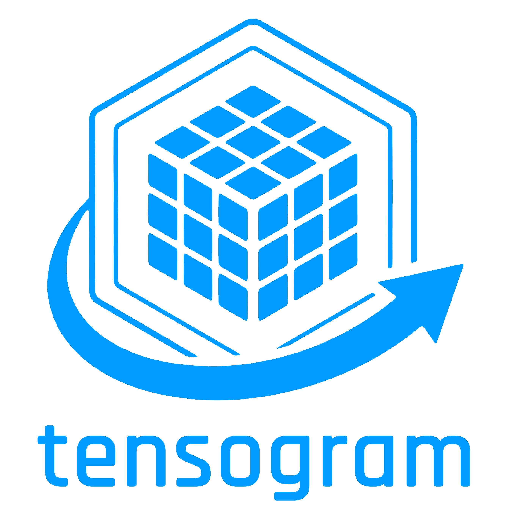

<div class="landing-logo">
  
</div>

# Introduction

Tensogram is a binary message format for **N-dimensional scientific tensors** — the kind of data that appears in weather forecasting, climate modelling, and machine learning pipelines. Think of it as a modern, flexible replacement for GRIB: it carries its own metadata, supports arbitrary tensor dimensions, and is fast to encode and decode.

## Why Tensogram?

GRIB (the format ECMWF uses today) is great for exchanging data with the outside world, but it has two structural limits:

- **Vocabulary is WMO-controlled.** Adding a new parameter type requires international negotiation that takes months to years.
- **Only 1-dimensional fields.** A sea wave spectrum (which is naturally a 3-tensor of lat × lon × frequency) must be flattened into many separate GRIB messages with ad-hoc conventions baked into application code.

Tensogram solves both. The metadata is CBOR (a compact binary version of JSON) so you can add any key you like without asking anyone's permission. And a single message can carry multiple N-dimensional tensor objects.

## What Tensogram Is — and Is Not

| | Tensogram |
|---|---|
| **Unit** | A *message* — a self-contained binary blob with metadata and one or more tensors |
| **Transmissible** | Yes — over TCP, HTTP, message queues, or files |
| **File format** | Not intrinsically, but multiple messages can be appended to a `.tgm` file |
| **Vocabulary-aware** | No — the library is vocabulary-agnostic. Your application layer (e.g. MARS) owns the key names |

## Crate Layout

The primary four Rust crates make up the default workspace build:

```
tensogram/
├── rust/
│   ├── tensogram-core        ← encode, decode, framing, file API,
│   │                            validation, remote object store
│   ├── tensogram-encodings   ← simple_packing, shuffle, compression
│   ├── tensogram-cli         ← `tensogram` command-line tool
│   └── tensogram-ffi         ← C FFI layer for C/C++ callers
├── python/
│   └── bindings/             ← Python bindings (PyO3 / maturin)
├── cpp/
│   └── include/              ← C++ wrapper header + C header
```

On top of those, the repository ships several opt-in crates — the
`tensogram-grib` / `tensogram-netcdf` converters (exposed as the
`convert-grib` / `convert-netcdf` CLI subcommands), the `tensogram-wasm`
WebAssembly bindings, and the pure-Rust `tensogram-szip` /
`tensogram-sz3` / `tensogram-sz3-sys` compression crates — together
with the separate Python packages `tensogram-xarray` (xarray backend)
and `tensogram-zarr` (Zarr v3 store backend), and a `tensogram-benchmarks`
crate. See [`plans/ARCHITECTURE.md`](https://github.com/ecmwf/tensogram/blob/main/plans/ARCHITECTURE.md)
for the full crate list and build recipes.

Most users interact with `tensogram-core` and the CLI. The encodings
crate is used internally by the core but is also importable directly
if you need to call the encoding functions outside of a full message.

## Quick Example

```rust
use std::collections::BTreeMap;
use tensogram_core::{
    encode, decode, GlobalMetadata, DataObjectDescriptor,
    ByteOrder, Dtype, EncodeOptions, DecodeOptions,
};

// Describe what you're storing: a 100×200 grid of f32 values
let desc = DataObjectDescriptor {
    obj_type: "ntensor".to_string(),
    ndim: 2,
    shape: vec![100, 200],
    strides: vec![200, 1],
    dtype: Dtype::Float32,
    byte_order: ByteOrder::Big,
    encoding: "none".to_string(),
    filter: "none".to_string(),
    compression: "none".to_string(),
    params: BTreeMap::new(),
    hash: None,
};

let global_meta = GlobalMetadata {
    version: 2,
    ..Default::default()
};

// Your raw bytes (100 × 200 × 4 bytes = 80,000 bytes)
let data = vec![0u8; 100 * 200 * 4];

// Encode into a self-contained message
let message = encode(&global_meta, &[(&desc, &data)], &EncodeOptions::default()).unwrap();

// Decode it back
let (meta, objects) = decode(&message, &DecodeOptions::default()).unwrap();
assert_eq!(objects[0].0.shape, vec![100, 200]);
assert_eq!(objects[0].1, data);
```

The `message` bytes can be written to a file, sent over a socket, or stored in a database. The receiver does not need any external schema — everything is self-describing.
